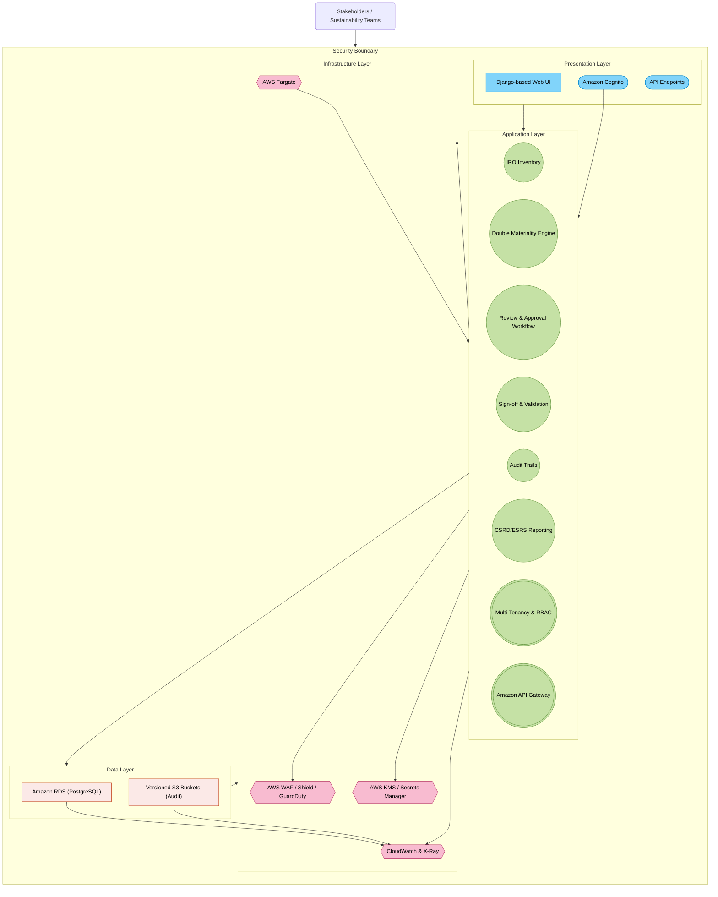

<solution design document>
# **Purpose-Built Double Materiality Assessment (DMA) SaaS Solution Design Document (AWS Edition)**

## **1. Executive Summary**

This document outlines a **purpose-built Double Materiality Assessment (DMA) SaaS platform**, enabling organizations to track and assess sustainability-related **Negative Impacts, Positive Impacts, Risks, and Opportunities (IROs)**. Depending on the type of statement, each individual IRO will be assessed either through the **Impact Materiality** (for negative and positive impacts) or **Financial Materiality** (for  risks and opportunities) perspectives per **EU CSRD** and **ESRS** requirements. 
When IROs are aggregated at topics level, you see the broader, “double” perspective—**Impact** and **Financial**—but each underlying IRO is only assessed under one perspective.

Summary of updates:

1. **Security Implementation Upgrades**: Holistic audit logging, immutable storage, and strong AWS security services (e.g., WAF, Shield, Cognito, KMS).  
2. **Infrastructure Optimization**: Use **AWS Fargate** initially for container workloads to reduce operational overhead; rely on **Amazon RDS** (PostgreSQL) for primary data storage.  
3. **Revised Feature Phases**: Three-phase approach focusing on security and core features first, advanced capabilities next, and global scale thereafter.  
4. **Cost-Effective Security**: Start with AWS Shield Standard, integrate only necessary security features up front, and scale capabilities based on emerging threats.


---

## **2. System Architecture Overview**

### **2.1 High-Level Architecture**

The solution is organized into four layers:

1. **Presentation Layer**  
   - **User Interface** built using Django (Python) for Double Materiality dashboards and IRO management.  
   - **API Endpoints** for external linkage (ESG data, stakeholder portals).  
   - **Authentication/Authorization** via **Amazon Cognito** (supporting MFA, social logins, and SSO).

2. **Application Layer**  
- **Core DMA Features**:  
  - *IRO Inventory*  explicitly distinguishes the type of assessment based on the type of statement -  between *Impact materiality for negative and positive impact statements* and *financial materiality for Risk/Opportunity statwments.* This means an IRO cannot have both an Impact Score and a Financial Score at the same time. 
  - *Double Materiality Engine* processes each IRO under the single materiality dimension that applies.  
  - *Workflow Approvals and Audit Trails* remain the same, but each IRO’s classification is enforced consistently throughout.  
  - *ESRS Reporting* flows from the aggregated (topic-level) perspective, covering both impact and financial angles but keeping the underlying IRO assignments distinct.  
   - **Enterprise Extensions**: Multi-tenancy, row-level security in RDS, RBAC, integration with **Amazon API Gateway**.  
   - **Serverless Workflow** (optional): AWS Lambda or AWS Step Functions for background tasks (report generation, notifications).

3. **Data Layer**  
   - **Primary Database**: **Amazon RDS (PostgreSQL)** for critical data storage, row-level security, audit logging.  
   - **Optional DynamoDB** (future high-throughput needs): Skipped initially unless specific performance or global distribution use cases arise.  
   - **Immutable Audit Storage**: Use versioned **Amazon S3** buckets for storing logs/audit trails if tamper-evident archives are required.

4. **Infrastructure Layer**  
   - **Container Orchestration**: **AWS Fargate** for containerized Django services (option to migrate to full EKS if operational scale warrants it).  
   - **Network & Security**: AWS WAF, Security Groups, AWS Shield (Standard to start, upgrade if needed), Amazon GuardDuty, Cognito, KMS.  
   - **Monitoring & Observability**: Amazon CloudWatch, AWS X-Ray for distributed tracing, AWS Security Hub, and AWS Backup.

**High-Level Architecture Diagram** (using Mermaid):



---

### **2.2 Technology Stack Details**

- **Application Framework**: **Django (Python)** for rapid development, robust security defaults, and admin UI.  
- **Container Deployment**: **AWS Fargate** tasks or services to reduce the operational overhead of managing Kubernetes.  
  - *Future Option*: Migrate to **Amazon EKS** if advanced orchestration, custom scheduling, or large-scale microservices demands arise.  
- **Database**: **Amazon RDS (PostgreSQL)** with row-level security for multi-tenancy, encryption at rest, and simplified audit trails.  
  - **Potential DynamoDB** usage if extremely high-scale or globally distributed data ingestion is needed later.  
- **Security Services**: AWS WAF, Security Groups, AWS Shield (Standard initially, upgrade if needed), Amazon Cognito, AWS KMS.  
- **Observability**: Amazon CloudWatch (metrics, logs), AWS X-Ray (tracing), and AWS Security Hub to unify security findings.

---

## **3. Core Functionality Design**

### **3.1 Detailed Component Breakdown**

1. **IRO Inventory Management**  
   - Captures **Impacts** or **Risks/Opportunities** (IROs) with properties such as category, likelihood, severity, or financial exposure.  
   - **Important Clarification**: Each IRO is classified as either an *Impact IRO* (positive or negative external impact) **or** a *Risk/Opportunity IRO* (financially relevant). This means each individual IRO is **only** assessed under *one* materiality dimension—impact **or** financial—based on its type.  
   - Topics, however, can contain **both** types of IROs. Therefore, at the topic level, you see the broader, “double” perspective—**Impact** and **Financial**—but each underlying IRO belongs to only one category.  
   - Users can import Excel-based IRO libraries, along with supporting documentation via manual CSV templates. In future phases, real-time integrations may support live ESG or financial risk data.  
   - Ensures multi-tenant isolation via dedicated schemas in PostgreSQL. Enforces row-level security for data partitioning.

2. **Double Materiality Assessment Engine**  
   - **Impact Materiality**: Evaluates external impact magnitude, scope, and likelihood for IROs classified as *Impact IROs*.  
   - **Financial Materiality**: Assesses financial severity and probability for IROs classified as *Risk/Opportunity IROs*.  
   - **Topic-Level View**: Since topics can group multiple IROs (some purely impact, some purely financial), the overall topic perspective reflects both dimensions. However, each IRO is **only scored** according to its respective classification.  This means an IRO cannot have both an Impact Score and a Financial Score at the same time. 
   - The engine merges results at the **topic** level for full double materiality visibility (showing which IROs drive Impact vs. which drive Financial factors).

3. **Review & Approval Workflow**  
   - Configurable stage-based review: *Draft → In_Review → Approved → Disclosed*.  
   - Incorporates role-based escalations and notifications via Amazon EventBridge or AWS Lambda triggers.  
   - Flexible time-bound reviews to meet compliance deadlines.

4. **Sign-off & Validation**  
   - Electronic sign-off with a tamper-proof audit trail.  
   - Supports third-party eSignature services if required (DocuSign, Adobe Sign).  
   - Sign-off records stored in **versioned S3** or **immutable** data structures if long-term immutability is needed.

5. **Audit Trails & Logging**  
   - Comprehensive logging (create, update, delete actions) across all modules.  
   - Uses CloudWatch Logs + AWS X-Ray for advanced correlation; optionally store logs in **S3** with versioning for immutability.  
   - Facilitates SOC 2, GDPR, and general compliance requirements from day one.

6. **CSRD/ESRS Reporting**  
   - Generates standardized reports for Impact Materiality, Financial Materiality, and overall alignment with ESRS.  
   - Publish to PDF, CSV, or Excel; push to external systems via **Amazon API Gateway** or S3 pre-signed URLs.

7. **Multi-Tenancy & RBAC**  
   - **Row-level security** enforced at the database layer for strict tenant data isolation.  
   - Role-based access controls to limit unauthorized user actions.  
   - Extendable to more granular permission sets if needed.

8. **API Integrations & Gateways**  
   - **Amazon API Gateway**: Rate limiting, request transformation, and easy versioning.  
   - **Webhook Support**: Outbound webhooks for real-time updates or integrated reporting workflows.  
   - Employ Edge-optimized endpoints if global low-latency access is needed.

---

### **3.2 Data Models and Relationships**

Below is a high-level representation of the primary entities:

```
 IRO                1--n       DMAssessment
 ┌─────────────┐                ┌────────────────────────┐
 │iro_id (PK)   │                │assessment_id (PK)      │
 │tenant_id     │<--------------│iro_id (FK -> IRO)      │
 │type          │               │impact_materiality_json │
 │title         │               │financial_materiality_json
 │description   │               │aggregated_score        │
 │...           │               │assessed_on             │
 └─────────────┘               └────────────────────────┘

 Review             1--n        Signoff
 ┌─────────────┐                ┌─────────────────────┐
 │review_id (PK)│                │signoff_id (PK)      │
 │iro_id (FK)   │<--------------│review_id (FK ->Review)
 │reviewer_id   │               │signed_by            │
 │status        │               │signed_on            │
 │...           │               │signature_ref        │
 └─────────────┘               └─────────────────────┘

         AuditTrail
         ┌─────────────────────────────┐
         │audit_id (PK)               │
         │tenant_id                   │
         │entity_type                 │
         │entity_id                   │
         │action                      │
         │timestamp                   │
         │data_diff (JSON)            │
         └─────────────────────────────┘
```

- **Tenant-Aware**: Each record includes a `tenant_id` for multi-tenant partitioning.  
- **Row-Level Security**: PostgreSQL policies can restrict row access based on `tenant_id`.  
- **Auditing**: Logs every action for compliance, with optional storage in immutable S3.

---

### **3.3 API Design and Endpoints**

- **`POST /api/v1/iros/`**: Create a new IRO.  
- **`GET /api/v1/iros/`**: Retrieve a list of IROs (supports filtering, pagination).  
- **`GET /api/v1/iros/{iro_id}/`**: Get details of a specific IRO.  
- **`POST /api/v1/iros/{iro_id}/assessments/`**: Create a Double Materiality Assessment.  
- **`GET /api/v1/reviews/{review_id}/`**: Retrieve a specific review’s status.  
- **`POST /api/v1/reviews/{review_id}/signoff/`**: Perform sign-off.  
- **`GET /api/v1/audittrails/`**: Query system audit logs.  
- **`GET /api/v1/csrd-reports/`**: Generate or retrieve a pre-built CSRD/ESRS report.

**Authentication & Authorization**  
- All endpoints require **Amazon Cognito** JWT tokens (Bearer).  
- RBAC enforced in Django and row-level security in RDS.  

**Rate Limiting & Versioning**  
- **Amazon API Gateway** handles rate limits and usage plans (e.g., 100 requests/min per user).  
- **Versioning** strategy: URL-based versioning (`/api/v1` → `.../v2`).

---

## **4. Enterprise Architecture Considerations**

### **4.1 Scalability and Performance**

1. **Compute Scalability**  
   - **AWS Fargate** tasks autoscale based on CPU or memory thresholds.  
   - Evaluate migrating to **Amazon EKS** if more control over container orchestration is needed (e.g., sidecar proxies, node-level customizations).

2. **Database Scaling**  
   - **Amazon RDS (PostgreSQL)** can be vertically scaled or use read replicas.  
   - Implement partitioning if extremely large data sets become the norm.

3. **Caching**  
   - **Amazon ElastiCache (Redis)** for frequently accessed data (e.g., aggregated DMA results, reference data).  
   - Improves performance under heavy read loads.

4. **CDN/Global Deployment**  
   - **Amazon CloudFront** or **AWS Global Accelerator** for global content delivery, especially for distributed tenant bases.  
   - Multi-region architecture in Phase 3 if agility and data residency demands arise.

5. **Performance Monitoring**  
   - **Amazon CloudWatch** (metrics, logs), AWS X-Ray (tracing).  
   - Review logs in real time to proactively address latency or resource bottlenecks.
</solution design document>

<design of user-facing views in Django>
Based on the provided solution design documents, here's a high-level summary of the key frameworks and modules recommended for building the main user-facing views in Django:

## Core Framework Stack

1. **View Layer**
- Django Class-Based Views (CBVs) for structured CRUD operations
- HTMX + Alpine.js for interactive features (lighter than React/Vue.js)
- django-formtools for multi-step wizards
- django-crispy-forms for form layouts

2. **Data Visualization**
- Chart.js + django-chartjs for materiality matrices and dashboards
- django-tables2 + django-filter for sortable data grids

3. **Authentication & Authorization**
- django-guardian for object-level permissions
- django-allauth for authentication (integrates with Amazon Cognito)

4. **API Integration**
- Django REST framework for API construction and documentation
</design of user-facing views in Django>


<consolidated Q&A bank>
Below is a **consolidated Q&A bank** divided into the four requested sections—**Assessment Framework**, **Data Architecture**, **User Interface**, and **Compliance**—with each question **numbered sequentially**. For each question, you will find:

- The **Question** text.  
- A **Recommended Solution** (summarizing the optimal approach).  
- A brief **Justification** explaining why that solution is advisable.

---

## **1. Assessment Framework**

---

### **Question 1**  
**How should the Double Materiality Assessment scoring be structured or implemented to handle organization-specific rubrics while maintaining consistent core criteria?**  

**Recommended Solution:**  
Provide a **baseline rubric** that covers both Impact Materiality (severity, scale, scope, irreversibility, likelihood) and Financial Materiality (magnitude, likelihood). Allow each organization to **customize numeric scales** (e.g., 1–5) and define how to interpret each level, then store **versioned rubrics** so changes are tracked over time.

**Justification:**  
- **Compliance**: Ensures all essential CSRD/ESRS criteria are met (impact and financial perspectives).  
- **Flexibility**: Accommodates different industries, business units, or internal scoring preferences.  
- **Auditability**: Version control creates a clear trail of scoring changes for regulators or internal auditors.

---

### **Question 2**  
**How frequently should organizations update their Double Materiality Assessments to remain compliant with EU CSRD?**  

**Recommended Solution:**  
Perform a **comprehensive annual** review of all IROs to align with the annual reporting cycle. Additionally, conduct **quarterly or biannual spot checks** for high-priority or rapidly evolving issues, ensuring critical changes are captured promptly.

**Justification:**  
- **Regulatory Alignment**: An annual formal update aligns with standard CSRD disclosure timelines.  
- **Risk Management**: More frequent interim checks on critical areas prevent material blind spots.  
- **Operational Practicality**: Balances compliance needs with organizational bandwidth.

---

### **Question 3**  
**Which approach should be used to identify and categorize IROs (Positive Impacts, Negative Impacts, Risks, and Opportunities) across various business units and supply chains?**  

**Recommended Solution:**  
Use a **hybrid taxonomy** anchored to recognized sustainability standards (like ESRS categories) while supporting **custom sub-categories** for specific industries or sites. Incorporate **stakeholder input** (employees, suppliers, communities) to ensure all relevant IROs are captured.

**Justification:**  
- **Standardization**: Anchoring to common frameworks simplifies reporting and benchmarking.  
- **Customization**: Industry- or site-specific tags allow deeper granularity where needed.  
- **Holistic Coverage**: Engaging multiple stakeholder groups helps uncover hidden or emerging IROs.

---

### **Question 4**  
**How should scenario analysis be integrated into the Double Materiality Assessment to account for future climate or regulatory changes?**

**Recommended Solution:**  
Provide **no direct in-app scenario modeling** component in the initial release. Instead, enable users to **upload scenario results** (e.g., climate stress tests) as supporting documents or comments linked to relevant IROs.

**Justification:**  
- **Simplicity**: Focuses the software on robust Double Materiality record-keeping rather than complex forecasting engines.  
- **Flexibility**: Organizations can use specialized climate or regulatory modeling tools and attach results as evidence.  
- **Scalability**: Deferring advanced scenario features reduces initial complexity while still accommodating scenario data.

---

### **Question 5**  
**What mechanisms should be in place to capture short-term or emerging “flash” risks within the Double Materiality framework?**

**Recommended Solution:**  
Retain **annual core updates** but designate a process to flag “interim exceptions” for short-term or urgent risks. These exceptions require a **separate management sign-off**, ensuring they are visible and tracked outside the normal cycle.

**Justification:**  
- **Practicality**: Preserves a predictable update rhythm while addressing urgent developments.  
- **Accountability**: Requiring a special sign-off raises visibility for flash risks among senior stakeholders.  
- **Documentation**: Clear records of interim changes reduce confusion and support audits.

---

### **Question 6**  
**How should stakeholder engagement be structured to enhance data quality and comprehensiveness in the Double Materiality Assessment process?**

**Recommended Solution:**  
Create a **digital stakeholder portal** where approved external or internal stakeholders can submit IRO insights, feedback, or supporting evidence. Integrate these inputs directly into the DMA platform for review and incorporation.

**Justification:**  
- **Automation**: Streamlines capturing new issues or validations directly from stakeholders.  
- **Traceability**: Each submission is timestamped and linked to a stakeholder, clarifying influence on final assessments.  
- **Inclusiveness**: Encourages continuous collaboration with key groups, improving the scope and accuracy of data.

---

### **Question 7**  
**How can the assessment framework handle multi-tier supply chains to ensure a robust analysis of Impact Materiality across all relevant suppliers and partners?**

**Recommended Solution:**  
Enable **value-chain tagging** within each IRO, allowing users to specify which part of the supply chain (upstream/downstream tiers) a risk or impact applies to. For deeper complexity, allow linking multiple tiers under a single IRO to track extended supply chain impacts.

**Justification:**  
- **Comprehensive Coverage**: Recognizes that major impacts often occur beyond direct Tier-1 suppliers.  
- **Granularity**: Tier-specific tagging helps isolate where key risks or opportunities lie.  
- **Scalability**: The model can expand as more supply-chain data becomes available.

---

### **Question 8**  
**What is the best approach to integrating external ESG or GHG emissions data sources into the Double Materiality system architecture?**

**Recommended Solution:**  
Use **manual CSV/Excel uploads** on a quarterly or annual basis, ensuring data is reviewed before ingestion. Provide clear templates and validation rules to maintain data quality.

**Justification:**  
- **Simplicity & Reliability**: Avoids building (and maintaining) complex, real-time integration pipelines early on.  
- **Data Governance**: Manual review ensures correctness, which is critical for official disclosures.  
- **Scalability**: The approach can evolve to APIs or automated feeds later if the organization’s data maturity increases.


## **3. User Interface**

---

### **Question 31**  
**What is the most effective way to present materiality assessment results to decision-makers?**  

**Recommended Solution:**  
Display a **2x2 materiality matrix** (impact severity vs. financial magnitude) as a high-level dashboard, and allow **drill-down** into heatmaps or tabular views of underlying IRO details.

**Justification:**  
- **Clarity**: Executives quickly grasp a 2x2 chart for prioritization.  
- **Depth**: Sustainability teams need more granular data—drill-down views deliver that detail.  
- **Adoption**: Familiar matrix visuals facilitate faster user acceptance.

---

### **Question 32**  
**How should the system handle collaborative assessment workflows for multiple reviewers or roles?**  

**Recommended Solution:**  
Implement a **configurable workflow engine** with sequential and parallel review steps. For example, items can progress from “Draft” → “In Review” → “Approved” → “Disclosed.” Allow **conditional routing** for high-severity IROs.

**Justification:**  
- **Flexibility**: Different organizations have varying governance processes.  
- **Accountability**: Each stage logs who reviewed/approved the record.  
- **Scalability**: Workflows can adapt to complex sign-off paths without major code changes.

---

### **Question 33**  
**What UI approach should be taken to accommodate various user roles (Sustainability Manager, CFO, Auditor, etc.) for Double Materiality Assessments?**  

**Recommended Solution:**  
Create a **unified interface** that applies **role-based access controls** (RBAC) to show or hide functionalities. Offer **role-specific “home” pages** so each user sees the data and KPIs most relevant to them upon login.

**Justification:**  
- **Efficiency**: A single codebase, but personalized experiences.  
- **Security**: RBAC ensures no user inadvertently sees data beyond their permissions.  
- **User Experience**: Minimizes confusion and highlights priority tasks or metrics.

---

### **Question 34**  
**How should the system represent and guide users through Impact vs. Financial Materiality in the UI?**  

**Recommended Solution:**  
Use a **step-by-step wizard** for data input:  
1) Collect Impact Materiality details (scope, scale, likelihood).  
2) Collect Financial Materiality details (magnitude, likelihood).  
Afterward, display a **combined Double Materiality summary** (e.g., matrix or aggregated scoring).

**Justification:**  
- **Ease of Use**: Breaking input into smaller steps is less overwhelming.  
- **Completeness**: Ensures both impact and financial dimensions are consistently assessed.  
- **Transparency**: The final overview clarifies how each dimension contributed to the overall conclusion.

---

### **Question 35**  
**What approach should be used to guide non-expert users through the DMA process (e.g., identifying IROs, setting severity, etc.)?**  

**Recommended Solution:**  
Implement a **wizard-style interface** with **mandatory fields** at each stage and **contextual tooltips** explaining technical terms. Optionally integrate a **chatbot** or help widget for just-in-time guidance.

**Justification:**  
- **Reduced Errors**: Mandatory prompts minimize incomplete data.  
- **User Confidence**: Clear help text or a chatbot reduces confusion about sustainability jargon.  
- **Accessibility**: Even small organizations with minimal sustainability expertise can complete assessments confidently.

---

### **Question 36**  
**How should final reports (aligned with ESRS requirements) be generated and shared with stakeholders?**  

**Recommended Solution:**  
Allow on-demand **PDF or Excel exports**, stored securely in the system. Provide **role-based permissions** for downloading or distributing these reports, plus the option to share via **secure links** or an **API** (for third-party compliance tools).

**Justification:**  
- **Universality**: PDF/Excel are standard formats accepted by boards, regulators, and auditors.  
- **Security**: Role-based controls ensure sensitive data goes only to authorized parties.  
- **Integration**: Exposing a REST API or secure link supports external compliance reviews or data rooms.

---

## **4. Compliance**

---

### **Question 37**  
**Which security and privacy frameworks should be prioritized to align with EU CSRD and stakeholder expectations?**  

**Recommended Solution:**  
Implement **SOC 2 Type II** controls for operational security and **GDPR** compliance for personal data. Add **ESRS-specific** checks on sustainability data integrity (e.g., verifying authenticity of ESG metrics).

**Justification:**  
- **SOC 2** addresses confidentiality, integrity, and availability—key for trust.  
- **GDPR** is mandatory for handling EU personal data.  
- **ESRS** alignment ensures consistent, transparent reporting on sustainability metrics.

---

### **Question 38**  
**How should the system handle audit trails to demonstrate compliance with ESRS reporting and internal governance?**  

**Recommended Solution:**  
Use a **comprehensive audit log** (or event-sourcing approach) capturing every state change (who, what, when). Store critical logs in **immutable storage** (e.g., versioned S3 or an append-only ledger).

**Justification:**  
- **Traceability**: Full history of changes supports internal investigations and external audits.  
- **Tamper Resistance**: Immutable or append-only logs protect the integrity of the audit trail.  
- **Transparency**: Clearly documents how data evolved over time, meeting CSRD/ESRS evidence needs.

---

### **Question 39**  
**What should be the policy for disclosing non-material IROs under CSRD guidelines if stakeholders request them?**  

**Recommended Solution:**  
Provide a **configurable toggle** to include/exclude non-material IROs in the main report. Offer a **“full list” export** if a deeper level of disclosure is requested by certain stakeholders.

**Justification:**  
- **Flexibility**: Not all organizations want to clutter primary reports with non-material items.  
- **Transparency**: The optional “full list” meets stakeholder demands for openness.  
- **Regulatory Respect**: CSRD focuses on material items but does not prohibit additional voluntary disclosure.

---

### **Question 40**  
**How can we demonstrate that stakeholder engagement processes (a key CSRD requirement) have been incorporated into the Double Materiality Assessment?**  

**Recommended Solution:**  
Include **fields or attachments** in each IRO record to document stakeholder input. Track **engagement events** (e.g., workshops, interviews) in a separate table referencing the relevant IROs.

**Justification:**  
- **Auditability**: Shows exactly when and how stakeholders contributed.  
- **Compliance**: Meets CSRD’s emphasis on inclusive materiality processes.  
- **Influence Trace**: Auditors or managers can see how engagement feedback changed the assessment outcomes.

---

### **Question 41**  
**Which mechanisms should be introduced to demonstrate alignment with ESRS guidelines and facilitate external audits?**  

**Recommended Solution:**  
Generate a **“DMA + ESRS Mapping”** report that correlates IRO data and Double Materiality results to each relevant ESRS disclosure requirement. Implement a **compliance checklist** within the platform that flags any missing mandatory data.

**Justification:**  
- **Clear Mapping**: Auditors can see how each ESRS requirement is addressed by specific data points.  
- **Internal Readiness**: The checklist ensures no key ESRS sections are overlooked before formal reporting.  
- **Simplified Audits**: A direct cross-reference accelerates external assurance or verification processes.

---

</consolidated Q&A bank>


<design of user-facing views in Django>
Based on the provided solution design documents, here's a high-level summary of the key frameworks and modules recommended for building the main user-facing views in Django:

## Core Framework Stack

1. **View Layer**
- Django Class-Based Views (CBVs) for structured CRUD operations
- HTMX + Alpine.js for interactive features (lighter than React/Vue.js)
- django-formtools for multi-step wizards
- django-crispy-forms for form layouts

2. **Data Visualization**
- Chart.js + django-chartjs for materiality matrices and dashboards
- django-tables2 + django-filter for sortable data grids

3. **Authentication & Authorization**
- django-guardian for object-level permissions
- django-allauth for authentication (integrates with Amazon Cognito)

4. **API Integration**
- Django REST framework for API construction and documentation
</design of user-facing views in Django>