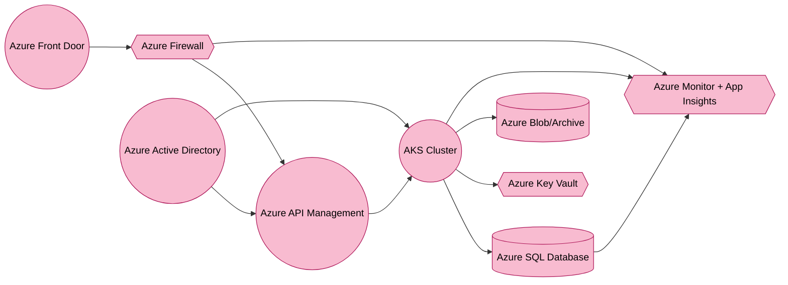

<goal>
expand the current landing page to provide more details and more punchy content on the core functionalities and the enterprise-ready architecture. This should convince both the sustainability team of a large corporation and their IT procurement.
</goal>

<current landing page>
<!DOCTYPE html>
<html lang="en">
<head>
    <meta charset="UTF-8">
    <meta name="viewport" content="width=device-width, initial-scale=1.0">
    <title>DMA SaaS - Enterprise Double Materiality Assessment Platform</title>
    <link rel="stylesheet" href="https://cdnjs.cloudflare.com/ajax/libs/font-awesome/6.0.0/css/all.min.css">
    <style>
        /* Modern design system variables */
        :root {
            --primary: #2E7D32;
            --primary-light: #4CAF50;
            --secondary: #0288D1;
            --accent: #FFC107;
            --dark: #1A2027;
            --gray: #607D8B;
            --light: #F5F7FA;
            --white: #ffffff;
            --shadow: 0 4px 6px rgba(0,0,0,0.1);
            --radius: 8px;
        }

        /* Reset and base styles */
        * {
            margin: 0;
            padding: 0;
            box-sizing: border-box;
            font-family: 'Inter', -apple-system, BlinkMacSystemFont, 'Segoe UI', Roboto, sans-serif;
        }

        body {
            line-height: 1.6;
            color: var(--dark);
            background: var(--light);
        }

        .container {
            max-width: 1200px;
            margin: 0 auto;
            padding: 0 20px;
        }

        /* Enhanced header styles */
        header {
            background: var(--white);
            padding: 1rem 0;
            position: fixed;
            width: 100%;
            top: 0;
            z-index: 1000;
            box-shadow: var(--shadow);
        }

        .nav {
            display: flex;
            justify-content: space-between;
            align-items: center;
        }

        .logo {
            font-size: 1.5rem;
            font-weight: 700;
            color: var(--primary);
            text-decoration: none;
            display: flex;
            align-items: center;
            gap: 0.5rem;
        }

        .nav-links {
            display: flex;
            gap: 2rem;
            align-items: center;
        }

        .nav-link {
            color: var(--dark);
            text-decoration: none;
            font-weight: 500;
            transition: color 0.3s ease;
        }

        .nav-link:hover {
            color: var(--primary);
        }

        /* Enhanced hero section */
        .hero {
            padding: 160px 0 80px;
            background: linear-gradient(135deg, var(--primary), var(--secondary));
            color: var(--white);
            position: relative;
            overflow: hidden;
        }

        .hero::before {
            content: '';
            position: absolute;
            top: 0;
            left: 0;
            right: 0;
            bottom: 0;
            background: url('data:image/svg+xml,<svg width="20" height="20" viewBox="0 0 20 20" xmlns="http://www.w3.org/2000/svg"><rect width="1" height="1" fill="rgba(255,255,255,0.1)"/></svg>');
            opacity: 0.1;
        }

        .hero-content {
            max-width: 800px;
            margin: 0 auto;
            text-align: center;
            position: relative;
            z-index: 1;
        }

        .hero h1 {
            font-size: 3.5rem;
            margin-bottom: 1.5rem;
            line-height: 1.2;
        }

        .hero p {
            font-size: 1.25rem;
            margin-bottom: 2rem;
            opacity: 0.9;
        }

        /* Enhanced features section */
        .features {
            padding: 100px 0;
            background: var(--white);
        }

        .section-title {
            text-align: center;
            margin-bottom: 3rem;
            color: var(--dark);
            font-size: 2.5rem;
        }

        .features-grid {
            display: grid;
            grid-template-columns: repeat(auto-fit, minmax(300px, 1fr));
            gap: 2rem;
            margin-top: 2rem;
        }

        .feature-card {
            background: var(--white);
            padding: 2rem;
            border-radius: var(--radius);
            box-shadow: var(--shadow);
            transition: transform 0.3s ease;
        }

        .feature-card:hover {
            transform: translateY(-5px);
        }

        .feature-icon {
            font-size: 2rem;
            color: var(--primary);
            margin-bottom: 1rem;
        }

        .feature-card h3 {
            color: var(--dark);
            margin-bottom: 1rem;
            font-size: 1.25rem;
        }

        /* Enhanced Enterprise Architecture section */
        .enterprise-architecture {
            background: var(--light);
            padding: 100px 0;
        }
        .architecture-grid {
            display: grid;
            grid-template-columns: 1fr 1fr;
            gap: 2rem;
            margin-top: 2rem;
        }
        .architecture-point {
            background: var(--white);
            padding: 2rem;
            border-radius: var(--radius);
            box-shadow: var(--shadow);
            display: flex;
            gap: 1rem;
            align-items: flex-start;
        }
        .architecture-icon {
            font-size: 2rem;
            color: var(--secondary);
        }
        .architecture-point h4 {
            margin-bottom: 0.5rem;
            color: var(--dark);
        }
        .architecture-point p {
            font-size: 1rem;
            margin-bottom: 0;
            color: var(--dark);
            line-height: 1.4;
        }
        @media (max-width: 992px) {
            .architecture-grid {
                grid-template-columns: 1fr;
            }
        }

        /* Enhanced CTA section */
        .cta {
            padding: 100px 0;
            background: var(--light);
            text-align: center;
        }

        .button {
            display: inline-flex;
            align-items: center;
            gap: 0.5rem;
            padding: 1rem 2rem;
            background: var(--primary);
            color: var(--white);
            text-decoration: none;
            border-radius: var(--radius);
            font-weight: 600;
            transition: all 0.3s ease;
        }

        .button:hover {
            background: var(--primary-light);
            transform: translateY(-2px);
        }

        .button-secondary {
            background: transparent;
            border: 2px solid var(--white);
        }

        .button-secondary:hover {
            background: rgba(255,255,255,0.1);
        }

        /* Enhanced footer */
        footer {
            background: var(--dark);
            color: var(--white);
            padding: 4rem 0;
        }

        .footer-content {
            display: grid;
            grid-template-columns: repeat(auto-fit, minmax(250px, 1fr));
            gap: 2rem;
        }

        .footer-section h4 {
            color: var(--white);
            margin-bottom: 1rem;
        }

        .footer-links {
            list-style: none;
        }

        .footer-links li {
            margin-bottom: 0.5rem;
        }

        .footer-links a {
            color: var(--light);
            text-decoration: none;
            opacity: 0.8;
            transition: opacity 0.3s ease;
        }

        .footer-links a:hover {
            opacity: 1;
        }

        /* Responsive design */
        @media (max-width: 768px) {
            .hero h1 {
                font-size: 2.5rem;
            }

            .nav-links {
                display: none;
            }

            .features-grid {
                grid-template-columns: 1fr;
            }
        }
    </style>
</head>
<body>
    <!-- Header -->
    <header>
        <div class="container nav">
            <a href="#" class="logo">
                <i class="fas fa-chart-line"></i>
                DMA SaaS
            </a>
            <nav class="nav-links">
                <a href="#features" class="nav-link">Features</a>
                <a href="#architecture" class="nav-link">Architecture</a>
                <a href="#about" class="nav-link">About</a>
                <a href="#contact" class="nav-link">Contact</a>
                <a href="#" class="button">Request Demo</a>
            </nav>
        </div>
    </header>

    <!-- Hero Section -->
    <section class="hero">
        <div class="container hero-content">
            <h1>Transform Your Sustainability Reporting</h1>
            <p>
                Drive compliance with the <strong>EU CSRD</strong> and prepare your organization for the upcoming audit requirements. Our 
                comprehensive, enterprise-ready Double Materiality Assessment platform simplifies the complexities.
            </p>
            <div style="display: flex; gap: 1rem; justify-content: center;">
                <a href="#" class="button">
                    <i class="fas fa-play-circle"></i>
                    Watch Demo
                </a>
                <a href="#" class="button button-secondary">
                    <i class="fas fa-paper-plane"></i>
                    Contact Sales
                </a>
            </div>
        </div>
    </section>

    <!-- Features Section -->
    <section class="features" id="features">
        <div class="container">
            <h2 class="section-title">Enterprise-Grade Features</h2>
            <p style="text-align: center; max-width: 800px; margin: 0 auto;">
                Our platform goes beyond basic reporting—enabling large organizations to confidently navigate 
                sustainability challenges, meet regulatory requirements, and empower diverse stakeholders 
                to collaborate effectively.
            </p>
            <div class="features-grid">
                <div class="feature-card">
                    <i class="fas fa-balance-scale feature-icon"></i>
                    <h3>Double Materiality Focus</h3>
                    <p>
                        Demonstrate your assessments of both <strong>Impact Materiality</strong> (effects on people and environment)
                        and <strong>Financial Materiality</strong> (exposure to sustainability-related risks and opportunities), fully aligned with 
                        EU CSRD requirements.
                    </p>
                </div>
                <div class="feature-card">
                    <i class="fas fa-project-diagram feature-icon"></i>
                    <h3>IRO Management</h3>
                    <p>
                        Centralize your <strong>Impact, Risk, and Opportunity (IRO)</strong> evaluations. Configure stakeholder 
                        workflows, capturing critical inputs for collaborative analysis and decision-making.
                    </p>
                </div>
                <div class="feature-card">
                    <i class="fas fa-chart-bar feature-icon"></i>
                    <h3>Robust Audit Trails</h3>
                    <p>
                        Track version history, changes, and sign-offs across your organization with 
                        complete traceability and accountability to streamline external audits.
                    </p>
                </div>
                <div class="feature-card">
                    <i class="fas fa-shield-alt feature-icon"></i>
                    <h3>Enterprise Security</h3>
                    <p>
                        Built with SOC 2 and GDPR compliance in mind, leveraging Azure AD (SSO) integration, 
                        end-to-end encryption, and granular role-based access control to safeguard all data.
                    </p>
                </div>
                <div class="feature-card">
                    <i class="fas fa-cloud feature-icon"></i>
                    <h3>Cloud-Native on Azure</h3>
                    <p>
                        Enjoy automatic scaling and high availability via <strong>Azure Kubernetes Service (AKS)</strong> and 
                        <strong>Azure SQL</strong>, supporting thousands of users worldwide with no performance lag.
                    </p>
                </div>
                <div class="feature-card">
                    <i class="fas fa-plug feature-icon"></i>
                    <h3>Flexible Integrations</h3>
                    <p>
                        Connect seamlessly with your ERPs, HR systems, and external sustainability data providers 
                        via our REST/GraphQL <strong>APIs</strong> for real-time data ingestion and analytics.
                    </p>
                </div>
            </div>
        </div>
    </section>

    <!-- Enterprise Architecture Section -->
    <section class="enterprise-architecture" id="architecture">
        <div class="container">
            <h2 class="section-title">Enterprise-Ready Architecture</h2>
            <p style="text-align: center; max-width: 800px; margin: 0 auto;">
                Our modern, multi-tenant SaaS architecture is tailor-made for large enterprises that handle 
                high volumes of data and demand top-tier compliance, scalability, and security. 
            </p>
            <div class="architecture-grid">
                <div class="architecture-point">
                    <div class="architecture-icon">
                        <i class="fas fa-network-wired"></i>
                    </div>
                    <div>
                        <h4>Scalable Multi-Tenant Design</h4>
                        <p>
                            Securely manage multiple subsidiaries or divisions under one umbrella, each with dedicated 
                            data segregation. Easily add new entities with minimal configuration, ensuring you scale without 
                            compromising performance or security.
                        </p>
                    </div>
                </div>
                <div class="architecture-point">
                    <div class="architecture-icon">
                        <i class="fas fa-key"></i>
                    </div>
                    <div>
                        <h4>Data Protection & Key Management</h4>
                        <p>
                            Leverage <strong>Azure Key Vault</strong> and best-practice encryption protocols. Our platform ensures that 
                            sensitive information—like ESG metrics, workforce records, and supply chain data—remains private and 
                            tamper-proof.
                        </p>
                    </div>
                </div>
                <div class="architecture-point">
                    <div class="architecture-icon">
                        <i class="fas fa-sync"></i>
                    </div>
                    <div>
                        <h4>High Availability & Disaster Recovery</h4>
                        <p>
                            Hosted on <strong>Azure Kubernetes Service</strong> with active-active replication, ensuring continuous 
                            uptime. Built-in backups and failover strategies minimize downtime and protect critical data.
                        </p>
                    </div>
                </div>
                <div class="architecture-point">
                    <div class="architecture-icon">
                        <i class="fas fa-cogs"></i>
                    </div>
                    <div>
                        <h4>Modular & Extensible</h4>
                        <p>
                            Designed with a microservices approach, allowing you to adopt new features, advanced analytics, 
                            or AI-driven scoring. Integrate with your existing infrastructure through REST/GraphQL APIs 
                            and webhooks for streamlined data flows.
                        </p>
                    </div>
                </div>
            </div>
        </div>
    </section>

    <!-- CTA Section -->
    <section class="cta">
        <div class="container">
            <h2 class="section-title">Ready to Elevate Your Sustainability Journey?</h2>
            <p style="margin-bottom: 2rem;">
                Join leading global enterprises that rely on DMA SaaS to achieve deep insights into their environmental 
                and social footprints. Gain clarity on your double materiality, streamline disclosures, and confidently 
                meet evolving regulatory expectations.
            </p>
            <a href="#" class="button">
                <i class="fas fa-calendar-alt"></i>
                Schedule a Demo
            </a>
        </div>
    </section>

    <!-- Footer -->
    <footer>
        <div class="container footer-content">
            <div class="footer-section">
                <h4>Product</h4>
                <ul class="footer-links">
                    <li><a href="#features">Features</a></li>
                    <li><a href="#architecture">Security &amp; Architecture</a></li>
                    <li><a href="#">Enterprise</a></li>
                    <li><a href="#">Pricing</a></li>
                </ul>
            </div>
            <div class="footer-section">
                <h4>Company</h4>
                <ul class="footer-links">
                    <li><a href="#">About Us</a></li>
                    <li><a href="#">Careers</a></li>
                    <li><a href="#">Blog</a></li>
                    <li><a href="#contact">Contact</a></li>
                </ul>
            </div>
            <div class="footer-section">
                <h4>Resources</h4>
                <ul class="footer-links">
                    <li><a href="#">Documentation</a></li>
                    <li><a href="#">API Reference</a></li>
                    <li><a href="#">Support</a></li>
                    <li><a href="#">Status</a></li>
                </ul>
            </div>
            <div class="footer-section">
                <h4>Legal</h4>
                <ul class="footer-links">
                    <li><a href="#">Privacy Policy</a></li>
                    <li><a href="#">Terms of Service</a></li>
                    <li><a href="#">Security</a></li>
                    <li><a href="#">Compliance</a></li>
                </ul>
            </div>
        </div>
    </footer>
</body>
</html>


</current landing page>

<solution design>
# **Purpose-Built Double Materiality Assessment (DMA) SaaS Solution Design Document**


---

## **1. Executive Summary**

This document presents a **purpose-built Double Materiality Assessment (DMA) SaaS platform**, leveraging **Django** on **Microsoft Azure**. The solution addresses the unique needs of organizations to track, assess, and report **Impacts, Risks, and Opportunities (IROs)** under **Impact Materiality** and **Financial Materiality** perspectives, as required by the **EU CSRD** and corresponding **European Sustainability Reporting Standards (ESRS)**.

### **Key Features and Goals**

- **Double Materiality Focus**: Built-in methodology to assess both *Impact Materiality* (effects on people/environment) and *Financial Materiality* (effects on the company’s finances).  
- **IRO Management**: Centralized platform to identify, assess, and monitor **Impacts**, **Risks**, and **Opportunities**, with clear workflows for stakeholder reviews.  
- **Multi-Tenant & Scalable**: Designed to handle multiple organizations with logically segregated data and robust autoscaling in Azure.  
- **Compliance & Security**: Aligns with SOC 2, GDPR, ISO 31000, and specific ESRS guidelines, ensuring data privacy and governance.  
- **Extensibility & Integration**: APIs for integration with existing sustainability tools, ERPs, and external data sources; extensible for AI-driven analytics.

---

## **2. System Architecture Overview**

### **2.1 High-level Architecture**

The overall architecture is layered to accommodate sustainability data capture, advanced assessments, and streamlined reporting. It comprises four primary layers:

1. **Presentation Layer**  
   - **User Interface (Django-based web app)** for Double Materiality dashboards.  
   - **API Endpoints** (REST/GraphQL) for external integration (e.g., ESG data providers, stakeholder platforms).  
   - **Authentication** via Azure AD (supports SSO and multi-factor authentication).

2. **Application Layer**  
   - **Core DMA Features**: IRO Inventory, Double Materiality Assessment Engine, Workflow Management, Stakeholder Sign-off, Audit Trails, and CSRD/ESRS Reporting.  
   - **Enterprise Extensions**: Multi-tenancy, Role-Based Access Control (RBAC), Data Segregation, Integration with **Azure API Management** for rate limiting and versioning.

3. **Data Layer**  
   - **Database**: Primarily **Azure SQL** for structured data (IRO records, workflows, assessments). Optionally, **Azure Cosmos DB** for large-scale or global data distribution scenarios.  
   - **Encryption & Key Management** via **Azure Key Vault**.  
   - **Backup & Retention** using **Azure Backup** and **Blob Storage**.

4. **Infrastructure Layer**  
   - **Azure Services**: Azure Kubernetes Service (AKS), Azure AD, Azure Logic Apps, Azure API Management.  
   - **Security & Monitoring**: Azure Firewall, Network Security Groups (NSGs), DDoS Protection, Azure Sentinel, Azure Monitor, and Application Insights.  
   - **Scalability**: Autoscaling for application containers (AKS) and database tiering (Azure SQL).

Below is a Mermaid diagram illustrating the **high-level architecture**:

```mermaid
flowchart TB
    classDef presentation fill:#81D4FA,stroke:#0288D1,color:#000,stroke-width:1px
    classDef core fill:#C5E1A5,stroke:#558B2F,color:#000,stroke-width:1px
    classDef enterprise fill:#C5E1A5,stroke:#2E7D32,color:#000,stroke-width:1px
    classDef data fill:#FBE9E7,stroke:#BF360C,color:#000,stroke-width:1px,shape:cylinder
    classDef infra fill:#F8BBD0,stroke:#AD1457,color:#000,stroke-width:1px

    User(Stakeholders / Sustainability Teams)
    User --> SB[Security Boundary]

    subgraph SB[Security Boundary]
      direction TB

      subgraph PL[Presentation Layer]
      A1["DMA Dashboard (Django)"]:::presentation
      A2([API Endpoints]):::presentation
      A3([Authentication - Azure AD]):::presentation
      end

      subgraph AL[Application Layer]
      B1((IRO Inventory)):::core
      B2((Double Materiality Engine)):::core
      B3((Review & Approval Workflow)):::core
      B4((Sign-off & Validation)):::core
      B5((Audit Trails)):::core
      B6((CSRD/ESRS Reporting)):::core

      B7(((Multi-tenancy))):::enterprise
      B8(((RBAC & Data Segregation))):::enterprise
      B9(((API Gateway))):::enterprise
      end

      subgraph DL[Data Layer]
      C1["Azure SQL / Cosmos DB"]:::data
      C2["Azure Key Vault (Encryption)"]:::data
      C3["Backups (Azure Backup / Blob)"]:::data
      end

      subgraph IL[Infrastructure Layer]
      D1{{Azure Services (AKS, AD, Logic Apps)}}:::infra
      D2{{Scaling (AKS Autoscaler, SQL tiers)}}:::infra
      D3{{Security (Firewall, NSGs, DDoS, Sentinel)}}:::infra
      D4{{Monitoring (Azure Monitor, App Insights)}}:::infra
      end
    end

    PL --> AL
    AL --> DL
    AL --> IL
    DL --> IL

    A3 --> D1
    B8 --> D3
    B2 --> D4
    D1 --> C1
```

---

### **2.2 Technology Stack Details**

1. **Backend Framework**  
   - **Django (Python)** for rapid development, built-in admin, ORM, and security hardening.

2. **Cloud Platform**  
   - **Microsoft Azure** for container orchestration (AKS), managed databases (Azure SQL/Cosmos DB), identity management (Azure AD), and DevOps pipelines (Azure DevOps or GitHub Actions).

3. **Database Technologies**  
   - **Azure SQL**: Primary data store for IRO records, assessment results, and audits (ACID compliance).  
   - **Cosmos DB** (optional): For large-scale, high-throughput or globally distributed queries. Often useful if capturing streaming sustainability metrics from IoT or external data sources.

4. **Infrastructure & Services**  
   - **Azure Kubernetes Service (AKS)** for container-based deployment, auto-scaling, and DevSecOps.  
   - **Azure Active Directory** for single sign-on, role assignment, and multi-factor authentication.  
   - **Azure Key Vault** for secrets, certificates, and encryption keys.  
   - **Azure Monitor + Application Insights** for end-to-end observability.  
   - **Azure Firewall, NSGs, DDoS** for robust network security.  
   - **Azure API Management** for rate limiting, versioning, and transformation of API calls.

---

## **3. Core Functionality Design**

### **3.1 Detailed Component Breakdown**

1. **IRO Inventory Management**  
   - Central repository for sustainability **Impacts, Risks, and Opportunities**.  
   - Each IRO entry includes attributes such as *impact category*, *financial exposure*, *stakeholders affected*, *likelihood*, *severity*, etc.  
   - Integration hooks to third-party ESG data providers or existing corporate systems (via Azure Logic Apps or REST endpoints).

2. **Double Materiality Assessment Engine**  
   - **Impact Materiality**: Evaluates *scale*, *scope*, *irremediable character*, *likelihood* for potential or actual impacts on people/environment.  
   - **Financial Materiality**: Assesses *magnitude* (financial significance), *likelihood* for risk or opportunity affecting cash flows, financial performance, or cost of capital.  
   - Automated scoring that consolidates *Impact* and *Financial* criteria to identify “material” IROs.

3. **Review & Approval Workflow**  
   - Multi-stage review process: *Draft → In_Review → Approved → Disclosed*.  
   - Role-based routing to sustainability committees, CFO, or specialized teams.  
   - Automated notifications and escalations if reviews exceed configured time windows.

4. **Sign-off & Validation**  
   - **Electronic signatures** via integration with DocuSign or Adobe Sign for final acknowledgment of critical IRO disclosures.  
   - Maintains tamper-proof history of sign-off events for audit readiness.

5. **Audit Trails & Change History**  
   - Comprehensive logging of IRO data changes, user actions, and system events.  
   - Coupled with Azure Monitor for advanced correlation and anomaly detection.

6. **CSRD/ESRS Reporting**  
   - Generates **standardized** and **custom** reports aligned with the ESRS (European Sustainability Reporting Standards).  
   - Produces disclosures for Impact Materiality, Financial Materiality, and how IROs align with organizational strategy.  
   - Export options: PDF, CSV, Excel, direct feed to external reporting systems (via webhooks or APIs).

7. **Multi-tenancy & RBAC**  
   - Logical segregation at the database layer (schema or row-level security).  
   - Fine-grained roles: *Sustainability Manager, CFO, Auditor, External Stakeholder* with distinct permissions.  
   - Ensures data isolation for each tenant while maintaining central administration.

8. **API Gateway & Integrations**  
   - **Azure API Management** for rate limiting, traffic throttling, transformation.  
   - Provides versioned REST endpoints to integrate with GHG emission trackers, external ESG rating providers, or partner systems for real-time data ingestion.

---

### **3.2 Data Models and Relationships**

A simplified UML focusing on **Impacts, Risks, and Opportunities (IRO)** entities:

```
┌─────────────────────────┐         ┌───────────────────────────┐
│ IRO                     │ 1     n │ DMAssessment              │
│-------------------------│         │---------------------------│
│ - id (PK)               │         │ - id (PK)                 │
│ - type (Impact/Risk/Opp)|         │ - iro_id (FK -> IRO)      │
│ - title                 │         │ - impact_materiality_json │
│ - description           │         │ - financial_materiality_json
│ - category              │         │ - aggregated_score        │
│ - owner_id (FK -> User) │         │ - assessed_on (Date)      │
│ - created_on (Date)     │         │ - assessed_by (FK -> User)│
└─────────────────────────┘         └───────────────────────────┘

┌─────────────────────────┐         ┌───────────────────────────┐
│ Review                  │ 1     n │ Signoff                   │
│-------------------------│         │---------------------------│
│ - id (PK)               │         │ - id (PK)                 │
│ - iro_id (FK -> IRO)    │         │ - review_id (FK -> Review)│
│ - reviewer_id (FK->User)│         │ - signed_by (FK -> User)  │
│ - status                │         │ - signed_on (Date)        │
│ - created_on (Date)     │         │ - signature_ref           │
└─────────────────────────┘         └───────────────────────────┘

┌───────────────────────────────────┐
│ AuditTrail                       │
│----------------------------------│
│ - id (PK)                        │
│ - entity_type (e.g., "IRO")      │
│ - entity_id                      │
│ - action (created, updated)      │
│ - user_id (FK -> User)           │
│ - tenant_id (optional)           │
│ - timestamp (DateTime)           │
│ - data_diff (JSON)               │
└───────────────────────────────────┘
```

#### **Database Indexing Strategies**
- **Primary Keys**: Clustered index on `id` fields.  
- **Composite Index**: For frequent queries, e.g., `(iro_id, assessed_on)` on **DMAssessment**.  
- **Tenant Isolation**: Index on `(tenant_id, iro_id)` or `(tenant_id, created_on)` to filter data by tenant for multi-tenant usage.  
- **Periodic Index Review**: Analyze execution plans to maintain query performance.

---

### **3.3 API Design and Endpoints**

- **`POST /api/v1/iros/`** – Create a new IRO (Impact, Risk, or Opportunity).  
- **`GET /api/v1/iros/`** – List or filter existing IROs.  
- **`GET /api/v1/iros/{iro_id}/`** – Retrieve details of a specific IRO.  
- **`PUT /api/v1/iros/{iro_id}/`** – Update an IRO.  
- **`POST /api/v1/iros/{iro_id}/assessments/`** – Submit a new Double Materiality Assessment for a given IRO.  
- **`GET /api/v1/reviews/`** – Query reviews; supports filters by status, date range, etc.  
- **`POST /api/v1/reviews/{review_id}/signoff/`** – Perform sign-off on a review.  
- **`GET /api/v1/audittrails/`** – Retrieve audit logs.  
- **`GET /api/v1/csrd-reports/`** – Generate or fetch a pre-built CSRD/ESRS report for the tenant.  

**Authentication & Authorization**  
- **Azure AD** tokens required (`Bearer <token>`).  
- Django enforces row-level RBAC or row-level security in the database for strict data segregation.  

#### **API Rate Limiting & Versioning**  
- **Azure API Management** enforces rate limiting (e.g., 100 requests/min per user).  
- **Versioning**: URL-based (`/api/v1` → `/api/v2`) or header-based. Deprecation policy in place for older versions.

#### **Webhook Support**  
- **Outbound Webhooks**: Subscribe to IRO changes or assessments for real-time updates to external systems (e.g., stakeholder portals).  
- Powered by **Azure Event Grid** or **Logic Apps** for advanced routing.

#### **Feature Toggles**  
- **Partial Rollouts**: Manage new features or pilot programs (e.g., advanced AI-driven scoring) using Django’s feature-flag libraries or Azure App Configuration.

---

## **4. Enterprise Architecture Considerations**

### **4.1 Scalability and Performance**

1. **Horizontal Scaling**  
   - **AKS HPA (Horizontal Pod Autoscaler)** to add more pods when CPU or memory surpass thresholds (e.g., 70% CPU).  
   - **Azure SQL** can be scaled up/down or use Hyperscale tier.  
   - **Read Replicas** or caching for high read traffic (Azure Cache for Redis).

2. **Resource Scaling Thresholds**  
   - Define usage triggers for pods (CPU > 70%, memory > 75%).  
   - Regular usage review to optimize cost vs. performance.

3. **Caching**  
   - **Azure Cache for Redis** for frequently accessed data (IRO lists, aggregated DMA results).  

4. **CDN / Global Reach**  
   - **Azure Front Door** for global content delivery and load balancing. Useful if hosting international organizations subject to CSRD.

5. **SLA Targets**  
   - Aim for 99.9% or 99.95% availability, leveraging redundancy in Azure.  
   - Consider active-active or active-passive multi-region deployments for business continuity.

---

### **4.2 Security Architecture**

1. **Application Security**  
   - Django’s built-in protections (CSRF, XSS, SQL injection defense).  
   - Strict RBAC enforced in Django views and via database row-level security.  
   - Align security practices with **SOC 2** and **GDPR** compliance for personal data handling.

2. **Network Security**  
   - **Hub-Spoke VNet** design with **Azure Firewall** gating inbound traffic.  
   - **NSGs** with strict allowlisting of ports (HTTP/S, DB connections).  
   - **DDoS Protection** at the Azure boundary for volumetric attacks.

3. **Data Security**  
   - **Encryption at Rest**: TDE for Azure SQL, client-side encryption if needed for high-sensitivity data.  
   - **Encryption in Transit**: Enforce TLS 1.2+ between clients and servers.  
   - **Key Management**: Use **Azure Key Vault** for storing secrets and keys.

4. **Identity & Access Management**  
   - **Azure AD** with conditional access, multi-factor authentication, and role-based privileges.  
   - **Privileged Identity Management (PIM)** to reduce persistent administrative roles.

5. **Incident Response**  
   - Integrate with **Azure Sentinel** for SIEM.  
   - Predefine runbook for incident detection, triage, containment, and post-incident analysis.

---

### **4.3 Azure Infrastructure Design**

1. **Azure Kubernetes Service (AKS)**  
   - Containerized Django application, with a baseline of 2–3 nodes (adjustable as usage grows).  
   - Implement policy-based security (Pod Security Policies or Azure Policy) to ensure only trusted container images.

2. **Azure SQL Database**  
   - **Private Link** or private endpoints to limit public internet exposure.  
   - **Automated Backups**: 7- to 35-day short-term retention; **Long-Term Retention (LTR)** for monthly/yearly backups (up to 10 years, depending on compliance needs).

3. **Backup Retention & Data Archival**  
   - **Azure Backup + Blob Storage** for additional snapshots.  
   - **Data Archival**: Move old IRO records (e.g., older than 5 years) to **Azure Archive Storage** or a lower-cost SQL tier.

4. **Monitoring & Alerting**  
   - **Azure Monitor** for cluster-level metrics (CPU, memory, throughput).  
   - **Application Insights** for application-level logging, tracing, and performance insights.  
   - Alerts integrated with Teams, Slack, or PagerDuty for real-time notifications.

---

## **5. Implementation Recommendations**

### **5.1 Development Phases**

1. **Phase 1: Core IRO & Single-Tenant MVP**  
   - Implement basic IRO module (Impacts, Risks, Opportunities).  
   - Deploy on Azure App Service or small AKS cluster with Azure SQL.  
   - Basic backups, monitoring, and security checks.

2. **Phase 2: Double Materiality & Multi-Tenancy**  
   - Implement the Double Materiality Assessment Engine (Impact + Financial Materiality).  
   - Introduce multi-tenant architecture with row-level security or separate schemas.  
   - Add review workflows, sign-off features, and partial ESRs (European Sustainability Reporting Standards) compliance.

3. **Phase 3: Enterprise-Grade Security & Compliance**  
   - Integrate with Azure Firewall, NSGs, advanced RBAC in Azure AD.  
   - Enhance audit logging and tie into Azure Sentinel for SIEM.  
   - Conduct official readiness checks for SOC 2, GDPR, CSRD/ESRS audits.

4. **Phase 4: Global Scale & Advanced Insights**  
   - Multi-region deployments with Azure Front Door, potential use of Cosmos DB for distributed data.  
   - AI-driven analytics for IRO trend forecasts (Azure ML).  
   - Finalize SLA definitions and disaster recovery strategy.

---

### **5.2 Best Practices**

- **Infrastructure as Code**: Automate setup with Terraform or Bicep for consistent environments.  
- **DevSecOps**: Embed security scanning (SAST/DAST) into CI/CD pipelines, ensure code coverage on critical paths.  
- **Zero Trust**: Implement micro-segmentation, continuous access evaluation, and least privilege.  
- **Regular DR Drills**: Validate RPO/RTO objectives with simulated failovers.  
- **Maintenance Windows**: Leverage rolling updates in AKS or App Service slots, communicate changes to tenants.  
- **Cost Optimization**: Monitor usage in **Azure Cost Management** and enforce scale-in policies when load is low.

---

## **6. Appendices**

### **6.1 Database Schema (Example)**

```sql
CREATE TABLE dbo.IRO (
    iro_id INT IDENTITY PRIMARY KEY,
    type NVARCHAR(20) NOT NULL,                -- 'Impact', 'Risk', 'Opportunity'
    title NVARCHAR(255) NOT NULL,
    description NVARCHAR(MAX),
    category NVARCHAR(100),
    owner_id INT NOT NULL,
    tenant_id INT NOT NULL,                    -- Multi-tenant reference
    created_on DATETIME2 NOT NULL DEFAULT(GETUTCDATE())
);

CREATE TABLE dbo.DMAssessment (
    assessment_id INT IDENTITY PRIMARY KEY,
    iro_id INT NOT NULL FOREIGN KEY REFERENCES dbo.IRO(iro_id),
    impact_materiality_json NVARCHAR(MAX),     -- JSON storing scale, scope, severity, likelihood
    financial_materiality_json NVARCHAR(MAX),  -- JSON storing magnitude, likelihood
    aggregated_score DECIMAL(5, 2),
    assessed_on DATETIME2 NOT NULL DEFAULT(GETUTCDATE()),
    assessed_by INT NOT NULL
);

CREATE TABLE dbo.Review (
    review_id INT IDENTITY PRIMARY KEY,
    iro_id INT NOT NULL FOREIGN KEY REFERENCES dbo.IRO(iro_id),
    reviewer_id INT NOT NULL,
    status NVARCHAR(50) NOT NULL,
    created_on DATETIME2 NOT NULL DEFAULT(GETUTCDATE())
);

CREATE TABLE dbo.Signoff (
    signoff_id INT IDENTITY PRIMARY KEY,
    review_id INT NOT NULL FOREIGN KEY REFERENCES dbo.Review(review_id),
    signed_by INT NOT NULL,
    signed_on DATETIME2 NOT NULL DEFAULT(GETUTCDATE()),
    signature_ref NVARCHAR(255)
);

CREATE TABLE dbo.AuditTrail (
    audit_id INT IDENTITY PRIMARY KEY,
    entity_type NVARCHAR(50),
    entity_id INT,
    action NVARCHAR(50),
    user_id INT,
    tenant_id INT,
    timestamp DATETIME2 NOT NULL DEFAULT(GETUTCDATE()),
    data_diff NVARCHAR(MAX)
);
```

- **Tenant Identification**: `tenant_id` in each table to ensure data isolation.  
- **Indexing**: Non-clustered indexes on `(tenant_id, iro_id)` or `(owner_id)` for performance.

---

### **6.2 API Documentation (Sample)**

| Endpoint                                          | Method | Description                                                          | Auth Required | Rate Limit (req/min) |
|---------------------------------------------------|--------|----------------------------------------------------------------------|--------------|----------------------|
| **`/api/v1/iros/`**                               | POST   | Create a new IRO (Impact, Risk, or Opportunity)                      | Yes          | 50                  |
| **`/api/v1/iros/`**                               | GET    | List or filter existing IROs                                         | Yes          | 100                 |
| **`/api/v1/iros/{iro_id}/`**                      | GET    | Retrieve a specific IRO’s details                                    | Yes          | 100                 |
| **`/api/v1/iros/{iro_id}/`**                      | PUT    | Update an existing IRO                                               | Yes          | 50                  |
| **`/api/v1/iros/{iro_id}/assessments/`**          | POST   | Create a Double Materiality Assessment for an IRO                    | Yes          | 50                  |
| **`/api/v1/reviews/`**                            | GET    | List or filter reviews                                               | Yes          | 100                 |
| **`/api/v1/reviews/{review_id}/signoff/`**        | POST   | Submit digital sign-off for a review                                 | Yes          | 25                  |
| **`/api/v1/audittrails/`**                        | GET    | Retrieve audit logs (filterable by entity, date range)               | Yes          | 100                 |
| **`/api/v1/csrd-reports/`**                       | GET    | Generate or retrieve CSRD/ESRS compliance reports                    | Yes          | 25                  |
| **`/api/v1/webhooks/{entity}/subscribe`**         | POST   | Subscribe to webhook notifications for IRO or assessment changes     | Yes          | 25                  |
| **`/api/v1/webhooks/{entity}/unsubscribe`**       | DELETE | Unsubscribe from webhook notifications                               | Yes          | 25                  |

- **Versioning**: `/api/v2/` endpoints introduced as new features roll out.  
- **Rate Limits**: Managed in **Azure API Management** at the user or subscription level.

---

### **6.3 Infrastructure Diagrams**

A simplified **Azure** deployment flow:



- **Azure Front Door**: Global load balancing & CDN for the web UI and APIs.  
- **Azure Firewall**: Filters and protects inbound traffic.  
- **Azure API Management**: Enforces rate limiting, transforms requests for API versioning.  
- **AKS**: Hosts the Django containers and runs the Double Materiality application logic.  
- **Azure SQL**: Relational data store for IROs, assessments, and audits.  
- **Azure Key Vault**: Securely holds secrets, keys, and certificates.  
- **Monitoring**: Centralized logs, metrics, and alerts.

---
</solution design>

<goal>
expand the current landing page to provide more details and more punchy content on the core functionalities and the enterprise-ready architecture. This should convince both the sustainability team of a large corporation and their IT procurement.
</goal>

<output instructions>
output a single COMPLETE UPDATED HTML landing page
</output instructions>