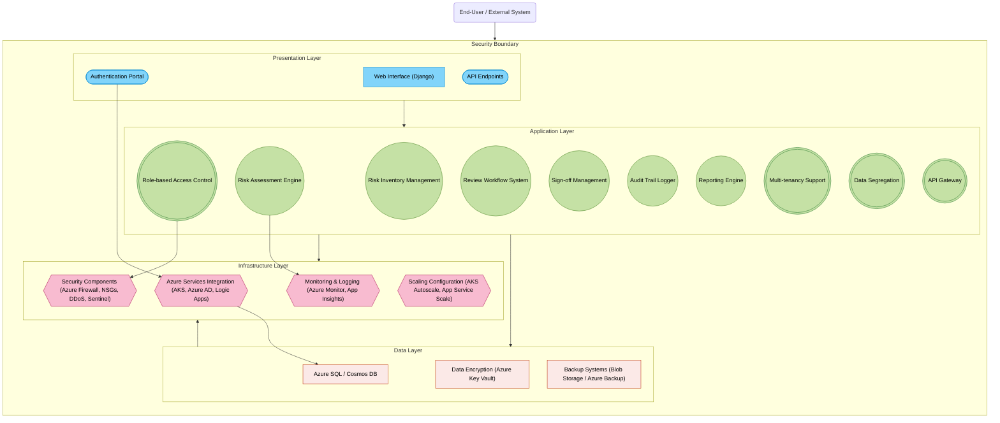
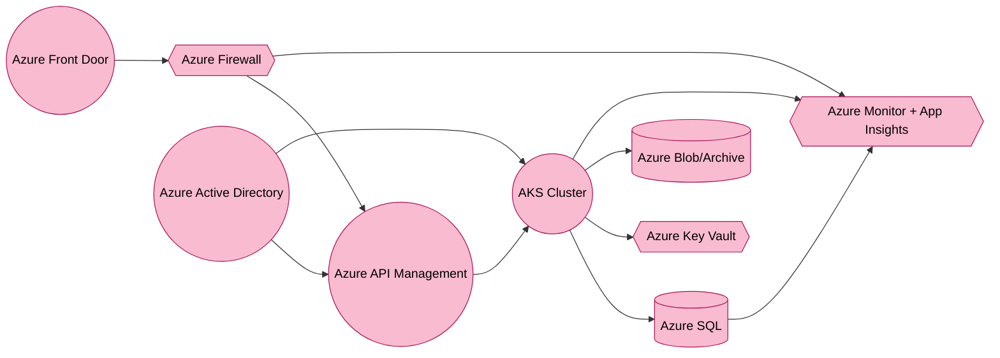

Below is a **complete, updated version** of the **Enterprise Risk Management (ERM) SaaS Solution Design Document**, incorporating additional considerations for API rate limiting, database indexing, backup retention, data archival strategies, operational enhancements (monitoring, SLAs, incident response), cost optimization, and integration/extensibility features.  

---

## 1. Executive Summary
This document presents a **comprehensive Enterprise Risk Management (ERM) SaaS solution architecture** built using **Django** on **Microsoft Azure**. The solution is designed for multi-tenant risk tracking, assessment, and reporting, emphasizing enterprise-grade scalability, security, cost optimization, and extensibility. Key compliance standards addressed include **SOC 2**, **GDPR**, and **ISO 31000**.

### Highlights
- **Layered Architecture**: Separation of concerns across Presentation, Application, Data, and Infrastructure layers.  
- **Multi-tenancy** with fine-grained **RBAC** and **data segregation**.  
- **Azure-native services** for high availability, scaling (AKS, App Service), and advanced security (Azure Firewall, NSGs, Azure Sentinel).  
- **Operational Excellence**: Monitoring thresholds, alerting, incident response, maintenance windows, and SLA considerations.  
- **Cost Optimization**: Resource scaling thresholds, storage lifecycle management, and multi-tenant cost allocation strategies.

---

## 2. System Architecture Overview

### 2.1 High-level Architecture

The system is organized into four layers:

1. **Presentation Layer**  
   - **Web Interface (Django-based UI)** providing risk management dashboards.  
   - **API Endpoints** (REST/GraphQL) for third-party integrations.  
   - **Authentication Portal** leveraging Azure AD for single sign-on (SSO).

2. **Application Layer**  
   - **Core Functionalities**: Risk Inventory, Risk Assessment, Workflow, Sign-off, Audit Trail, Reporting.  
   - **Enterprise Features**: Multi-tenancy, Role-Based Access Control, Data Segregation, API Gateway (via Azure API Management).

3. **Data Layer**  
   - **Database Architecture**: Primary store in **Azure SQL**; optionally **Azure Cosmos DB** for high-scale or globally distributed scenarios.  
   - **Data Encryption** with **Azure Key Vault** for key management.  
   - **Backup Systems** leveraging **Azure Backup** and **Blob Storage** with defined retention policies (detailed in Section 4.3).

4. **Infrastructure Layer**  
   - **Azure Services Integration**: Azure Kubernetes Service (AKS), Azure AD, Azure Logic Apps, Azure API Management.  
   - **Scaling Configuration**: AKS Autoscale, Azure App Service Scale.  
   - **Security Components**: Azure Firewall, NSGs, DDoS Protection, Azure Sentinel.  
   - **Monitoring & Logging**: Azure Monitor, Application Insights, custom alerting thresholds.

Below is the **Mermaid** diagram illustrating the high-level architecture:



---

### 2.2 Technology Stack Details

1. **Backend Framework**:  
   - **Django** (Python), leveraging its ORM, admin interface, built-in security, and robust architectural patterns.

2. **Cloud Platform**:  
   - **Microsoft Azure** for hosting (AKS or App Service), managed databases (Azure SQL, Cosmos DB), CI/CD (Azure DevOps or GitHub Actions), and security (Azure AD, Key Vault, Firewall).

3. **Database Technologies**:  
   - **Azure SQL Database**: Preferred for ACID transactions, complex queries, and multi-tenant schema strategies.  
   - **Cosmos DB** (optional): For massive scalability, unstructured data, or globally distributed writes.

4. **Infrastructure & Services**:  
   - **Azure Kubernetes Service (AKS)**: Container orchestration, autoscaling.  
   - **Azure Active Directory (Azure AD)**: Identity and access management.  
   - **Azure Key Vault**: Secrets, certificates, encryption key management.  
   - **Azure Monitor & Application Insights**: Centralized logging, custom alerting thresholds.  
   - **Azure Firewall, NSGs, DDoS Protection**: Network security controls.  
   - **Azure API Management**: API gateway, rate limiting, transformations.

---

## 3. Core Functionality Design

### 3.1 Detailed Component Breakdown

1. **Risk Inventory Management**  
   - Central repository tracking risk attributes (owner, category, impact).  
   - Integration with third-party systems (ERP, CRM) using Azure Logic Apps or REST APIs.

2. **Risk Assessment Engine**  
   - Supports both qualitative and quantitative methods (e.g., factor-based, Monte Carlo simulations).  
   - Provides dynamic scoring with AI-driven insights if extended via Azure Machine Learning.

3. **Review Workflow System**  
   - Automated routing to designated approvers or committees.  
   - Status transitions (draft → in_review → approved) with transparent notifications.

4. **Sign-off Management**  
   - Digital endorsement via electronic signatures (integration with Adobe Sign or DocuSign).  
   - Tamper-proof records stored with timestamps.

5. **Audit Trail Logger**  
   - Immutable logs capturing user actions and system events.  
   - Combines with Azure Monitor logs for deeper correlation (e.g., suspicious activity detection).

6. **Reporting Engine**  
   - Real-time dashboards for inherent/residual risk, compliance metrics, and trend analysis.  
   - Integrations with Excel, Power BI, or custom PDF/CSV exports.

7. **Multi-tenancy Support**  
   - Logical segregation at the database layer, with either dedicated schemas per tenant or row-level security for large-scale usage.  
   - Cost allocation strategies track usage at tenant level (detailed in Section 5.3).

8. **Role-Based Access Control (RBAC)**  
   - Granular roles (e.g., risk owner, reviewer, auditor) mapped to Azure AD groups.  
   - Ability to define custom roles with restricted or read-only permissions.

9. **Data Segregation**  
   - Ensures sensitive risk data is visible only to authorized tenant(s).  
   - Cryptographic isolation with separate keys for high-security data (optional).

10. **API Gateway**  
   - Azure API Management applies rate limiting, usage quotas, and IP filtering.  
   - Facilitates API versioning, transformation, and analytics.

---

### 3.2 Data Models and Relationships

A simplified UML overview of critical entities:

```
┌─────────────────────────┐         ┌───────────────────────┐
│ Risk                    │ 1     n │ RiskAssessment         │
│-------------------------│         │-------------------------│
│ - id (PK)               │         │ - id (PK)              │
│ - title                 │         │ - risk_id (FK -> Risk) │
│ - description           │         │ - methodology          │
│ - category              │         │ - score                │
│ - owner_id (FK -> User) │         │ - assessed_on (Date)   │
│ - created_on (Date)     │         │ - assessed_by (FK -> User)
└─────────────────────────┘         └───────────────────────┘

┌─────────────────────────┐         ┌───────────────────────┐
│ Review                  │ 1     n │ Signoff               │
│-------------------------│         │------------------------│
│ - id (PK)               │         │ - id (PK)             │
│ - risk_id (FK -> Risk)  │         │ - review_id (FK -> Review)
│ - reviewer (FK -> User) │         │ - signed_by (FK -> User)
│ - status                │         │ - signed_on (Date)    │
│ - created_on (Date)     │         │ - signature_ref       │
└─────────────────────────┘         └───────────────────────┘

┌───────────────────────────────────┐
│ AuditTrail                       │
│----------------------------------│
│ - id (PK)                        │
│ - entity_type (e.g., "Risk")     │
│ - entity_id                      │
│ - action (created, updated)      │
│ - user_id (FK -> User)           │
│ - timestamp (DateTime)           │
│ - data_diff (JSON)               │
└───────────────────────────────────┘
```

#### Database Indexing Strategies
- Create **clustered index** on primary keys (id).  
- **Composite indexes** on frequently filtered columns, e.g., `(risk_id, assessed_on)`.  
- Non-clustered indexes for high-usage queries (e.g., `(owner_id)` in the `Risk` table if searching by risk owner is common).  
- Periodically **review and optimize** index usage based on execution plans in Azure SQL to maintain performance.

---

### 3.3 API Design and Endpoints

Typical REST-based endpoints include:

- **`POST /api/v1/risks/`** – Create a new risk.  
- **`GET /api/v1/risks/`** – List or filter risks.  
- **`GET /api/v1/risks/{risk_id}/`** – Retrieve a specific risk.  
- **`PUT /api/v1/risks/{risk_id}/`** – Update a risk.  
- **`POST /api/v1/risks/{risk_id}/assessments/`** – Create a new risk assessment.  
- **`GET /api/v1/reviews/`** – Fetch reviews; optional filters (status, date range).  
- **`POST /api/v1/reviews/{review_id}/signoff/`** – Digital sign-off on a review.  
- **`GET /api/v1/audittrails/`** – Retrieve audit logs, filterable by entity or time range.

**Authentication & Authorization**  
- **Azure AD** OAuth2/OpenID Connect; tokens must be presented as Bearer tokens.  
- Django-level RBAC or row-level security in the database to ensure tenant isolation.

#### API Rate Limiting & Versioning
- **Rate Limiting**: Enforce request quotas via **Azure API Management** (e.g., 100 requests/min/user).  
- **Versioning Strategy**: Use URL versioning (`/api/v1`, `/api/v2`) or header-based versioning. Provide a deprecation policy to guide clients through upgrades.

#### Webhook Support
- **Outbound Webhooks**: Offer subscription-based webhooks for real-time notifications (e.g., newly approved risks, sign-off events).  
- **Azure Event Grid** or **Azure Logic Apps** can facilitate these for custom integrations.

#### Feature Toggles & Extension Points
- **Feature Flags**: Enable partial rollouts of new functionalities (e.g., advanced risk scoring) using toggles in Django (e.g., Waffle library) or Azure App Configuration.  
- **Extension Points**: Provide pre- and post-processing hooks in critical workflows (e.g., after risk creation) to allow custom logic for individual tenants.

---

## 4. Enterprise Architecture Considerations

### 4.1 Scalability and Performance

1. **Horizontal Scaling**  
   - **Azure Kubernetes Service (AKS)** automatically scales pods using the Horizontal Pod Autoscaler (HPA).  
   - **Azure SQL** Hyperscale tier or read replicas for heavy read loads.

2. **Resource Scaling Thresholds**  
   - Define CPU/memory usage thresholds (e.g., scale out at 70% CPU usage).  
   - Evaluate monthly usage trends to fine-tune scaling policies.

3. **Caching**  
   - **Azure Cache for Redis** for read-intensive queries or frequently accessed risk data.

4. **Content Delivery**  
   - **Azure Front Door** for global load balancing and content caching for multi-regional user bases.

5. **SLA Targets & Uptime Guarantees**  
   - Application SLA: 99.9% or higher, subject to Azure resource SLAs (SQL Database, AKS).  
   - Active-active or active-passive multi-region deployments for meeting SLA commitments.

---

### 4.2 Security Architecture

1. **Application Security**  
   - Django’s built-in security (CSRF, XSS, SQL injection prevention).  
   - Strict RBAC checks enforced in both Django and database layers.

2. **Network Security**  
   - **Hub-Spoke VNet** design with **Azure Firewall** to isolate application pods from the public internet.  
   - **NSGs** restricting traffic to only required ports (HTTPS, database ports).

3. **Data Security**  
   - **Encryption at rest**: Transparent Data Encryption (TDE) in Azure SQL.  
   - **Encryption in transit**: TLS 1.2+ enforced on all endpoints.  
   - **Backup & Retention**: See Section 4.3 for details.

4. **Identity & Access Management**  
   - **Azure Active Directory**: Single sign-on, MFA, Conditional Access.  
   - **Privileged Identity Management (PIM)**: Minimizes standing admin privileges.

5. **Incident Response**  
   - Integrate logs into **Azure Sentinel** for real-time security analytics.  
   - Define an incident response runbook:  
     1. Alert detection (via Azure Monitor).  
     2. Triage & classification.  
     3. Containment & root-cause analysis.  
     4. Post-incident review.

---

### 4.3 Azure Infrastructure Design

1. **Azure Kubernetes Service (AKS)**  
   - Runs containerized Django applications, scaled automatically.  
   - PodSecurityPolicy or Azure Policy for container security.  

2. **Azure SQL Database**  
   - **Private endpoint** to restrict public traffic.  
   - **Automated backups** with 35-day retention by default; can extend to meet compliance needs.

3. **Backup Retention Policies**  
   - **Long-Term Retention (LTR)** for monthly or yearly backups (e.g., 7 years for regulatory reasons).  
   - **Blob Storage** for additional snapshots or offsite backups.

4. **Data Archival Strategies**  
   - For stale records (e.g., closed risks older than 5 years), move to **Azure Archive Storage** or a separate cold table in Azure SQL with reduced costs.  
   - Implement an archiving schedule using Azure Data Factory or SQL jobs.

5. **Monitoring & Alerting**  
   - **Azure Monitor** for granular metrics (CPU usage, request latency, DB DTU usage).  
   - **Application Insights** for deep application performance monitoring (APM).  
   - Custom thresholds set for CPU (e.g., 70%), memory usage (80%), and DB connections.  
   - Automated alerts via email, Teams, or PagerDuty for critical events.

---

## 5. Implementation Recommendations

### 5.1 Development Phases

1. **Phase 1: Core & Single-Tenant MVP**  
   - Implement fundamental Risk modules (Inventory, Assessment, Reporting).  
   - Deploy to Azure (App Service or a small AKS cluster) with Azure SQL.  
   - Configure basic backups and monitoring.

2. **Phase 2: Multi-Tenant & Advanced Features**  
   - Introduce multi-tenancy (database schema or row-level security).  
   - Add advanced workflows, sign-off management, extended reporting, webhooks.  
   - Implement feature toggles for partial rollouts.

3. **Phase 3: Enterprise Hardening & Compliance**  
   - Tighten security with Azure Firewall, NSGs, advanced RBAC in Azure AD.  
   - Integrate with Azure Sentinel for SIEM, define incident response runbooks.  
   - Conduct readiness assessments for SOC 2/GDPR compliance.  
   - Refine cost-allocation model for multi-tenant usage.

4. **Phase 4: Global Scale & AI**  
   - Deploy multi-region with Azure Traffic Manager, Cosmos DB for global data distribution if needed.  
   - Leverage Azure ML or Cognitive Services for predictive risk analytics.  
   - Finalize SLA definitions and incorporate advanced DevSecOps practices.

---

### 5.2 Best Practices

- **Infrastructure as Code**: Use Terraform or Bicep to automate environment setup.  
- **DevSecOps**: Embed security scanning (SAST/DAST) in pipelines, code reviews.  
- **Zero Trust**: Enforce least privilege, micro-segmentation, continuous verification.  
- **Disaster Recovery Drills**: Regularly test failover processes, ensuring RPO/RTO alignment with SLAs.  
- **Maintenance Windows**: Schedule planned downtime or rolling upgrades using AKS or App Service deployment slots. Communicate changes to tenants in advance.

### 5.3 Cost Optimization & Allocation

1. **Cost Estimation & Monitoring**  
   - Use **Azure Cost Management + Billing** to track real-time consumption.  
   - Identify top cost drivers (e.g., database size, egress traffic).

2. **Resource Scaling Thresholds**  
   - Automate scale-up/down at certain CPU/memory thresholds (e.g., scale out a node at 70% CPU utilization).  
   - Use tags to group resources by tenant or environment for cost breakdown.

3. **Storage Lifecycle Management**  
   - Move infrequently accessed data to cheaper tiers (Cool/Archive Storage).  
   - Implement data retention policies to delete or archive old risk logs after regulatory deadlines.

4. **Cost Allocation for Multi-Tenant**  
   - Tenant-level usage metrics (API calls, storage, user count) stored for billing or chargeback.  
   - Provide transparency via usage dashboards so each tenant sees their consumption.

---

## 6. Appendices

### 6.1 Database Schema (Example)

```sql
CREATE TABLE dbo.Risk (
    risk_id INT IDENTITY PRIMARY KEY,
    title NVARCHAR(255) NOT NULL,
    description NVARCHAR(MAX),
    category NVARCHAR(100),
    owner_id INT NOT NULL,
    tenant_id INT NOT NULL,  -- For multi-tenant association
    created_on DATETIME2 NOT NULL DEFAULT(GETUTCDATE())
);

CREATE TABLE dbo.RiskAssessment (
    assessment_id INT IDENTITY PRIMARY KEY,
    risk_id INT NOT NULL FOREIGN KEY REFERENCES dbo.Risk(risk_id),
    methodology NVARCHAR(50),
    score DECIMAL(5,2),
    assessed_on DATETIME2 NOT NULL DEFAULT(GETUTCDATE()),
    assessed_by INT NOT NULL
);

CREATE TABLE dbo.Review (
    review_id INT IDENTITY PRIMARY KEY,
    risk_id INT NOT NULL FOREIGN KEY REFERENCES dbo.Risk(risk_id),
    reviewer_id INT NOT NULL,
    status NVARCHAR(50) NOT NULL,
    created_on DATETIME2 NOT NULL DEFAULT(GETUTCDATE())
);

CREATE TABLE dbo.Signoff (
    signoff_id INT IDENTITY PRIMARY KEY,
    review_id INT NOT NULL FOREIGN KEY REFERENCES dbo.Review(review_id),
    signed_by INT NOT NULL,
    signed_on DATETIME2 NOT NULL DEFAULT(GETUTCDATE()),
    signature_ref NVARCHAR(255)
);

CREATE TABLE dbo.AuditTrail (
    audit_id INT IDENTITY PRIMARY KEY,
    entity_type NVARCHAR(50),
    entity_id INT,
    action NVARCHAR(50),
    user_id INT,
    tenant_id INT,
    timestamp DATETIME2 NOT NULL DEFAULT(GETUTCDATE()),
    data_diff NVARCHAR(MAX)
);
```

- **Tenant Identification**: `tenant_id` columns to segregate data.  
- **Indexing**: Non-clustered indexes on `(tenant_id, risk_id)` or `(risk_id, created_on)` to optimize multi-tenant queries.

---

### 6.2 API Documentation (Sample)

| Endpoint                                   | Method | Description                                | Auth Required | Rate Limit (req/min) |
|--------------------------------------------|--------|--------------------------------------------|--------------|----------------------|
| `/api/v1/risks/`                          | GET    | List/filter risks                          | Yes          | 100                 |
| `/api/v1/risks/`                          | POST   | Create a new risk                          | Yes          | 50                  |
| `/api/v1/risks/{risk_id}/`                | GET    | Get details of a specific risk             | Yes          | 100                 |
| `/api/v1/risks/{risk_id}/`                | PUT    | Update a risk                              | Yes          | 50                  |
| `/api/v1/risks/{risk_id}/assessments/`    | POST   | Create a new assessment for a risk         | Yes          | 50                  |
| `/api/v1/reviews/`                        | GET    | List or filter reviews                     | Yes          | 100                 |
| `/api/v1/reviews/{review_id}/signoff/`    | POST   | Digital sign-off on a review               | Yes          | 25                  |
| `/api/v1/audittrails/`                    | GET    | Retrieve audit trail logs                  | Yes          | 100                 |
| `/api/v1/webhooks/{entity}/subscribe`     | POST   | Subscribe to webhook notifications         | Yes          | 25                  |
| `/api/v1/webhooks/{entity}/unsubscribe`   | DELETE | Unsubscribe from webhook notifications     | Yes          | 25                  |

**Notes**:
- **API Versioning**: Additional versions will be exposed as `/api/v2/risks/`, etc.  
- **Rate Limits** can be adjusted in **Azure API Management** to align with tenant SLAs.

---

### 6.3 Infrastructure Diagrams

Below is a simplified Azure deployment flow in Mermaid:



