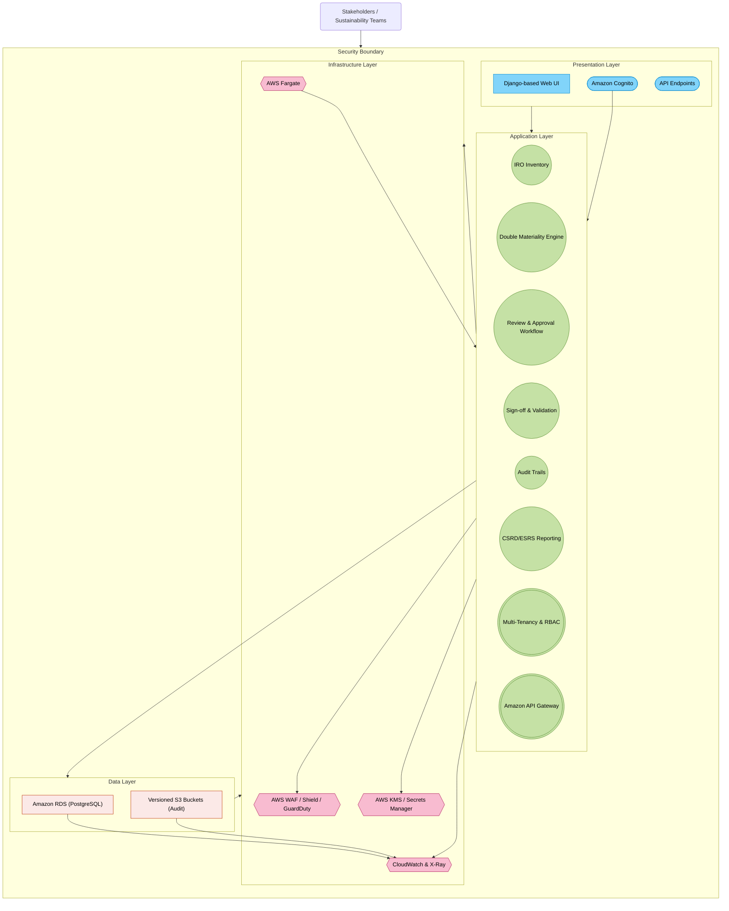
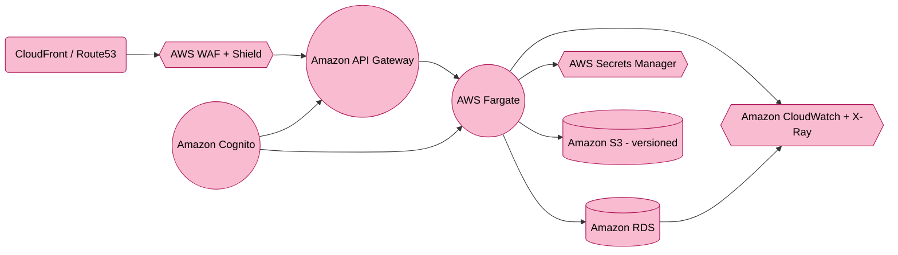

<solution design document>
# **Purpose-Built Double Materiality Assessment (DMA) SaaS Solution Design Document (AWS Edition)**

## **1. Executive Summary**

This document outlines a **purpose-built Double Materiality Assessment (DMA) SaaS platform**, enabling organizations to track, assess, and report **Impacts, Risks, and Opportunities (IROs)** from both **Impact Materiality** and **Financial Materiality** perspectives per **EU CSRD** and **ESRS** requirements. It integrates the following **refined recommendations** from a respected colleague:

1. **Security Implementation Upgrades**: Holistic audit logging, immutable storage, and strong AWS security services (e.g., WAF, Shield, Cognito, KMS).  
2. **Infrastructure Optimization**: Use **AWS Fargate** initially for container workloads to reduce operational overhead; rely on **Amazon RDS** (PostgreSQL) for primary data storage.  
3. **Revised Feature Phases**: Three-phase approach focusing on security and core features first, advanced capabilities next, and global scale thereafter.  
4. **Cost-Effective Security**: Start with AWS Shield Standard, integrate only necessary security features up front, and scale capabilities based on emerging threats.

The **updated design** ensures improved security posture from day one, reduces complexity in initial deployments, and provides a clear roadmap to scale capabilities and features over time.

---

## **2. System Architecture Overview**

### **2.1 High-Level Architecture**

The solution is organized into four layers:

1. **Presentation Layer**  
   - **User Interface** built using Django (Python) for Double Materiality dashboards and IRO management.  
   - **API Endpoints** for external linkage (ESG data, stakeholder portals).  
   - **Authentication/Authorization** via **Amazon Cognito** (supporting MFA, social logins, and SSO).

2. **Application Layer**  
   - **Core DMA Features**: IRO Inventory, Double Materiality Engine, Workflow Approvals, Audit Trails, ESRS Reporting.  
   - **Enterprise Extensions**: Multi-tenancy, row-level security in RDS, RBAC, integration with **Amazon API Gateway**.  
   - **Serverless Workflow** (optional): AWS Lambda or AWS Step Functions for background tasks (report generation, notifications).

3. **Data Layer**  
   - **Primary Database**: **Amazon RDS (PostgreSQL)** for critical data storage, row-level security, audit logging.  
   - **Optional DynamoDB** (future high-throughput needs): Skipped initially unless specific performance or global distribution use cases arise.  
   - **Immutable Audit Storage**: Use versioned **Amazon S3** buckets for storing logs/audit trails if tamper-evident archives are required.

4. **Infrastructure Layer**  
   - **Container Orchestration**: **AWS Fargate** for containerized Django services (option to migrate to full EKS if operational scale warrants it).  
   - **Network & Security**: AWS WAF, Security Groups, AWS Shield (Standard to start, upgrade if needed), Amazon GuardDuty, Cognito, KMS.  
   - **Monitoring & Observability**: Amazon CloudWatch, AWS X-Ray for distributed tracing, AWS Security Hub, and AWS Backup.

**High-Level Architecture Diagram** (using Mermaid):



---

### **2.2 Technology Stack Details**

- **Application Framework**: **Django (Python)** for rapid development, robust security defaults, and admin UI.  
- **Container Deployment**: **AWS Fargate** tasks or services to reduce the operational overhead of managing Kubernetes.  
  - *Future Option*: Migrate to **Amazon EKS** if advanced orchestration, custom scheduling, or large-scale microservices demands arise.  
- **Database**: **Amazon RDS (PostgreSQL)** with row-level security for multi-tenancy, encryption at rest, and simplified audit trails.  
  - **Potential DynamoDB** usage if extremely high-scale or globally distributed data ingestion is needed later.  
- **Security Services**: AWS WAF, Security Groups, AWS Shield (Standard initially, upgrade if needed), Amazon Cognito, AWS KMS.  
- **Observability**: Amazon CloudWatch (metrics, logs), AWS X-Ray (tracing), and AWS Security Hub to unify security findings.

---

## **3. Core Functionality Design**

### **3.1 Detailed Component Breakdown**

1. **IRO Inventory Management**  
   - Captures **Impacts, Risks, and Opportunities** with properties such as category, financial exposure, likelihood, severity, etc.  
   - Import excel-based IRO libraries and supporting documentation with manual CSV import templates (performed by user) or scheduled batch imports. Introduce partial or full real-time integrations in Phase 2 or 3 of the rollout—particularly for high-value use cases that demand live ESG data.
   - Ensures multi-tenant isolation via dedicated schemas in a single PostgreSQL.

2. **Double Materiality Assessment Engine**  
   - **Impact Materiality**: Evaluates external impact magnitude, scope, and likelihood.  
   - **Financial Materiality**: Assesses financial severity and probability of risks/opportunities.  
   - Combines both to identify the most critical IROs for compliance and strategic decisions.

3. **Review & Approval Workflow**  
   - Configurable stage-based review: *Draft → In_Review → Approved → Disclosed*.  
   - Incorporates role-based escalations and notifications via Amazon EventBridge or AWS Lambda triggers.  
   - Flexible time-bound reviews to meet compliance deadlines.

4. **Sign-off & Validation**  
   - Electronic sign-off with a tamper-proof audit trail.  
   - Supports third-party eSignature services if required (DocuSign, Adobe Sign).  
   - Sign-off records stored in **versioned S3** or **immutable** data structures if long-term immutability is needed.

5. **Audit Trails & Logging**  
   - Comprehensive logging (create, update, delete actions) across all modules.  
   - Uses CloudWatch Logs + AWS X-Ray for advanced correlation; optionally store logs in **S3** with versioning for immutability.  
   - Facilitates SOC 2, GDPR, and general compliance requirements from day one.

6. **CSRD/ESRS Reporting**  
   - Generates standardized reports for Impact Materiality, Financial Materiality, and overall alignment with ESRS.  
   - Publish to PDF, CSV, or Excel; push to external systems via **Amazon API Gateway** or S3 pre-signed URLs.

7. **Multi-Tenancy & RBAC**  
   - **Row-level security** enforced at the database layer for strict tenant data isolation.  
   - Role-based access controls to limit unauthorized user actions.  
   - Extendable to more granular permission sets if needed.

8. **API Integrations & Gateways**  
   - **Amazon API Gateway**: Rate limiting, request transformation, and easy versioning.  
   - **Webhook Support**: Outbound webhooks for real-time updates or integrated reporting workflows.  
   - Employ Edge-optimized endpoints if global low-latency access is needed.

---

### **3.2 Data Models and Relationships**

Below is a high-level representation of the primary entities:

```
 IRO                1--n       DMAssessment
 ┌─────────────┐                ┌────────────────────────┐
 │iro_id (PK)   │                │assessment_id (PK)      │
 │tenant_id     │<--------------│iro_id (FK -> IRO)      │
 │type          │               │impact_materiality_json │
 │title         │               │financial_materiality_json
 │description   │               │aggregated_score        │
 │...           │               │assessed_on             │
 └─────────────┘               └────────────────────────┘

 Review             1--n        Signoff
 ┌─────────────┐                ┌─────────────────────┐
 │review_id (PK)│                │signoff_id (PK)      │
 │iro_id (FK)   │<--------------│review_id (FK ->Review)
 │reviewer_id   │               │signed_by            │
 │status        │               │signed_on            │
 │...           │               │signature_ref        │
 └─────────────┘               └─────────────────────┘

         AuditTrail
         ┌─────────────────────────────┐
         │audit_id (PK)               │
         │tenant_id                   │
         │entity_type                 │
         │entity_id                   │
         │action                      │
         │timestamp                   │
         │data_diff (JSON)            │
         └─────────────────────────────┘
```

- **Tenant-Aware**: Each record includes a `tenant_id` for multi-tenant partitioning.  
- **Row-Level Security**: PostgreSQL policies can restrict row access based on `tenant_id`.  
- **Auditing**: Logs every action for compliance, with optional storage in immutable S3.

---

### **3.3 API Design and Endpoints**

- **`POST /api/v1/iros/`**: Create a new IRO.  
- **`GET /api/v1/iros/`**: Retrieve a list of IROs (supports filtering, pagination).  
- **`GET /api/v1/iros/{iro_id}/`**: Get details of a specific IRO.  
- **`POST /api/v1/iros/{iro_id}/assessments/`**: Create a Double Materiality Assessment.  
- **`GET /api/v1/reviews/{review_id}/`**: Retrieve a specific review’s status.  
- **`POST /api/v1/reviews/{review_id}/signoff/`**: Perform sign-off.  
- **`GET /api/v1/audittrails/`**: Query system audit logs.  
- **`GET /api/v1/csrd-reports/`**: Generate or retrieve a pre-built CSRD/ESRS report.

**Authentication & Authorization**  
- All endpoints require **Amazon Cognito** JWT tokens (Bearer).  
- RBAC enforced in Django and row-level security in RDS.  

**Rate Limiting & Versioning**  
- **Amazon API Gateway** handles rate limits and usage plans (e.g., 100 requests/min per user).  
- **Versioning** strategy: URL-based versioning (`/api/v1` → `.../v2`).

---

## **4. Enterprise Architecture Considerations**

### **4.1 Scalability and Performance**

1. **Compute Scalability**  
   - **AWS Fargate** tasks autoscale based on CPU or memory thresholds.  
   - Evaluate migrating to **Amazon EKS** if more control over container orchestration is needed (e.g., sidecar proxies, node-level customizations).

2. **Database Scaling**  
   - **Amazon RDS (PostgreSQL)** can be vertically scaled or use read replicas.  
   - Implement partitioning if extremely large data sets become the norm.

3. **Caching**  
   - **Amazon ElastiCache (Redis)** for frequently accessed data (e.g., aggregated DMA results, reference data).  
   - Improves performance under heavy read loads.

4. **CDN/Global Deployment**  
   - **Amazon CloudFront** or **AWS Global Accelerator** for global content delivery, especially for distributed tenant bases.  
   - Multi-region architecture in Phase 3 if agility and data residency demands arise.

5. **Performance Monitoring**  
   - **Amazon CloudWatch** (metrics, logs), AWS X-Ray (tracing).  
   - Review logs in real time to proactively address latency or resource bottlenecks.

---

### **4.2 Security Architecture**

1. **Security Implementation (Refined)**  
   - **Comprehensive Audit Trails**: Log all system events and changes to an immutable store (versioned S3).  
   - **WAF, Shield, Security Groups**: Protect application endpoints from common threats and DDoS.  
   - **Data Encryption**: KMS for RDS, server-side encryption for S3.  
   - **Row-Level Security**: Strict multi-tenant data isolation at the database layer.  
   - **Cognito Authentication**: Enforce MFA and single sign-on integration.

2. **Compliance & Governance**  
   - Align with **SOC 2**, **GDPR**, and emerging **CSRD/ESRS** guidelines.  
   - Periodic penetration testing and vulnerability scans.  
   - Use **AWS Security Hub** + **GuardDuty** to centralize security alerts.

3. **Identity & Access Management**  
   - **Least Privilege**: Limit IAM roles and security group scope.  
   - Integrate AWS Organizations for environment-wide service control policies.  
   - Maintain read-only audit logs for forensic review if needed.

4. **Cost-Effective Security**  
   - Use **AWS Shield Standard** initially (upgrade to Advanced as threats escalate).  
   - Implement the essential logging and threat detection; add advanced tooling only when justified by risk profile.  
   - Leverage built-in RDS/PostgreSQL security before expanding with specialized third-party tools.

---

### **4.3 Azure Infrastructure Design (Adapted for AWS)**

*(Note: The original heading mentions Azure. Below is the AWS-equivalent design to maintain consistency with the rest of the document.)*

1. **AWS Fargate Deployment**  
   - Simple container context: Fargate tasks for Django web services.  
   - Automatic patching and minimal management overhead.

2. **Amazon RDS (PostgreSQL)**  
   - Multi-AZ configuration for high availability.  
   - Point-in-time recovery, backups configured with AWS Backup.  
   - Row-level security for multi-tenant separation.

3. **Networking & Security**  
   - Private subnets for application tasks and database.  
   - Public subnets only for load balancers / API Gateway endpoints.  
   - VPC flow logs for tracing inbound/outbound traffic.

4. **Monitoring & Logging**  
   - **Amazon CloudWatch** for container metrics, AWS X-Ray for application tracing.  
   - **AWS Security Hub** + **GuardDuty** for threat detection and compliance checks.

---

## **5. Implementation Recommendations**

### **5.1 Development Phases (Refined)**

**Phase 1: Essential Security + Core Features**  
- **Multi-tenant data isolation** using row-level security in RDS.  
- **Basic IRO management** (Impacts, Risks, Opportunities).  
- **Fundamental Double Materiality** calculations for Impact & Financial aspects.  
- **Core Security Controls**: WAF, Shield Standard, Security Groups, KMS encryption.  
- **Advanced Workflows**: Review & Approval pipelines.  
- **Detailed Audit Trails**: CloudWatch logs, versioned S3 for immutable storage.

**Phase 2: Enhanced Capabilities**  
- **AI/ML Analytics**: Integrate advanced analytics (e.g., Amazon SageMaker) for risk forecasting or materiality scoring.  
- **Extended Integrations**: Connect external ESG data, third-party sign-off platforms, or ERPs.  
- **API Maturity**: Expand versioning, webhook subscriptions, refined rate limits in API Gateway.

**Phase 3: Scale + Future Features**  
- **Multi-Region Support**: Active-passive or active-active architecture for global coverage.  
- **Disaster Recovery**: Cross-region replication for RDS, region failover strategies.  
- **Additional Features**: Based on market demand (e.g., real-time IoT data ingestion, partner marketplaces).

---

### **5.2 Best Practices**

- **Infrastructure as Code**: Use CloudFormation, AWS CDK, or Terraform to provision environments reliably.  
- **DevSecOps**: Integrate scanning tools (SAST/DAST) in pipelines, adopt automatic container image checks.  
- **Zero Trust**: Enforce least privilege, strong identity controls, and isolate workloads in separate VPC subnets.  
- **Regular DR Drills**: Validate RPO (Recovery Point Objective) / RTO (Recovery Time Objective) with simulated failovers.  
- **Cost Optimization**: Monitor usage in AWS Cost Explorer, adopt instance savings plans or Fargate savings if usage patterns are predictable.

---

## **6. Appendices**

### **6.1 Database Schema (Example)**

```sql
CREATE TABLE dbo.IRO (
    iro_id SERIAL PRIMARY KEY,
    tenant_id INT NOT NULL,
    type VARCHAR(20) NOT NULL, -- Impact, Risk, Opportunity
    title VARCHAR(255) NOT NULL,
    description TEXT,
    category VARCHAR(100),
    owner_id INT NOT NULL,
    created_on TIMESTAMP NOT NULL DEFAULT NOW()
);

CREATE TABLE dbo.DMAssessment (
    assessment_id SERIAL PRIMARY KEY,
    iro_id INT NOT NULL REFERENCES dbo.IRO(iro_id),
    impact_materiality_json TEXT,
    financial_materiality_json TEXT,
    aggregated_score NUMERIC(5,2),
    assessed_on TIMESTAMP NOT NULL DEFAULT NOW(),
    assessed_by INT NOT NULL
);

CREATE TABLE dbo.Review (
    review_id SERIAL PRIMARY KEY,
    iro_id INT NOT NULL REFERENCES dbo.IRO(iro_id),
    reviewer_id INT NOT NULL,
    status VARCHAR(50) NOT NULL,
    created_on TIMESTAMP NOT NULL DEFAULT NOW()
);

CREATE TABLE dbo.Signoff (
    signoff_id SERIAL PRIMARY KEY,
    review_id INT NOT NULL REFERENCES dbo.Review(review_id),
    signed_by INT NOT NULL,
    signed_on TIMESTAMP NOT NULL DEFAULT NOW(),
    signature_ref VARCHAR(255)
);

CREATE TABLE dbo.AuditTrail (
    audit_id SERIAL PRIMARY KEY,
    entity_type VARCHAR(50),
    entity_id INT,
    action VARCHAR(50),
    user_id INT,
    tenant_id INT,
    timestamp TIMESTAMP NOT NULL DEFAULT NOW(),
    data_diff TEXT
);
```

- **Tenant Field**: `tenant_id` is crucial for row-level security.  
- **RLS Policies**: One policy per table can restrict `tenant_id` to the user’s assigned tenant.  
- **Backups**: Enabled automatically in RDS; use AWS Backup and store long-term in S3.

---

### **6.2 API Documentation (Sample)**

| Endpoint                                          | Method | Description                                                          | Auth Required | Rate Limit/min |
|---------------------------------------------------|--------|----------------------------------------------------------------------|--------------|---------------|
| `/api/v1/iros/`                                   | POST   | Create a new IRO                                                     | Yes          | 50            |
| `/api/v1/iros/`                                   | GET    | List/filter existing IROs                                           | Yes          | 100           |
| `/api/v1/iros/{iro_id}/`                          | GET    | Retrieve a single IRO                                               | Yes          | 100           |
| `/api/v1/iros/{iro_id}/`                          | PUT    | Update a specific IRO                                               | Yes          | 50            |
| `/api/v1/iros/{iro_id}/assessments/`              | POST   | Submit a Double Materiality Assessment                              | Yes          | 50            |
| `/api/v1/reviews/`                                | GET    | List reviews (filter by status, date)                               | Yes          | 100           |
| `/api/v1/reviews/{review_id}/signoff/`            | POST   | Provide digital sign-off for a review                               | Yes          | 25            |
| `/api/v1/audittrails/`                            | GET    | Query system audit logs                                             | Yes          | 100           |
| `/api/v1/csrd-reports/`                           | GET    | Generate/fetch CSRD/ESRS compliance reports                         | Yes          | 25            |

- **Versioning**: Additional endpoints or changes introduced at `/api/v2/...`.  
- **Webhooks**: Subscribe to changes in IRO or assessment statuses, configured via custom endpoints.

---

### **6.3 Infrastructure Diagrams (AWS Fargate Emphasis)**



- **AWS Fargate**: Runs containers with minimal operational overhead.  
- **Amazon RDS**: Managed PostgreSQL for the core data store.  
- **S3 (Versioned)**: Storing immutable logs/audit evidence.  
- **CloudWatch/X-Ray**: Central logging, tracing, and metric analysis.

---

## **Conclusion**

By adopting **AWS Fargate** for containers, focusing on **Amazon RDS** for data isolation, and embedding **day-one security** through comprehensive auditing, encryption, and threat detection, this updated design balances ease of implementation with the flexibility to grow. **Phased feature** rollouts ensure critical security and multi-tenant needs are met first, followed by advanced analytics and global scale in later phases. Future enhancements—like migrating to **Amazon EKS** for more granular container orchestration or incorporating **DynamoDB** for specific high-volume use cases—are still possible. Ultimately, this approach provides a **cost-effective, secure, and compliant** foundation for a Double Materiality Assessment SaaS platform, ready to satisfy **EU CSRD**, **ESRS**, and broader enterprise requirements. 
</solution design document>


<consolidated Q&A bank>
Below is a **consolidated Q&A bank** divided into the four requested sections—**Assessment Framework**, **Data Architecture**, **User Interface**, and **Compliance**—with each question **numbered sequentially**. For each question, you will find:

- The **Question** text.  
- A **Recommended Solution** (summarizing the optimal approach).  
- A brief **Justification** explaining why that solution is advisable.

---

## **1. Assessment Framework**

---

### **Question 1**  
**How should the Double Materiality Assessment scoring be structured or implemented to handle organization-specific rubrics while maintaining consistent core criteria?**  

**Recommended Solution:**  
Provide a **baseline rubric** that covers both Impact Materiality (severity, scale, scope, irreversibility, likelihood) and Financial Materiality (magnitude, likelihood). Allow each organization to **customize numeric scales** (e.g., 1–5) and define how to interpret each level, then store **versioned rubrics** so changes are tracked over time.

**Justification:**  
- **Compliance**: Ensures all essential CSRD/ESRS criteria are met (impact and financial perspectives).  
- **Flexibility**: Accommodates different industries, business units, or internal scoring preferences.  
- **Auditability**: Version control creates a clear trail of scoring changes for regulators or internal auditors.

---

### **Question 2**  
**How frequently should organizations update their Double Materiality Assessments to remain compliant with EU CSRD?**  

**Recommended Solution:**  
Perform a **comprehensive annual** review of all IROs to align with the annual reporting cycle. Additionally, conduct **quarterly or biannual spot checks** for high-priority or rapidly evolving issues, ensuring critical changes are captured promptly.

**Justification:**  
- **Regulatory Alignment**: An annual formal update aligns with standard CSRD disclosure timelines.  
- **Risk Management**: More frequent interim checks on critical areas prevent material blind spots.  
- **Operational Practicality**: Balances compliance needs with organizational bandwidth.

---

### **Question 3**  
**Which approach should be used to identify and categorize IROs (Impacts, Risks, and Opportunities) across various business units and supply chains?**  

**Recommended Solution:**  
Use a **hybrid taxonomy** anchored to recognized sustainability standards (like ESRS categories) while supporting **custom sub-categories** for specific industries or sites. Incorporate **stakeholder input** (employees, suppliers, communities) to ensure all relevant IROs are captured.

**Justification:**  
- **Standardization**: Anchoring to common frameworks simplifies reporting and benchmarking.  
- **Customization**: Industry- or site-specific tags allow deeper granularity where needed.  
- **Holistic Coverage**: Engaging multiple stakeholder groups helps uncover hidden or emerging IROs.

---

### **Question 4**  
**How should scenario analysis be integrated into the Double Materiality Assessment to account for future climate or regulatory changes?**

**Recommended Solution:**  
Provide **no direct in-app scenario modeling** component in the initial release. Instead, enable users to **upload scenario results** (e.g., climate stress tests) as supporting documents or comments linked to relevant IROs.

**Justification:**  
- **Simplicity**: Focuses the software on robust Double Materiality record-keeping rather than complex forecasting engines.  
- **Flexibility**: Organizations can use specialized climate or regulatory modeling tools and attach results as evidence.  
- **Scalability**: Deferring advanced scenario features reduces initial complexity while still accommodating scenario data.

---

### **Question 5**  
**What mechanisms should be in place to capture short-term or emerging “flash” risks within the Double Materiality framework?**

**Recommended Solution:**  
Retain **annual core updates** but designate a process to flag “interim exceptions” for short-term or urgent risks. These exceptions require a **separate management sign-off**, ensuring they are visible and tracked outside the normal cycle.

**Justification:**  
- **Practicality**: Preserves a predictable update rhythm while addressing urgent developments.  
- **Accountability**: Requiring a special sign-off raises visibility for flash risks among senior stakeholders.  
- **Documentation**: Clear records of interim changes reduce confusion and support audits.

---

### **Question 6**  
**How should stakeholder engagement be structured to enhance data quality and comprehensiveness in the Double Materiality Assessment process?**

**Recommended Solution:**  
Create a **digital stakeholder portal** where approved external or internal stakeholders can submit IRO insights, feedback, or supporting evidence. Integrate these inputs directly into the DMA platform for review and incorporation.

**Justification:**  
- **Automation**: Streamlines capturing new issues or validations directly from stakeholders.  
- **Traceability**: Each submission is timestamped and linked to a stakeholder, clarifying influence on final assessments.  
- **Inclusiveness**: Encourages continuous collaboration with key groups, improving the scope and accuracy of data.

---

### **Question 7**  
**How can the assessment framework handle multi-tier supply chains to ensure a robust analysis of Impact Materiality across all relevant suppliers and partners?**

**Recommended Solution:**  
Enable **value-chain tagging** within each IRO, allowing users to specify which part of the supply chain (upstream/downstream tiers) a risk or impact applies to. For deeper complexity, allow linking multiple tiers under a single IRO to track extended supply chain impacts.

**Justification:**  
- **Comprehensive Coverage**: Recognizes that major impacts often occur beyond direct Tier-1 suppliers.  
- **Granularity**: Tier-specific tagging helps isolate where key risks or opportunities lie.  
- **Scalability**: The model can expand as more supply-chain data becomes available.

---

### **Question 8**  
**What is the best approach to integrating external ESG or GHG emissions data sources into the Double Materiality system architecture?**

**Recommended Solution:**  
Use **manual CSV/Excel uploads** on a quarterly or annual basis, ensuring data is reviewed before ingestion. Provide clear templates and validation rules to maintain data quality.

**Justification:**  
- **Simplicity & Reliability**: Avoids building (and maintaining) complex, real-time integration pipelines early on.  
- **Data Governance**: Manual review ensures correctness, which is critical for official disclosures.  
- **Scalability**: The approach can evolve to APIs or automated feeds later if the organization’s data maturity increases.

---

## **2. Data Architecture**

---

### **Question 9**  
**What is the optimal approach for storing and managing assessment evidence (e.g., documents, images) linked to IROs?**  

**Recommended Solution:**  
Use **Amazon S3** for file storage with versioning enabled and store **metadata references** (e.g., document path, upload date) in a relational table (e.g., Amazon RDS).

**Justification:**  
- **Scalability & Cost**: S3 easily handles large files, supports lifecycle rules, and offers low-cost storage.  
- **Auditability**: Versioning in S3 plus references in RDS facilitate traceability of document changes.  
- **Performance**: Keeping only references in the main DB avoids bloating the primary transactional tables.

---

### **Question 10**  
**How should the system handle data integration with existing ESG systems?**  

**Recommended Solution:**  
Support **file-based imports** (e.g., CSV or Excel) for bulk or historical data loads and selectively build **API/ETL connectors** for ESG platforms that offer stable, well-documented endpoints.

**Justification:**  
- **Immediate Practicality**: Many ESG solutions still rely on file transfers, especially for older or custom systems.  
- **Scalable Evolution**: Allows incremental API integrations for organizations with more modern infrastructure.  
- **Flexibility**: Users can choose whichever integration method suits their existing processes.

---

### **Question 11**  
**How should the solution handle the storage of granular Impact Materiality and Financial Materiality scoring data?**  

**Recommended Solution:**  
Create **dedicated child tables** or structured JSON columns to store each dimension (scale, scope, likelihood, magnitude). Reference them from a main “assessments” table with proper foreign keys.

**Justification:**  
- **Clarity**: Separating these details prevents overloading the main table with too many columns.  
- **Flexibility**: New criteria or scoring adjustments can be added without disruptive schema overhauls.  
- **Query Performance**: Well-designed foreign keys or indexed JSON fields simplify retrieving specific criteria.

---

### **Question 12**  
**What is the best strategy for archiving older IRO records and their assessments while still retaining accessibility for audit or compliance checks?**  

**Recommended Solution:**  
After a defined retention period (e.g., 3–5 years), migrate older IRO data into **Amazon S3 with Glacier** for cost-effective long-term storage. Maintain a **minimal reference** in the primary database for quick lookups or retrieval requests.

**Justification:**  
- **Cost Efficiency**: Glacier storage is cheaper than keeping stale records in a high-performance DB.  
- **Compliance**: S3 versioning and retrieval logs ensure robust audit trails.  
- **Performance**: Reduces operational load on the main database while preserving direct access to archived data.

---

### **Question 13**  
**Which data model strategy is most appropriate for storing and linking IRO records with their respective Double Materiality Assessments?**  

**Recommended Solution:**  
Use **normalized relational tables**: an `IRO` table for base info, `Assessments` for double materiality results, plus optional child tables (e.g., `ImpactMateriality`, `FinancialMateriality`). Use **foreign keys** to link them.

**Justification:**  
- **Data Integrity**: Relationships are enforced via primary/foreign key constraints.  
- **Maintainability**: Easier to query and maintain, especially for compliance or auditing.  
- **Extensibility**: Additional attributes or new criteria can be accommodated without radical schema changes.

---

### **Question 14**  
**How should the platform manage multi-tenancy at the database level to ensure data isolation and scalability?**  

**Recommended Solution:**  
Adopt a **multi-tenant architecture** using either:  
1) **Separate schemas** in a single database for most tenants, enforcing row- or schema-level security, and  
2) **Dedicated database instances** for larger or highly regulated clients who need maximum isolation.

**Justification:**  
- **Cost-Effectiveness**: A single database with multiple schemas is simpler and cheaper for standard tenants.  
- **Flexibility**: High-compliance or big-volume tenants can be moved to dedicated instances.  
- **Scalability**: Supports a wide range of tenant needs without overcomplicating the core design.

---

### **Question 15**  
**How should we design the data model to accommodate stakeholder feedback at multiple levels (e.g., local site teams, CSR committees, board-level reviews) without causing schema bloat or redundant records?**

**Recommended Solution:**  
Create a set of **normalized feedback tables** (e.g., `Feedback`, `StakeholderGroup`, `FeedbackDetail`), each linked to the relevant IRO or assessment record via foreign keys.

**Justification:**  
- **Minimal Redundancy**: Centralizes feedback attributes, avoids duplicating columns across many tables.  
- **Data Integrity**: Relational links prevent confusion about which feedback belongs to which stakeholder or IRO.  
- **Scalability**: Adding new feedback categories or hierarchical levels is straightforward in a well-normalized model.

---

### **Question 16**  
**What is the best method for ingesting near real-time environmental or financial metrics (e.g., energy consumption, carbon footprints) into the DMA platform?**

**Recommended Solution:**  
*(Currently not in scope.)* The platform does not initially offer near real-time ingestion. Focus instead on **periodic file-based or API-driven imports** at scheduled intervals.

**Justification:**  
- **Complexity Control**: Real-time data pipelines (streaming, message queues) significantly increase architectural complexity.  
- **Practical Frequency**: Most sustainability metrics are updated monthly or quarterly, so daily or weekly batches suffice.  
- **Future Expandability**: The design can evolve to real-time ingestion once there is a clear business case.

---

### **Question 17**  
**How should the system handle on-demand analytics (e.g., financial stress tests, scenario modeling) that require aggregating large volumes of assessment data?**

**Recommended Solution:**  
*(Currently not in scope.)* The DMA platform will not include built-in large-scale stress-testing modules. Export data to specialized analytics tools or data warehouses when advanced modeling is required.

**Justification:**  
- **Simplicity**: Keeps the core platform lightweight and focused on Double Materiality record-keeping.  
- **Best-of-Breed**: Specialized analytics software is better suited for complex scenario modeling.  
- **Modularity**: Export-based integration ensures future flexibility in choosing analytics or BI platforms.

---

### **Question 18**  
**What strategy should be used to integrate external ESG or sustainability frameworks (e.g., GRI, SASB, TCFD) so that their data can be leveraged for a comprehensive Double Materiality Assessment?**

**Recommended Solution:**  
*(Currently not in scope.)* No direct framework-to-framework integration at first. Provide **mapping guides** for users to align GRI/SASB/TCFD data fields with the IRO structure, typically via manual or CSV-based imports.

**Justification:**  
- **Avoid Overcomplication**: Handling each framework’s variations in real time is complex.  
- **User Flexibility**: Many organizations already have partial data or specialized consultants for these frameworks.  
- **Incremental Approach**: Start with a generic import method; refine or automate mapping if enough demand arises.

---

### **Question 19**  
**How should the platform manage integration with external financial systems (e.g., ERP, accounting software) to correlate sustainability metrics with actual financial performance?**

**Recommended Solution:**  
*(Currently not in scope.)* Rely on periodic or on-demand **manual data exports** from the ERP or financial system in a structured format (CSV/Excel). Upload these files into the DMA platform for reference or correlation.

**Justification:**  
- **Lower Risk**: Building real-time ERP integrations requires significant engineering and governance overhead.  
- **Incremental**: Start with manual ingestion to gauge usage before investing in tight ERP API integrations.  
- **Data Validation**: Manual reviews or approvals help ensure data accuracy before linking to IROs.

---

### **Question 20**  
**How can we securely expose the DMA platform’s data resources to external clients, enabling them to read and update their IRO records via an API?**

**Recommended Solution:**  
Use **OAuth 2.0** (e.g., via Amazon Cognito) with short-lived tokens and apply granular Role-Based Access Control (RBAC). Validate all tokens at the API Gateway and combine this with database-level row- or schema-level security.

**Justification:**  
- **Standards-Based**: OAuth 2.0 is widely recognized and integrates smoothly with AWS services.  
- **Granular Security**: Fine-grained RBAC plus row-level security ensures each client sees only their own data.  
- **Scalability**: The token-based approach handles high traffic while staying secure and compliant.

---

### **Question 21**  
**What measures can we implement to ensure that only authorized external clients can programmatically manipulate assessment data without introducing undue complexity?**

**Recommended Solution:**  
Use **short-lived, fine-grained OAuth 2.0 access tokens** enforced by AWS API Gateway. Each token is scoped to specific operations (read/write) and must be renewed frequently.

**Justification:**  
- **Reduced Risk Window**: Short expiry tokens limit the impact of compromised credentials.  
- **Centralized Authorization**: API Gateway is a single choke point for validating tokens and applying usage rules.  
- **Compliance**: Detailed logs of token issuance and usage satisfy CSRD/GDPR security requirements.

---

### **Question 22**  
**How can the DMA platform maintain stable, secure, and backward-compatible API endpoints for clients who integrate deeply with the system over time?**

**Recommended Solution:**  
Adopt a **versioned REST API** strategy (e.g., `/api/v1/` and `/api/v2/`) with clear deprecation policies and robust documentation. Provide a transition window before retiring older versions.

**Justification:**  
- **Predictability**: Clients can safely rely on a stable version without sudden breaking changes.  
- **Maintainability**: Versioning isolates new features or breaking updates from existing consumers.  
- **Transparency**: A published deprecation schedule helps external developers plan updates proactively.

---

### **Question 23**  
**How should we automate tenant onboarding in a multi-tenant SaaS environment to minimize manual intervention and ensure consistent setup workflows?**

**Recommended Solution:**  
Use a **self-service registration process** that triggers an **event-driven provisioning pipeline** (AWS Lambda or Step Functions) to set up tenant resources (schemas, default roles, initial user accounts) in a standardized way.

**Justification:**  
- **Consistency**: Automated pipelines eliminate human error and ensure each new tenant is configured uniformly.  
- **Scalability**: Event-driven workflows handle spikes in sign-ups without manual bottlenecks.  
- **Extendibility**: Additional tasks (e.g., generating sample data) can be appended to the pipeline with minimal effort.

---

### **Question 24**  
**What is the most efficient strategy for managing tenant lifecycle events (e.g., suspending, reactivating, or offboarding tenants) while adhering to compliance requirements?**

**Recommended Solution:**  
Develop a **central “Tenant Lifecycle” microservice** with dedicated endpoints for each event (activate, suspend, offboard). Update tenant status in the database and systematically restrict or restore access.

**Justification:**  
- **Single Source of Truth**: All lifecycle logic is in one place, simplifying audits and debugging.  
- **Data Integrity**: Suspended tenants keep their data intact (just restricted), ensuring compliance with CSRD record-keeping.  
- **Modular**: Any other service (billing, user access) can listen for lifecycle events and respond accordingly.

---

### **Question 25**  
**How can we optimize database isolation for tenants who require more stringent performance or compliance guarantees without introducing unnecessary complexity for all tenants?**

**Recommended Solution:**  
Use a **hybrid model**. Most tenants share a single database (with separate schemas or row-level security), whereas premium or highly regulated tenants receive a **dedicated database instance** or cluster.

**Justification:**  
- **Cost Efficiency**: Simple shared infrastructure serves most tenants well.  
- **Enhanced Isolation**: Critical clients avoid “noisy neighbor” issues and meet strict compliance demands.  
- **Flexibility**: Allows the SaaS to serve both SMBs and large enterprises under one architecture.

---

### **Question 26**  
**Which approach should be used to provide tenant-specific customizations (e.g., branding, feature toggles) without complicating the core codebase?**

**Recommended Solution:**  
Store **configuration metadata** (branding preferences, feature flags) in a central `tenant_config` table keyed by `tenant_id`. Load these settings at runtime to dynamically adjust UI or features.

**Justification:**  
- **Clean Separation**: Core logic remains the same; only the presentation or feature availability changes by tenant config.  
- **Maintainability**: New customization fields can be added easily in a single table, avoiding code fragmentation.  
- **Auditability**: A single source of truth for customizations simplifies tracking changes and diagnosing issues.

---

### **Question 27**  
**How can we ensure that automated tenant onboarding and lifecycle management processes remain resilient and recover gracefully from exceptions or partial failures?**

**Recommended Solution:**  
Use **idempotent, event-driven workflows** with **compensating transactions**. If any provisioning step fails, the workflow can roll back changes or retry safely without duplicating partial resources.

**Justification:**  
- **Data Consistency**: Eliminates orphaned records or incomplete setups in the event of failure.  
- **Reliability**: Automatic retries and rollback steps ensure a stable onboarding experience.  
- **Compliance**: Well-defined workflows with full logging simplify audits and error tracing.

---

### **Question 28**  
**How should the DMA platform store billing details for subscription-based usage (e.g., plan tiers, usage limits, payment history) without overcomplicating the core Double Materiality data model?**

**Recommended Solution:**  
Integrate with a **specialized billing service** (e.g., Stripe, Chargebee) for complex financial transactions, while storing **minimal references** (subscription ID, plan type, usage tier) in the main RDS.

**Justification:**  
- **Separation of Concerns**: Offloads tax logic, invoicing, and payment processing to experts.  
- **Reduced Complexity**: Maintains a lean schema in the DMA database.  
- **Global Compliance**: Third-party billing platforms often handle region-specific regulations out of the box.

---

### **Question 29**  
**What is the best approach for managing invoicing data—such as invoice generation, tracking, and adjustments—associated with multiple tenant accounts in the platform?**

**Recommended Solution:**  
Keep a **lightweight “Invoices” table** in the DMA database for invoice metadata (e.g., invoice number, date, amount) linked to each tenant. Any advanced accounting or tax calculations remain in the external billing service.

**Justification:**  
- **Immediate Visibility**: The DMA platform can show invoice status/history for each tenant.  
- **Delegation of Complexity**: Detailed financial processes (tax rates, payment gateways) stay external.  
- **Scalable**: If more sophisticated invoicing features are needed, the external billing engine can handle them.

---

### **Question 30**  
**How can the platform handle refunds, credits, or returns on billed amounts (e.g., if a tenant overpays or opts out mid-cycle) without disrupting the core Double Materiality Assessment workflows?**

**Recommended Solution:**  
Use a **separate “Refund/Adjustment” table** referencing the original invoice record. Store refund amounts, dates, and rationale. Reflect this in the tenant’s billing status but keep the original invoice intact.

**Justification:**  
- **Audit Trail**: Ensures refunds or credits don’t overwrite original financial records.  
- **Transparency**: Adjustments are tracked independently, aligning with standard accounting practices.  
- **Simplicity**: The Double Materiality data remains unaffected, preventing confusion around core assessment records.

---

## **3. User Interface**

---

### **Question 31**  
**What is the most effective way to present materiality assessment results to decision-makers?**  

**Recommended Solution:**  
Display a **2x2 materiality matrix** (impact severity vs. financial magnitude) as a high-level dashboard, and allow **drill-down** into heatmaps or tabular views of underlying IRO details.

**Justification:**  
- **Clarity**: Executives quickly grasp a 2x2 chart for prioritization.  
- **Depth**: Sustainability teams need more granular data—drill-down views deliver that detail.  
- **Adoption**: Familiar matrix visuals facilitate faster user acceptance.

---

### **Question 32**  
**How should the system handle collaborative assessment workflows for multiple reviewers or roles?**  

**Recommended Solution:**  
Implement a **configurable workflow engine** with sequential and parallel review steps. For example, items can progress from “Draft” → “In Review” → “Approved” → “Disclosed.” Allow **conditional routing** for high-severity IROs.

**Justification:**  
- **Flexibility**: Different organizations have varying governance processes.  
- **Accountability**: Each stage logs who reviewed/approved the record.  
- **Scalability**: Workflows can adapt to complex sign-off paths without major code changes.

---

### **Question 33**  
**What UI approach should be taken to accommodate various user roles (Sustainability Manager, CFO, Auditor, etc.) for Double Materiality Assessments?**  

**Recommended Solution:**  
Create a **unified interface** that applies **role-based access controls** (RBAC) to show or hide functionalities. Offer **role-specific “home” pages** so each user sees the data and KPIs most relevant to them upon login.

**Justification:**  
- **Efficiency**: A single codebase, but personalized experiences.  
- **Security**: RBAC ensures no user inadvertently sees data beyond their permissions.  
- **User Experience**: Minimizes confusion and highlights priority tasks or metrics.

---

### **Question 34**  
**How should the system represent and guide users through Impact vs. Financial Materiality in the UI?**  

**Recommended Solution:**  
Use a **step-by-step wizard** for data input:  
1) Collect Impact Materiality details (scope, scale, likelihood).  
2) Collect Financial Materiality details (magnitude, likelihood).  
Afterward, display a **combined Double Materiality summary** (e.g., matrix or aggregated scoring).

**Justification:**  
- **Ease of Use**: Breaking input into smaller steps is less overwhelming.  
- **Completeness**: Ensures both impact and financial dimensions are consistently assessed.  
- **Transparency**: The final overview clarifies how each dimension contributed to the overall conclusion.

---

### **Question 35**  
**What approach should be used to guide non-expert users through the DMA process (e.g., identifying IROs, setting severity, etc.)?**  

**Recommended Solution:**  
Implement a **wizard-style interface** with **mandatory fields** at each stage and **contextual tooltips** explaining technical terms. Optionally integrate a **chatbot** or help widget for just-in-time guidance.

**Justification:**  
- **Reduced Errors**: Mandatory prompts minimize incomplete data.  
- **User Confidence**: Clear help text or a chatbot reduces confusion about sustainability jargon.  
- **Accessibility**: Even small organizations with minimal sustainability expertise can complete assessments confidently.

---

### **Question 36**  
**How should final reports (aligned with ESRS requirements) be generated and shared with stakeholders?**  

**Recommended Solution:**  
Allow on-demand **PDF or Excel exports**, stored securely in the system. Provide **role-based permissions** for downloading or distributing these reports, plus the option to share via **secure links** or an **API** (for third-party compliance tools).

**Justification:**  
- **Universality**: PDF/Excel are standard formats accepted by boards, regulators, and auditors.  
- **Security**: Role-based controls ensure sensitive data goes only to authorized parties.  
- **Integration**: Exposing a REST API or secure link supports external compliance reviews or data rooms.

---

## **4. Compliance**

---

### **Question 37**  
**Which security and privacy frameworks should be prioritized to align with EU CSRD and stakeholder expectations?**  

**Recommended Solution:**  
Implement **SOC 2 Type II** controls for operational security and **GDPR** compliance for personal data. Add **ESRS-specific** checks on sustainability data integrity (e.g., verifying authenticity of ESG metrics).

**Justification:**  
- **SOC 2** addresses confidentiality, integrity, and availability—key for trust.  
- **GDPR** is mandatory for handling EU personal data.  
- **ESRS** alignment ensures consistent, transparent reporting on sustainability metrics.

---

### **Question 38**  
**How should the system handle audit trails to demonstrate compliance with ESRS reporting and internal governance?**  

**Recommended Solution:**  
Use a **comprehensive audit log** (or event-sourcing approach) capturing every state change (who, what, when). Store critical logs in **immutable storage** (e.g., versioned S3 or an append-only ledger).

**Justification:**  
- **Traceability**: Full history of changes supports internal investigations and external audits.  
- **Tamper Resistance**: Immutable or append-only logs protect the integrity of the audit trail.  
- **Transparency**: Clearly documents how data evolved over time, meeting CSRD/ESRS evidence needs.

---

### **Question 39**  
**What should be the policy for disclosing non-material IROs under CSRD guidelines if stakeholders request them?**  

**Recommended Solution:**  
Provide a **configurable toggle** to include/exclude non-material IROs in the main report. Offer a **“full list” export** if a deeper level of disclosure is requested by certain stakeholders.

**Justification:**  
- **Flexibility**: Not all organizations want to clutter primary reports with non-material items.  
- **Transparency**: The optional “full list” meets stakeholder demands for openness.  
- **Regulatory Respect**: CSRD focuses on material items but does not prohibit additional voluntary disclosure.

---

### **Question 40**  
**How can we demonstrate that stakeholder engagement processes (a key CSRD requirement) have been incorporated into the Double Materiality Assessment?**  

**Recommended Solution:**  
Include **fields or attachments** in each IRO record to document stakeholder input. Track **engagement events** (e.g., workshops, interviews) in a separate table referencing the relevant IROs.

**Justification:**  
- **Auditability**: Shows exactly when and how stakeholders contributed.  
- **Compliance**: Meets CSRD’s emphasis on inclusive materiality processes.  
- **Influence Trace**: Auditors or managers can see how engagement feedback changed the assessment outcomes.

---

### **Question 41**  
**Which mechanisms should be introduced to demonstrate alignment with ESRS guidelines and facilitate external audits?**  

**Recommended Solution:**  
Generate a **“DMA + ESRS Mapping”** report that correlates IRO data and Double Materiality results to each relevant ESRS disclosure requirement. Implement a **compliance checklist** within the platform that flags any missing mandatory data.

**Justification:**  
- **Clear Mapping**: Auditors can see how each ESRS requirement is addressed by specific data points.  
- **Internal Readiness**: The checklist ensures no key ESRS sections are overlooked before formal reporting.  
- **Simplified Audits**: A direct cross-reference accelerates external assurance or verification processes.

---

</consolidated Q&A bank>

<architectural design document>
## 1. Executive Summary

This document proposes an **AWS-hosted, multi-tenant SaaS architecture** that aligns with the **AWS Well-Architected Framework** (covering **Security**, **Reliability**, **Performance Efficiency**, **Cost Optimization**, and **Operational Excellence**). The goal is to deliver a **secure**, **scalable**, and **cost-effective** application for multiple tenants while ensuring **stringent data isolation** and compliance with relevant standards (e.g., GDPR, SOC 2, industry-specific regulations).

This design accommodates:
- **Tenant isolation** via logical or physical segmentation.
- **Centralized authentication and authorization** through Amazon Cognito and AWS IAM best practices.
- **Highly available** and **fault-tolerant** microservices and databases.
- **Monitoring and observability** using AWS-native services (Amazon CloudWatch, AWS X-Ray).
- **Phased cost optimization** to ensure resources match usage and budget targets.

---

## 2. System Requirements and Constraints

### 2.1 Functional Requirements
1. **Multi-Tenant Support**  
   - Segregated data per tenant  
   - Ability to onboard new tenants rapidly  

2. **Secure & Compliant**  
   - End-to-end encryption (in transit, at rest)  
   - Centralized identity management with MFA  
   - Audit logging for compliance (GDPR, SOC 2, etc.)  

3. **Scalable & Highly Available**  
   - Auto-scaling for peak loads  
   - Multi-AZ or multi-region failover options  

4. **API-Driven**  
   - RESTful APIs with versioning  
   - Tenant-level usage analytics and rate limiting  

### 2.2 Non-Functional Requirements
1. **Performance**  
   - Sub-second latency for typical read/write operations  
   - Ability to handle large data volumes (tens of millions of records)  

2. **Reliability**  
   - 99.9% SLA or better for critical paths  
   - Automated backups and disaster recovery strategy  

3. **Maintainability**  
   - Infrastructure as Code (IaC) approach (CloudFormation / CDK / Terraform)  
   - Clear separation of concerns between microservices  

4. **Cost Constraints**  
   - Optimize for pay-as-you-grow with minimal overhead for small tenants  
   - Expand capacity with usage or enterprise-tier growth  

5. **Compliance & Auditing**  
   - Configurable data retention policies  
   - Detailed user and admin activity logs  

---

## 3. Architecture Overview

### 3.1 High-Level Diagram

Below is a high-level **ASCII architecture diagram** illustrating the major AWS components and data flow.

```
                   ┌─────────────┐
                   │   Amazon    │
                   │   Route 53  │
                   └──────▲──────┘
                          │
                    ┌─────┴─────┐
                    │  Amazon   │
                    │ CloudFront│
                    └─────▲─────┘
                          │
                    ┌─────┴─────┐     ┌───────────────┐
   Internet  ─────>  │   AWS WAF  │ -->│ AWS Shield (Opt)│
                    └─────┬─────┘     └───────────────┘
                          │
                    ┌─────┴─────┐
                    │ API Gateway│
                    └─────┬─────┘
                          │
                  ┌───────┴───────────┐
                  │ AWS Fargate/ECS   │
                  │  (Microservices)  │
                  └───────┬───────────┘
                          │
                ┌─────────┴─────────┐
                │ Amazon RDS (PostgreSQL) │
                │  (Multi-tenant DB) │
                └─────────┬─────────┘
                          │
             ┌────────────┴─────────────┐
             │   Amazon S3 (Audit/Logs) │
             └──────────────────────────┘

   ┌─────────────────────────┐
   │    Amazon Cognito       │
   │ (AuthN/AuthZ, MFA, SSO) │
   └─────────────────────────┘
```

### 3.2 Key Components

1. **Amazon Route 53 & Amazon CloudFront**  
   - Custom domain resolution, optional CDN for static assets and API caching.  

2. **AWS WAF & AWS Shield**  
   - Web Application Firewall to defend against common exploits.  
   - Shield Standard or Advanced (depending on threat level) for DDoS mitigation.  

3. **Amazon API Gateway**  
   - Front door for all REST APIs, usage plans, throttle limits, and authentication integration.  

4. **AWS Fargate (ECS)**  
   - Container orchestration with minimal overhead.  
   - Host microservices (e.g., tenant management, core application logic).  

5. **Amazon RDS (PostgreSQL)**  
   - Primary transactional store with row-level security or separate schemas for tenant isolation.  

6. **Amazon S3**  
   - Stores large files, audit logs, and backups.  
   - Versioning enabled for immutability of logs.  

7. **Amazon Cognito**  
   - Centralized identity provider for multi-tenant user pools.  
   - MFA, SSO, fine-grained identity and access control.  

### 3.3 Data Flow

1. **External Client / Tenant Request** enters via Route 53 → CloudFront → WAF → API Gateway.  
2. **API Gateway** authorizes requests using **Cognito JWT tokens** and forwards valid requests to Fargate-based microservices.  
3. **Microservices** process requests, apply tenant-specific logic, and communicate with the **RDS** backend.  
4. **RDS** enforces row-level security or separate schema constraints, returning only tenant-specific data.  
5. **Logs** and **audit trails** are forwarded to Amazon S3 (versioned) or CloudWatch for compliance and analytics.  
6. **Monitoring** and metrics are collected by Amazon CloudWatch and AWS X-Ray for distributed tracing.

---

## 4. Detailed Component Design

### 4.1 Tenant Isolation Strategy

- **Primary Approach**: Single RDS cluster with either  
  - **Row-Level Security (RLS)** filtering by `tenant_id`, or  
  - **Separate Schemas** per tenant for heavier data partitioning.  
- **Premium Tier**: Dedicated RDS instance if compliance or throughput demands require fully isolated DB.  
- **Benefits**:  
  - RLS + proper IAM roles ensure minimal risk of cross-tenant data leakage.  
  - Easier to manage than multiple DB instances for smaller tenants.

### 4.2 Authentication and Authorization

- **Amazon Cognito** as the IDaaS solution:
  - **User Pools**: Manage tenant users, support SAML/OIDC for enterprise SSO.  
  - **Identity Pools (optional)**: Provide temporary AWS credentials for direct S3 uploads or other resources.  
- **Roles & Policies**: Fine-grained roles (e.g., Admin, Manager, Viewer) enforced within microservices and RLS.  
- **MFA**: Strongly recommended for all privileged accounts.  
- **JWT Validation**: API Gateway checks token claims before routing traffic to microservices.  

### 4.3 Data Layer Design

1. **Amazon RDS (PostgreSQL)**  
   - **Multi-AZ** for high availability.  
   - **Point-in-time recovery** and automated backups.  
   - **Encryption at rest** (KMS) and in transit (TLS).  
   - **RLS** policies or separate schemas for multi-tenant.  

2. **Amazon S3**  
   - **Versioned buckets** for audit logs, compliance data.  
   - **Lifecycle policies** to transition old logs to Glacier for cost savings.  
   - **Server-side encryption** using AWS KMS.  

3. **Optional ElastiCache (Redis)**  
   - Caching layer to offload read traffic from the DB.  
   - Helps with frequently accessed tenant-specific data or session info (if not using Cognito tokens).

### 4.4 API Layer Architecture

- **Amazon API Gateway** (REST or HTTP APIs):
  - **Custom usage plans** per tenant or per role.  
  - **Rate limiting** to prevent misuse and DOS attacks.  
  - **Stage variables** for versioning (e.g., `/v1`, `/v2`).  
- **Integration with AWS Fargate**:
  - **Private integration** or via an internal ALB to keep traffic within VPC.  
- **Deployment Pipeline**:
  - **CI/CD** (AWS CodePipeline or GitHub Actions) triggers build/test.  
  - Automated integration tests and canary deployments.

### 4.5 Monitoring and Observability

- **Amazon CloudWatch**  
  - Collects logs (application logs, access logs) and system metrics (CPU, memory).  
  - Custom dashboards for tenant usage tracking.  
- **AWS X-Ray**  
  - Distributed tracing across microservices.  
  - Pinpoints latency or error rates by tenant or endpoint.  
- **Amazon GuardDuty & Security Hub**  
  - Monitors and aggregates security findings across the AWS environment.  
- **Metrics & Alerts**  
  - CloudWatch Alarms on RDS CPU usage, Fargate container health, API Gateway 4xx/5xx errors.  
  - Automated notification (SNS, Slack, or email) for threshold breaches.

---

## 5. Security Considerations

1. **Encryption**  
   - **KMS** for database and S3 encryption.  
   - SSL/TLS for all inbound traffic (HTTPS), including internal service calls.  
2. **Least Privilege IAM**  
   - Microservices use **minimal IAM roles** with access only to required resources (S3 bucket, RDS secrets).  
   - Restrictive **Security Groups** to limit east-west traffic.  
3. **Web Application Firewall (WAF)**  
   - Rules for SQL injection, XSS, IP reputation blocking.  
4. **AWS Shield**  
   - **Shield Standard** for baseline DDoS protection (upgradable to **Advanced** if needed).  
5. **Audit Trails**  
   - CloudTrail for AWS-level API calls.  
   - Application-level logging with user action details (create/update/delete events).  
   - Store logs in **immutable** S3 buckets (versioning + write-once, read-many if needed).  
6. **Secure Secret Management**  
   - **AWS Secrets Manager** for DB credentials and API keys.  
   - Automated rotation for credentials where feasible.

---

## 6. Scalability and Performance

1. **Compute Scaling**  
   - **AWS Fargate** services autoscale based on CPU/memory or custom CloudWatch metrics (request count, queue depth).  
   - Additional containers spin up as traffic grows, spin down in off-peak times.  

2. **Database Scaling**  
   - **Vertical scaling** of RDS instance type.  
   - **Read replicas** for read-heavy workloads, or if multi-region read access is required.  

3. **Storage Tiering**  
   - S3 + Glacier for cold data storage.  
   - Lifecycle policies to automatically move less-used logs to cheaper storage.  

4. **Network & Global Distribution**  
   - **Amazon CloudFront** to reduce latency for static assets.  
   - Potential **multi-region** replication for disaster recovery or low-latency global coverage.  

5. **Caching**  
   - **ElastiCache (Redis)** for session or frequently accessed data.  
   - **API Gateway** caching for certain endpoints if read patterns are consistent.  

---

## 7. Cost Optimization

1. **Serverless & Fargate**  
   - Pay only for actual container runtime.  
   - Avoid overhead of idle servers.  
2. **RDS Right-Sizing**  
   - Start with smaller instance types; scale up as tenants increase or usage grows.  
   - Evaluate **Reserved Instances** or **Savings Plans** if usage is predictable.  
3. **S3 Storage Classes**  
   - Use **Intelligent-Tiering** or **Glacier** for older data.  
   - Versioning carefully to avoid excess storage of changed files.  
4. **Optimize Data Retention**  
   - Archive logs after a set retention period.  
   - Limit row-level detail in S3 if summary logs suffice.  
5. **Monitor Billing**  
   - Use **AWS Budgets** and **Cost Explorer** for real-time cost tracking.  
   - Tag resources (by tenant, environment) for detailed cost attribution.

---

## 8. Implementation Recommendations

1. **Phase 1: Core Multi-Tenant Foundation**  
   - Set up single PostgreSQL instance (Multi-AZ) with row-level security or separate schemas.  
   - Deploy microservices to **AWS Fargate** with a minimal set of containers (web/API, worker).  
   - Integrate Amazon Cognito for tenant user authentication.  
   - Enable CloudWatch and basic WAF rules.  

2. **Phase 2: Security & Feature Enhancements**  
   - Expand to advanced WAF rules, guard against bots or advanced threats.  
   - Introduce **ElastiCache** if performance metrics show DB stress.  
   - Implement advanced user roles, custom usage metrics, and tenant-level dashboards.  

3. **Phase 3: Horizontal/Global Scaling**  
   - Implement **read replicas** or cross-region RDS for global low-latency.  
   - Use **CloudFront** with custom edge logic if content distribution is needed.  
   - Evaluate **AWS Shield Advanced** if the application faces persistent DDoS threats.  

4. **DevOps & Automation**  
   - Use **AWS CodePipeline** or Terraform to maintain Infrastructure as Code.  
   - Automatic blue-green or canary deployments.  
   - Integrate security scanning (SAST/DAST) in the pipeline for container images and code.  

5. **Ongoing Monitoring and Refinement**  
   - Continually tune auto-scaling policies and WAF rules.  
   - Regularly audit IAM roles, guardrail policies in AWS Organizations.  
   - Perform DR drills to test RDS backups and restore times.

---
</architectural design document>


<design of user-facing views in Django>
Based on the provided solution design documents, here's a high-level summary of the key frameworks and modules recommended for building the main user-facing views in Django:

## Core Framework Stack

1. **View Layer**
- Django Class-Based Views (CBVs) for structured CRUD operations
- HTMX + Alpine.js for interactive features (lighter than React/Vue.js)
- django-formtools for multi-step wizards
- django-crispy-forms for form layouts

2. **Data Visualization**
- Chart.js + django-chartjs for materiality matrices and dashboards
- django-tables2 + django-filter for sortable data grids

3. **Authentication & Authorization**
- django-guardian for object-level permissions
- django-allauth for authentication (integrates with Amazon Cognito)

4. **API Integration**
- Django REST framework for API construction and documentation
</design of user-facing views in Django>

<Django project file structure>
project_root/                      # Root directory containing the entire Django project
├── compose/                      # Docker compose configuration and environment-specific startup scripts
│   ├── local/                   # Local development environment configurations
│   │   └── django/             # Django-specific local development settings
│   │       └── start.sh        # Local environment startup script
│   └── production/             # Production environment configurations
│       └── django/            # Django-specific production settings
│           └── start.sh       # Production environment startup script
├── config/                     # Django project configuration files
│   ├── settings/              # Modular settings for different environments
│   │   ├── base.py           # Base settings shared across all environments
│   │   ├── local.py          # Local development specific settings
│   │   └── production.py     # Production environment specific settings
│   ├── urls.py               # Main URL routing configuration
│   └── wsgi.py               # WSGI application entry point
├── apps/                      # Django applications directory for modular organization
│   ├── accounts/             # User authentication and authorization app
│   │   ├── migrations/       # Database migrations for accounts app
│   │   ├── api/             # API endpoints for accounts
│   │   ├── models.py        # Account-related data models
│   │   └── views.py         # Account-related views
│   ├── assessments/         # Core assessment functionality app
│   │   ├── migrations/      # Database migrations for assessments
│   │   ├── api/            # API endpoints for assessments
│   │   ├── models.py       # Assessment-related data models
│   │   └── views.py        # Assessment-related views
│   ├── common/             # Shared utilities and middleware
│   │   ├── middleware/     # Custom middleware components
│   │   ├── utils/         # Utility functions and helpers
│   │   └── validators/    # Custom validation logic
│   └── reporting/         # Reporting and analytics functionality
│       ├── migrations/    # Database migrations for reporting
│       ├── api/          # API endpoints for reporting
│       ├── models.py     # Reporting-related data models
│       └── views.py      # Reporting-related views
├── static/               # Static files (CSS, JavaScript, images)
│   ├── css/            # Stylesheet files
│   ├── js/            # JavaScript files
│   └── images/        # Image assets
├── templates/          # HTML templates
│   ├── base.html      # Base template for inheritance
│   ├── accounts/      # Account-related templates
│   ├── assessments/   # Assessment-related templates
│   └── reporting/     # Reporting-related templates
├── docs/              # Project documentation
├── scripts/           # Utility and maintenance scripts
├── tests/            # Test suite directory
├── .env             # Environment variables configuration
├── .gitignore      # Git ignore rules
├── docker-compose.yml  # Docker compose service definitions
├── Dockerfile      # Docker container configuration
├── manage.py      # Django command-line utility
├── pyproject.toml # Project metadata and dependencies
└── README.md     # Project documentation and setup instructions
</Django project file structure>