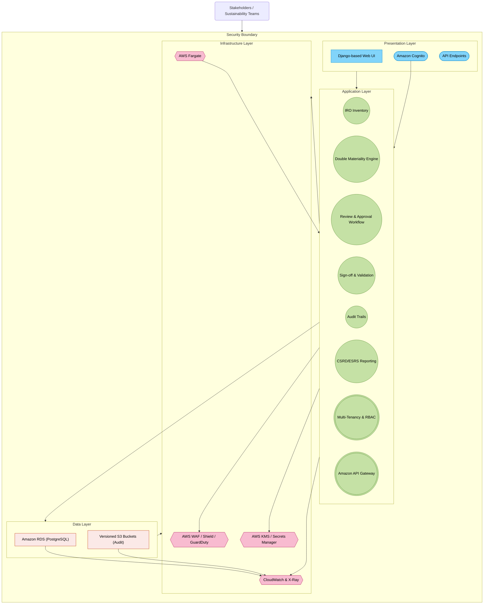
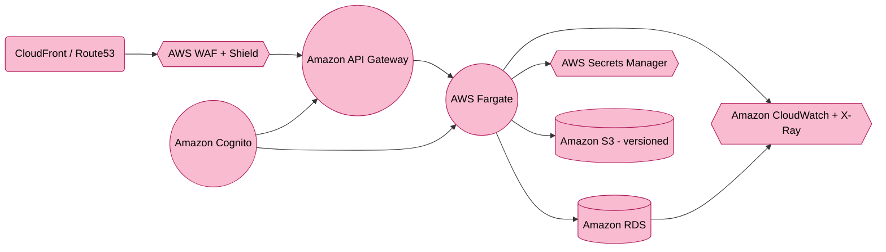

    <context>
        <project_type>Double Materiality Assessment System Development</project_type>
        <framework>EU CSRD Compliance</framework>
        <primary_goal>Consoldiate the current bank of architectural and developmentQ&A</primary_goal>
    </context>


<context on Double materiality assessments>
Definitions in the Context of EU CSRD:

1. DMAs (Double Materiality Assessments):
   - Definition: DMAs involve assessing sustainability matters from two perspectives:
     - Impact Materiality: The company's actual or potential effects on people and the environment.
     - Financial Materiality: The effects of sustainability matters on the company’s financial performance, position, cash flows, and access to finance.

2. IROs (Impacts, Risks, and Opportunities):
   - Definition: IROs are the sustainability-related impacts, risks, and opportunities that companies must evaluate and report on:
     - Impacts: Actual or potential effects on society and the environment.
     - Risks: Potential adverse effects on the company’s business if sustainability matters are neglected.
     - Opportunities: Positive outcomes or benefits from addressing sustainability matters.

Criteria for Assessment:

1. Impact Materiality Criteria (within DMA):
   - Scale: The gravity of the impact.
   - Scope: The number of individuals/environment affected.
   - Irremediable Character: Difficulty in reversing or compensating for the impact.
   - Likelihood (for potential impacts): Probability of occurrence.

2. Financial Materiality Criteria (within DMA):
   - Magnitude: Expected financial effects on performance, position, cash flows, access to finance, and cost of capital.
   - Likelihood: Probability of financial impact occurring.

Assessment Process:

1. DMAs:
   - Context Understanding: Analyze the business model, value chain, and stakeholders.
   - Identification of IROs: Map out actual and potential sustainability matters.
   - Application of Criteria:
     - Apply severity, scale, scope, and likelihood for impact materiality.
     - Apply magnitude and likelihood for financial materiality.
   - Consolidation: Determine material IROs based on impact and financial perspectives.

2. IROs:
   - Impacts: Assess severity, scale, scope, and likelihood.
   - Risks & Opportunities: Assess financial magnitude and likelihood.

Overall Process:

1. Step A: Understand the context (business model, value chain, stakeholders).
2. Step B: Identify actual and potential IROs.
3. Step C: Assess and determine material IROs using double materiality (impact and financial).
4. Step D: Report process and outcomes as per ESRS (European Sustainability Reporting Standards).

Key Reporting Elements:
- Document methodologies, thresholds, and stakeholder engagement processes.
- Disclose material IROs and their interactions with business strategy.
- Provide transparency regarding omissions or non-material topics.

</context on Double materiality assessments>


<solution design document>
# **Purpose-Built Double Materiality Assessment (DMA) SaaS Solution Design Document (AWS Edition)**

## **1. Executive Summary**

This document outlines a **purpose-built Double Materiality Assessment (DMA) SaaS platform**, enabling organizations to track, assess, and report **Impacts, Risks, and Opportunities (IROs)** from both **Impact Materiality** and **Financial Materiality** perspectives per **EU CSRD** and **ESRS** requirements. It integrates the following **refined recommendations** from a respected colleague:

1. **Security Implementation Upgrades**: Holistic audit logging, immutable storage, and strong AWS security services (e.g., WAF, Shield, Cognito, KMS).  
2. **Infrastructure Optimization**: Use **AWS Fargate** initially for container workloads to reduce operational overhead; rely on **Amazon RDS** (PostgreSQL) for primary data storage.  
3. **Revised Feature Phases**: Three-phase approach focusing on security and core features first, advanced capabilities next, and global scale thereafter.  
4. **Cost-Effective Security**: Start with AWS Shield Standard, integrate only necessary security features up front, and scale capabilities based on emerging threats.

The **updated design** ensures improved security posture from day one, reduces complexity in initial deployments, and provides a clear roadmap to scale capabilities and features over time.

---

## **2. System Architecture Overview**

### **2.1 High-Level Architecture**

The solution is organized into four layers:

1. **Presentation Layer**  
   - **User Interface** built using Django (Python) for Double Materiality dashboards and IRO management.  
   - **API Endpoints** for external linkage (ESG data, stakeholder portals).  
   - **Authentication/Authorization** via **Amazon Cognito** (supporting MFA, social logins, and SSO).

2. **Application Layer**  
   - **Core DMA Features**: IRO Inventory, Double Materiality Engine, Workflow Approvals, Audit Trails, ESRS Reporting.  
   - **Enterprise Extensions**: Multi-tenancy, row-level security in RDS, RBAC, integration with **Amazon API Gateway**.  
   - **Serverless Workflow** (optional): AWS Lambda or AWS Step Functions for background tasks (report generation, notifications).

3. **Data Layer**  
   - **Primary Database**: **Amazon RDS (PostgreSQL)** for critical data storage, row-level security, audit logging.  
   - **Optional DynamoDB** (future high-throughput needs): Skipped initially unless specific performance or global distribution use cases arise.  
   - **Immutable Audit Storage**: Use versioned **Amazon S3** buckets for storing logs/audit trails if tamper-evident archives are required.

4. **Infrastructure Layer**  
   - **Container Orchestration**: **AWS Fargate** for containerized Django services (option to migrate to full EKS if operational scale warrants it).  
   - **Network & Security**: AWS WAF, Security Groups, AWS Shield (Standard to start, upgrade if needed), Amazon GuardDuty, Cognito, KMS.  
   - **Monitoring & Observability**: Amazon CloudWatch, AWS X-Ray for distributed tracing, AWS Security Hub, and AWS Backup.

**High-Level Architecture Diagram** (using Mermaid):



---

### **2.2 Technology Stack Details**

- **Application Framework**: **Django (Python)** for rapid development, robust security defaults, and admin UI.  
- **Container Deployment**: **AWS Fargate** tasks or services to reduce the operational overhead of managing Kubernetes.  
  - *Future Option*: Migrate to **Amazon EKS** if advanced orchestration, custom scheduling, or large-scale microservices demands arise.  
- **Database**: **Amazon RDS (PostgreSQL)** with row-level security for multi-tenancy, encryption at rest, and simplified audit trails.  
  - **Potential DynamoDB** usage if extremely high-scale or globally distributed data ingestion is needed later.  
- **Security Services**: AWS WAF, Security Groups, AWS Shield (Standard initially, upgrade if needed), Amazon Cognito, AWS KMS.  
- **Observability**: Amazon CloudWatch (metrics, logs), AWS X-Ray (tracing), and AWS Security Hub to unify security findings.

---

## **3. Core Functionality Design**

### **3.1 Detailed Component Breakdown**

1. **IRO Inventory Management**  
   - Captures **Impacts, Risks, and Opportunities** with properties such as category, financial exposure, likelihood, severity, etc.  
   - Integrates with external ESG data providers for real-time sustainability metrics.  
   - Ensures multi-tenant isolation at the row level via PostgreSQL.

2. **Double Materiality Assessment Engine**  
   - **Impact Materiality**: Evaluates external impact magnitude, scope, and likelihood.  
   - **Financial Materiality**: Assesses financial severity and probability of risks/opportunities.  
   - Combines both to identify the most critical IROs for compliance and strategic decisions.

3. **Review & Approval Workflow**  
   - Configurable stage-based review: *Draft → In_Review → Approved → Disclosed*.  
   - Incorporates role-based escalations and notifications via Amazon EventBridge or AWS Lambda triggers.  
   - Flexible time-bound reviews to meet compliance deadlines.

4. **Sign-off & Validation**  
   - Electronic sign-off with a tamper-proof audit trail.  
   - Supports third-party eSignature services if required (DocuSign, Adobe Sign).  
   - Sign-off records stored in **versioned S3** or **immutable** data structures if long-term immutability is needed.

5. **Audit Trails & Logging**  
   - Comprehensive logging (create, update, delete actions) across all modules.  
   - Uses CloudWatch Logs + AWS X-Ray for advanced correlation; optionally store logs in **S3** with versioning for immutability.  
   - Facilitates SOC 2, GDPR, and general compliance requirements from day one.

6. **CSRD/ESRS Reporting**  
   - Generates standardized reports for Impact Materiality, Financial Materiality, and overall alignment with ESRS.  
   - Publish to PDF, CSV, or Excel; push to external systems via **Amazon API Gateway** or S3 pre-signed URLs.

7. **Multi-Tenancy & RBAC**  
   - **Row-level security** enforced at the database layer for strict tenant data isolation.  
   - Role-based access controls to limit unauthorized user actions.  
   - Extendable to more granular permission sets if needed.

8. **API Integrations & Gateways**  
   - **Amazon API Gateway**: Rate limiting, request transformation, and easy versioning.  
   - **Webhook Support**: Outbound webhooks for real-time updates or integrated reporting workflows.  
   - Employ Edge-optimized endpoints if global low-latency access is needed.

---

### **3.2 Data Models and Relationships**

Below is a high-level representation of the primary entities:

```
 IRO                1--n       DMAssessment
 ┌─────────────┐                ┌────────────────────────┐
 │iro_id (PK)   │                │assessment_id (PK)      │
 │tenant_id     │<--------------│iro_id (FK -> IRO)      │
 │type          │               │impact_materiality_json │
 │title         │               │financial_materiality_json
 │description   │               │aggregated_score        │
 │...           │               │assessed_on             │
 └─────────────┘               └────────────────────────┘

 Review             1--n        Signoff
 ┌─────────────┐                ┌─────────────────────┐
 │review_id (PK)│                │signoff_id (PK)      │
 │iro_id (FK)   │<--------------│review_id (FK ->Review)
 │reviewer_id   │               │signed_by            │
 │status        │               │signed_on            │
 │...           │               │signature_ref        │
 └─────────────┘               └─────────────────────┘

         AuditTrail
         ┌─────────────────────────────┐
         │audit_id (PK)               │
         │tenant_id                   │
         │entity_type                 │
         │entity_id                   │
         │action                      │
         │timestamp                   │
         │data_diff (JSON)            │
         └─────────────────────────────┘
```

- **Tenant-Aware**: Each record includes a `tenant_id` for multi-tenant partitioning.  
- **Row-Level Security**: PostgreSQL policies can restrict row access based on `tenant_id`.  
- **Auditing**: Logs every action for compliance, with optional storage in immutable S3.

---

### **3.3 API Design and Endpoints**

- **`POST /api/v1/iros/`**: Create a new IRO.  
- **`GET /api/v1/iros/`**: Retrieve a list of IROs (supports filtering, pagination).  
- **`GET /api/v1/iros/{iro_id}/`**: Get details of a specific IRO.  
- **`POST /api/v1/iros/{iro_id}/assessments/`**: Create a Double Materiality Assessment.  
- **`GET /api/v1/reviews/{review_id}/`**: Retrieve a specific review’s status.  
- **`POST /api/v1/reviews/{review_id}/signoff/`**: Perform sign-off.  
- **`GET /api/v1/audittrails/`**: Query system audit logs.  
- **`GET /api/v1/csrd-reports/`**: Generate or retrieve a pre-built CSRD/ESRS report.

**Authentication & Authorization**  
- All endpoints require **Amazon Cognito** JWT tokens (Bearer).  
- RBAC enforced in Django and row-level security in RDS.  

**Rate Limiting & Versioning**  
- **Amazon API Gateway** handles rate limits and usage plans (e.g., 100 requests/min per user).  
- **Versioning** strategy: URL-based versioning (`/api/v1` → `.../v2`).

---

## **4. Enterprise Architecture Considerations**

### **4.1 Scalability and Performance**

1. **Compute Scalability**  
   - **AWS Fargate** tasks autoscale based on CPU or memory thresholds.  
   - Evaluate migrating to **Amazon EKS** if more control over container orchestration is needed (e.g., sidecar proxies, node-level customizations).

2. **Database Scaling**  
   - **Amazon RDS (PostgreSQL)** can be vertically scaled or use read replicas.  
   - Implement partitioning if extremely large data sets become the norm.

3. **Caching**  
   - **Amazon ElastiCache (Redis)** for frequently accessed data (e.g., aggregated DMA results, reference data).  
   - Improves performance under heavy read loads.

4. **CDN/Global Deployment**  
   - **Amazon CloudFront** or **AWS Global Accelerator** for global content delivery, especially for distributed tenant bases.  
   - Multi-region architecture in Phase 3 if agility and data residency demands arise.

5. **Performance Monitoring**  
   - **Amazon CloudWatch** (metrics, logs), AWS X-Ray (tracing).  
   - Review logs in real time to proactively address latency or resource bottlenecks.

---

### **4.2 Security Architecture**

1. **Security Implementation (Refined)**  
   - **Comprehensive Audit Trails**: Log all system events and changes to an immutable store (versioned S3).  
   - **WAF, Shield, Security Groups**: Protect application endpoints from common threats and DDoS.  
   - **Data Encryption**: KMS for RDS, server-side encryption for S3.  
   - **Row-Level Security**: Strict multi-tenant data isolation at the database layer.  
   - **Cognito Authentication**: Enforce MFA and single sign-on integration.

2. **Compliance & Governance**  
   - Align with **SOC 2**, **GDPR**, and emerging **CSRD/ESRS** guidelines.  
   - Periodic penetration testing and vulnerability scans.  
   - Use **AWS Security Hub** + **GuardDuty** to centralize security alerts.

3. **Identity & Access Management**  
   - **Least Privilege**: Limit IAM roles and security group scope.  
   - Integrate AWS Organizations for environment-wide service control policies.  
   - Maintain read-only audit logs for forensic review if needed.

4. **Cost-Effective Security**  
   - Use **AWS Shield Standard** initially (upgrade to Advanced as threats escalate).  
   - Implement the essential logging and threat detection; add advanced tooling only when justified by risk profile.  
   - Leverage built-in RDS/PostgreSQL security before expanding with specialized third-party tools.

---

### **4.3 Azure Infrastructure Design (Adapted for AWS)**

*(Note: The original heading mentions Azure. Below is the AWS-equivalent design to maintain consistency with the rest of the document.)*

1. **AWS Fargate Deployment**  
   - Simple container context: Fargate tasks for Django web services.  
   - Automatic patching and minimal management overhead.

2. **Amazon RDS (PostgreSQL)**  
   - Multi-AZ configuration for high availability.  
   - Point-in-time recovery, backups configured with AWS Backup.  
   - Row-level security for multi-tenant separation.

3. **Networking & Security**  
   - Private subnets for application tasks and database.  
   - Public subnets only for load balancers / API Gateway endpoints.  
   - VPC flow logs for tracing inbound/outbound traffic.

4. **Monitoring & Logging**  
   - **Amazon CloudWatch** for container metrics, AWS X-Ray for application tracing.  
   - **AWS Security Hub** + **GuardDuty** for threat detection and compliance checks.

---

## **5. Implementation Recommendations**

### **5.1 Development Phases (Refined)**

**Phase 1: Essential Security + Core Features**  
- **Multi-tenant data isolation** using row-level security in RDS.  
- **Basic IRO management** (Impacts, Risks, Opportunities).  
- **Fundamental Double Materiality** calculations for Impact & Financial aspects.  
- **Core Security Controls**: WAF, Shield Standard, Security Groups, KMS encryption.  
- **Advanced Workflows**: Review & Approval pipelines.  
- **Detailed Audit Trails**: CloudWatch logs, versioned S3 for immutable storage.

**Phase 2: Enhanced Capabilities**  
- **AI/ML Analytics**: Integrate advanced analytics (e.g., Amazon SageMaker) for risk forecasting or materiality scoring.  
- **Extended Integrations**: Connect external ESG data, third-party sign-off platforms, or ERPs.  
- **API Maturity**: Expand versioning, webhook subscriptions, refined rate limits in API Gateway.

**Phase 3: Scale + Future Features**  
- **Multi-Region Support**: Active-passive or active-active architecture for global coverage.  
- **Disaster Recovery**: Cross-region replication for RDS, region failover strategies.  
- **Additional Features**: Based on market demand (e.g., real-time IoT data ingestion, partner marketplaces).

---

### **5.2 Best Practices**

- **Infrastructure as Code**: Use CloudFormation, AWS CDK, or Terraform to provision environments reliably.  
- **DevSecOps**: Integrate scanning tools (SAST/DAST) in pipelines, adopt automatic container image checks.  
- **Zero Trust**: Enforce least privilege, strong identity controls, and isolate workloads in separate VPC subnets.  
- **Regular DR Drills**: Validate RPO (Recovery Point Objective) / RTO (Recovery Time Objective) with simulated failovers.  
- **Cost Optimization**: Monitor usage in AWS Cost Explorer, adopt instance savings plans or Fargate savings if usage patterns are predictable.

---

## **6. Appendices**

### **6.1 Database Schema (Example)**

```sql
CREATE TABLE dbo.IRO (
    iro_id SERIAL PRIMARY KEY,
    tenant_id INT NOT NULL,
    type VARCHAR(20) NOT NULL, -- Impact, Risk, Opportunity
    title VARCHAR(255) NOT NULL,
    description TEXT,
    category VARCHAR(100),
    owner_id INT NOT NULL,
    created_on TIMESTAMP NOT NULL DEFAULT NOW()
);

CREATE TABLE dbo.DMAssessment (
    assessment_id SERIAL PRIMARY KEY,
    iro_id INT NOT NULL REFERENCES dbo.IRO(iro_id),
    impact_materiality_json TEXT,
    financial_materiality_json TEXT,
    aggregated_score NUMERIC(5,2),
    assessed_on TIMESTAMP NOT NULL DEFAULT NOW(),
    assessed_by INT NOT NULL
);

CREATE TABLE dbo.Review (
    review_id SERIAL PRIMARY KEY,
    iro_id INT NOT NULL REFERENCES dbo.IRO(iro_id),
    reviewer_id INT NOT NULL,
    status VARCHAR(50) NOT NULL,
    created_on TIMESTAMP NOT NULL DEFAULT NOW()
);

CREATE TABLE dbo.Signoff (
    signoff_id SERIAL PRIMARY KEY,
    review_id INT NOT NULL REFERENCES dbo.Review(review_id),
    signed_by INT NOT NULL,
    signed_on TIMESTAMP NOT NULL DEFAULT NOW(),
    signature_ref VARCHAR(255)
);

CREATE TABLE dbo.AuditTrail (
    audit_id SERIAL PRIMARY KEY,
    entity_type VARCHAR(50),
    entity_id INT,
    action VARCHAR(50),
    user_id INT,
    tenant_id INT,
    timestamp TIMESTAMP NOT NULL DEFAULT NOW(),
    data_diff TEXT
);
```

- **Tenant Field**: `tenant_id` is crucial for row-level security.  
- **RLS Policies**: One policy per table can restrict `tenant_id` to the user’s assigned tenant.  
- **Backups**: Enabled automatically in RDS; use AWS Backup and store long-term in S3.

---

### **6.2 API Documentation (Sample)**

| Endpoint                                          | Method | Description                                                          | Auth Required | Rate Limit/min |
|---------------------------------------------------|--------|----------------------------------------------------------------------|--------------|---------------|
| `/api/v1/iros/`                                   | POST   | Create a new IRO                                                     | Yes          | 50            |
| `/api/v1/iros/`                                   | GET    | List/filter existing IROs                                           | Yes          | 100           |
| `/api/v1/iros/{iro_id}/`                          | GET    | Retrieve a single IRO                                               | Yes          | 100           |
| `/api/v1/iros/{iro_id}/`                          | PUT    | Update a specific IRO                                               | Yes          | 50            |
| `/api/v1/iros/{iro_id}/assessments/`              | POST   | Submit a Double Materiality Assessment                              | Yes          | 50            |
| `/api/v1/reviews/`                                | GET    | List reviews (filter by status, date)                               | Yes          | 100           |
| `/api/v1/reviews/{review_id}/signoff/`            | POST   | Provide digital sign-off for a review                               | Yes          | 25            |
| `/api/v1/audittrails/`                            | GET    | Query system audit logs                                             | Yes          | 100           |
| `/api/v1/csrd-reports/`                           | GET    | Generate/fetch CSRD/ESRS compliance reports                         | Yes          | 25            |

- **Versioning**: Additional endpoints or changes introduced at `/api/v2/...`.  
- **Webhooks**: Subscribe to changes in IRO or assessment statuses, configured via custom endpoints.

---

### **6.3 Infrastructure Diagrams (AWS Fargate Emphasis)**



- **AWS Fargate**: Runs containers with minimal operational overhead.  
- **Amazon RDS**: Managed PostgreSQL for the core data store.  
- **S3 (Versioned)**: Storing immutable logs/audit evidence.  
- **CloudWatch/X-Ray**: Central logging, tracing, and metric analysis.

---

## **Conclusion**

By adopting **AWS Fargate** for containers, focusing on **Amazon RDS** for data isolation, and embedding **day-one security** through comprehensive auditing, encryption, and threat detection, this updated design balances ease of implementation with the flexibility to grow. **Phased feature** rollouts ensure critical security and multi-tenant needs are met first, followed by advanced analytics and global scale in later phases. Future enhancements—like migrating to **Amazon EKS** for more granular container orchestration or incorporating **DynamoDB** for specific high-volume use cases—are still possible. Ultimately, this approach provides a **cost-effective, secure, and compliant** foundation for a Double Materiality Assessment SaaS platform, ready to satisfy **EU CSRD**, **ESRS**, and broader enterprise requirements. 
</solution design document>

    <instructions>
        <main_task>
            Consolidate the provided Q&A bank
        </main_task>
        
        <response_structure>
            <section name="assessment_framework">Questions about assessment methodology and framework implementation</section>
            <section name="data_architecture">Questions about data storage, processing, and integration</section>
            <section name="user_interface">Questions about user interaction and reporting interface</section>
            <section name="compliance">Questions about regulatory compliance and audit requirements</section>
        </response_structure>

        <output_format>
            For each question:
            - Number each question sequentially
            - Include one recommended solution with justification
            - Format as specified in output instructions
        </output_format>
    </instructions>

    <evaluation_criteria>
        <criterion>Technical feasibility</criterion>
        <criterion>Compliance with EU CSRD</criterion>
        <criterion>Scalability</criterion>
        <criterion>Maintainability</criterion>
        <criterion>User experience</criterion>
    </evaluation_criteria>


<current Q&A Bank>
---

## 1. **Assessment Framework**

---

### **Question 1**
**How should the Double Materiality Assessment scoring be structured or implemented to handle organization-specific rubrics while maintaining consistent core criteria?**

**Recommended Solution:**
- Provide a **baseline rubric** using the essential Double Materiality criteria:
  - **Impact Materiality:** Severity/Scale/Scope/Irremediability (for negative impacts) plus Likelihood.  
  - **Financial Materiality:** Magnitude (financial significance) plus Likelihood.
- Allow each **organization to customize** numeric scales (e.g., 1–5) and interpretation guidelines (how “3” is defined).
- **Version** each rubric so that changes are tracked over time and linked to specific assessments.

**Justification:**
- Ensures **compliance** with EU CSRD by covering the core impact and financial criteria.
- **Flexibility** accommodates sector- or organization-specific differences, allowing each tenant to refine how they measure severity or magnitude.
- **Version control** creates transparency and auditability for any scoring changes.

---

### **Question 2**
**How frequently should organizations update their Double Materiality Assessments to remain compliant with EU CSRD?**

**Recommended Solution:**
- Conduct a **comprehensive annual** review of all IROs for formal reporting.
- Perform **quarterly or biannual “spot checks”** on high-priority or rapidly evolving risks and impacts.

**Justification:**
- An **annual** cycle aligns with CSRD’s disclosure cadence.
- **Periodic interim reviews** ensure critical changes are addressed promptly, reducing the risk of outdated data influencing strategic decisions.

---

### **Question 3**
**Which approach should be used to identify and categorize IROs (Impacts, Risks, and Opportunities) across various business units and supply chains?**

**Recommended Solution:**
- Adopt a **hybrid taxonomy** anchored to recognized standards (e.g., ESRS categories) but allow **custom sub-categories** for unique industry or site-specific IROs.
- Incorporate **stakeholder input** and cross-functional reviews to ensure comprehensive identification.

**Justification:**
- **Standardization** to ESRS ensures consistency and makes external reporting simpler.
- **Customization** allows organizations in specialized sectors (e.g., mining, pharmaceuticals) to capture specific IRO nuances.
- Engaging multiple stakeholders promotes **internal alignment** and thorough risk/impact discovery.


---

## 2. **Data Architecture**

---

### **Question 4**
**What is the optimal approach for storing and managing assessment evidence (e.g., documents, images) linked to IROs?**

**Recommended Solution:**
- Store **files in Amazon S3** (enabling versioning and lifecycle policies).
- Keep **structured metadata** (file references, timestamps, context) in the main database (e.g., Amazon RDS).

**Justification:**
- **S3** scales cost-effectively and supports immutability/versioning of large files.
- Storing **pointers** in the relational DB maintains quick reference for searching, sorting, and auditing.

---

### **Question 5**
**How should the system handle data integration with existing ESG systems?**

**Recommended Solution:**
- Support **file-based batch imports** (CSV/Excel) for large or historical data sets.
- Where possible, implement a **REST API or ETL layer** to automate data ingestion from common ESG platforms.

**Justification:**
- **Batch imports** simplify initial or periodic large-scale data transfers.
- An **API-based approach** allows near-real-time updates and a more modern integration path for systems that expose web services.

---

### **Question 6**
**How should the solution handle the storage of granular Impact Materiality and Financial Materiality scoring data?**

**Recommended Solution:**
- Create **dedicated tables** (e.g., `impact_materiality`, `financial_materiality`) or well-defined JSON columns to capture each dimension (scale, scope, magnitude, likelihood).
- Reference these detail tables from a main **assessments** table via foreign keys.

**Justification:**
- **Normalized** separation provides clarity, reduces redundancy, and facilitates easier reporting queries.
- Storing data with **clear foreign-key relationships** keeps the schema extensible as scoring criteria evolve.

---

### **Question 7**
**What is the best strategy for archiving older IRO records and their assessments while still retaining accessibility for audit or compliance checks?**

**Recommended Solution:**
- Move IRO records older than a defined threshold (e.g., 5 years) to **Amazon S3 (with Glacier)** for cheaper long-term storage.
- Keep **minimal references** in the main DB to allow quick lookups and retrieval on-demand.

**Justification:**
- **Lower storage costs** and a leaner primary database improve performance.
- S3 and Glacier offer **durability** and compliance features (versioning, retrieval logs).
- References ensure **faster compliance responses** whenever older data must be accessed.

---

### **Question 8**
**Which data model strategy is most appropriate for storing and linking IRO records with their respective Double Materiality Assessments?**

**Recommended Solution:**
- Maintain **separate relational tables** for:
  1. **IRO** (Impacts, Risks, Opportunities)
  2. **Impact Materiality** data
  3. **Financial Materiality** data
  4. **Assessments** (linking IRO to the scoring details)
- Join them with **foreign keys** to ensure data integrity.

**Justification:**
- **Logical separation** improves clarity and maintainability.
- **Relational integrity** enforces consistent links among IROs, Impact/Financial scoring, and final assessments.
- Facilitates **scalable queries** for reporting, auditing, and analytics.

---

Below are the **updated Q&As** reflecting a **single database with multiple schemas** as the **baseline** for most tenants, and **fully separate database instances** for premium or highly regulated clients.

---

### **Question 9**  
**How should the platform manage multi-tenancy at the database level to ensure data isolation and scalability?**

**Recommended Solution:**  
- **Baseline:** Use a **single database** with **separate schemas** for each tenant, ensuring logical isolation without requiring multiple physical instances.  
- **Premium Option:** For tenants with elevated performance or compliance demands, offer a **dedicated database** instance.

**Justification:**  
- **Multiple Schemas** in one DB provide clearer per-tenant isolation than simple row-level security, yet remain much simpler and cheaper than running multiple databases.  
- **Full Isolation** (separate DB instances) can be offered to large or compliance-heavy clients who demand dedicated resources.  
- This **hybrid** approach streamlines cost and operational overhead for the majority of tenants while still accommodating specialized requirements.


---

## 3. **User Interface**

---

### **Question 10**
**What is the most effective way to present materiality assessment results to decision-makers?**

*(Combining “What is the most effective way to present materiality assessment results?” and “Which approach should the platform take to visualize the final double materiality outcomes?”)*

**Recommended Solution:**
- Provide a **default 2x2 materiality matrix** at the sustainability topic level (Impact severity vs. Financial magnitude).
- Offer **drill-down** visualizations (heatmaps, radar charts) for deeper analysis at the IRO level.

**Justification:**
- A **2x2 matrix** is widely recognized and easy to interpret for executives.
- **Additional visualizations** cater to sustainability experts needing more granular insights.
- This approach gives a **high-level snapshot** plus the flexibility for advanced exploration.

---

### **Question 11**
**How should the system handle collaborative assessment workflows for multiple reviewers or roles?**

*(Combining “How should the system handle collaborative assessment workflows?” and “How should the platform accommodate reviewer roles and approval flows?”)*

**Recommended Solution:**
- Implement a **configurable workflow engine** with both **sequential** (e.g., CFO after Sustainability Manager) and **parallel** (e.g., finance and sustainability teams concurrently) review paths.
- Allow **conditional routing** (if high severity, require additional approval).

**Justification:**
- Different organizations have **varied governance** structures, so a flexible workflow tool can adapt to either simple or complex sign-off paths.
- **Conditional** logic ensures high-severity or high-impact items get **escalated** to the right approvers.

---

### **Question 12**
**What UI approach should be taken to accommodate various user roles (Sustainability Manager, CFO, Auditor, etc.) for Double Materiality Assessments?**

**Recommended Solution:**
- Provide a **unified dashboard** and dynamically reveal or restrict features based on **role permissions** (RBAC).
- Offer **role-specific default layouts** (e.g., CFO sees financial materiality first, Sustainability Manager sees impact severity first).

**Justification:**
- A **single interface** simplifies development and reduces training overhead.
- **Role-based configuration** ensures each user quickly accesses data relevant to their function while maintaining data governance and security.

---

### **Question 13**
**How should the system represent and guide users through Impact vs. Financial Materiality in the UI?**

*(Combining “How should the UI guide users in applying both Impact Materiality and Financial Materiality criteria?” and “How should the system represent and visualize Impact vs. Financial Materiality in the UI?”)*

**Recommended Solution:**
- Implement a **step-by-step wizard** that first prompts for **impact criteria** (scope, scale, likelihood) and then **financial criteria** (magnitude, likelihood).
- Display a **combined “Double Materiality” overview** (e.g., 2x2 matrix) once both steps are complete.

**Justification:**
- Separating **impact vs. financial** inputs reduces confusion for non-expert users.
- The **wizard approach** ensures data completeness for each perspective.
- A final **combined** view helps teams understand the full spectrum of materiality in one place.

---

### **Question 14**
**What approach should be used to guide non-expert users through the DMA process (e.g., identifying IROs, setting severity, etc.)?**

**Recommended Solution:**
- Provide a **wizard-style** interface with **mandatory fields** at each step.
- Embed **tooltips** and **contextual help** that define each criterion (e.g., how “irreversibility” is measured).
- Optionally, integrate a **virtual assistant** or chatbot for quick Q&A on methodology.

**Justification:**
- A **guided workflow** minimizes errors and ensures consistent data input.
- **Contextual help** clarifies technical terms, fostering user confidence.
- A **chatbot** offers real-time clarifications for complex sustainability concepts.

---

### **Question 15**
**How should final reports (aligned with ESRS requirements) be generated and shared with stakeholders?**

**Recommended Solution:**
- Generate **PDF and Excel** reports **on-demand**, storing them securely on the platform.
- Allow **role-based access** for direct download or a **secure link** to share externally.
- Optionally provide **API endpoints** to feed data into external compliance systems.

**Justification:**
- **PDF/Excel** are universally recognized formats suitable for regulatory submission and board reviews.
- **On-demand** generation ensures that data is always current.
- Secure sharing respects confidentiality while **facilitating collaboration** and external audits.

---

## 4. **Compliance**

---

### **Question 16**
**Which security and privacy frameworks should be prioritized to align with EU CSRD and stakeholder expectations?**

**Recommended Solution:**
- Implement **SOC 2 Type II** controls for operational security and **GDPR** compliance for personal data protection.
- Add **ESRS-specific controls** for sustainability data (e.g., verifying data integrity for IRO metrics).

**Justification:**
- **SOC 2** covers critical aspects of data security, availability, and integrity.
- **GDPR** handles personal data requirements, vital for EU jurisdictions.
- **CSRD/ESRS** alignment ensures the platform can handle sustainability disclosures in a **transparent and trustworthy** manner.

---

### **Question 17**
**How should the system handle audit trails to demonstrate compliance with ESRS reporting and internal governance?**

*(Combining “How should the system maintain audit trails for assessment changes?” “How should the system handle audit trails to demonstrate compliance?” and related duplicates.)*

**Recommended Solution:**
- Use an **event-sourcing** or **comprehensive audit table** approach capturing **every state change** (who, what, when).
- Regularly **archive** critical events to **immutable storage** (e.g., versioned S3 or QLDB).

**Justification:**
- **Event-sourcing** provides fine-grained history and easy replays of changes.
- **Immutable backups** meet regulatory demands for integrity and tamper-evidence.
- This model facilitates **robust audits** and supports forensic analysis if needed.

---

### **Question 18**
**What should be the policy for disclosing non-material IROs under CSRD guidelines if stakeholders request them?**

**Recommended Solution:**
- Allow a **user-configurable toggle** to include/exclude non-material IROs in standard reports.
- Provide a **separate “full list” export** for stakeholders who request deeper transparency.

**Justification:**
- **CSRD** emphasizes material disclosures but does not prohibit revealing non-material items if relevant.
- A **toggle** or separate export meets stakeholder requests without cluttering mainstream reports.
- Maintains **flexibility** for organizations that want to demonstrate openness.

---

### **Question 19**
**How can we demonstrate that stakeholder engagement processes (a key CSRD requirement) have been incorporated into the Double Materiality Assessment?**

*(Combining “How can we demonstrate stakeholder engagement?” with “How should the platform address the CSRD requirement to involve stakeholder engagement?”)*

**Recommended Solution:**
- Provide **dedicated fields** or attachments within each IRO record to document **stakeholder input**, feedback forms, or minutes from engagement sessions.
- Track **engagement events** (e.g., meeting logs) in a separate table referencing each IRO.

**Justification:**
- Storing **stakeholder feedback** in the same system ensures traceability and compliance with CSRD requirements.
- Having an **audit trail** of engagement events shows how external input influenced final materiality decisions.

---

### **Question 20**
**Which mechanisms should be introduced to demonstrate alignment with ESRS guidelines and facilitate external audits?**

**Recommended Solution:**
- Develop a **standardized “DMA Results + ESRS Mapping”** export that correlates IRO data, double materiality results, and ESRS references.
- Implement a **compliance checklist** verifying that each required ESRS disclosure is addressed.

**Justification:**
- A **clear mapping** between your data and ESRS sections simplifies external audits and proves alignment.
- A **checklist** ensures no required disclosures are overlooked, supporting **internal governance** and regulatory clarity.

---

### *End of Consolidated Q&A Bank*
</consolidated>

<net new>
<assessment_framework>

**Question 4**  
**How should scenario analysis be integrated into the Double Materiality Assessment to account for future climate or regulatory changes?**  

**Recommended Solution: There is NO in-app integration of scenario analysis. Our solution will simply be a system of record for IROs. The user can certainly include results of climate scenario work as comments for relevant IROs.

---

**Question 5**  
**What mechanisms should be in place to capture short-term or emerging “flash” risks within the Double Materiality framework?**  
Rely on annual materiality updates, flagging any short-term events as “interim exceptions” that require a separate management sign-off.  

---

**Question 6**  
**How should stakeholder engagement be structured to enhance data quality and comprehensiveness in the Double Materiality Assessment process?**  
- **Recommended Solution:** Implement a digital stakeholder portal integrated with the DMA system, where approved users can submit insights or flag emerging IROs.  
- **Justification:** A dedicated stakeholder portal automates data capture and fosters ongoing dialogue. It provides traceability (who submitted which input, when) and integrates smoothly with the system’s core data model, improving both transparency and timeliness.

---

**Question 7**  
**How can the assessment framework handle multi-tier supply chains to ensure a robust analysis of Impact Materiality across all relevant suppliers and partners?**  
- **Recommended Solution:** the solution will by design integrate the complete end to end value chain, from upstream tier 2+ supplyers like raw material extraction to downstream tier 2+ like product end of life services. Each IRO will be tagged to one or more value chain locations.

---

**Question 8**  
**What is the best approach to integrating external ESG or GHG emissions data sources into the Double Materiality system architecture?**  
- **Option C:** Rely on manual uploads (CSV or Excel) for quarterly or annual data imports, focusing on data review prior to ingestion.  
- **Recommended Solution: ** Rely on manual uploads (CSV or Excel) for quarterly or annual data imports, focusing on data review prior to ingestion.    

</assessment_framework>


<section name="data_architecture">

  <question id="10">
    <text>How should we design the data model to accommodate stakeholder feedback at multiple levels (e.g., local site teams, CSR committees, board-level reviews) without causing schema bloat or redundant records?</text>
    <solutions>
      <solution>Create separate normalized tables (e.g., <em>Feedback</em>, <em>StakeholderGroup</em>, <em>FeedbackDetail</em>) linked by foreign keys to reduce redundancy.</solution>
    </solutions>
    <recommendedSolution>
      <text>Create separate normalized tables to isolate stakeholder feedback from core assessment data, linking via foreign keys.</text>
      <justification>
        This approach prevents schema bloat by centralizing feedback attributes in their own tables, ensures data integrity through relational constraints, and supports clear queries (e.g., per stakeholder group, feedback type) without imposing rigid or overly complex JSON structures.
      </justification>
    </recommendedSolution>
  </question>

  <question id="11">
    <text>What is the best method for ingesting near real-time environmental or financial metrics (e.g., energy consumption, carbon footprints) into the DMA platform?</text>
    <solutions>
      <solution>This is not a feature in the foreseable future</solution>
    </solutions>
  </question>

  <question id="12">
    <text>How should the system handle on-demand analytics (e.g., financial stress tests, scenario modeling) that require aggregating large volumes of assessment data?</text>
    <solutions>
      <solution>This is not a feature in the foreseable future</solution>
    </solutions>
  </question>

  <question id="13">
    <text>What strategy should be used to integrate external ESG or sustainability frameworks (e.g., GRI, SASB, TCFD) so that their data can be leveraged for a comprehensive Double Materiality Assessment?</text>
    <solutions>
     <solutions>
      <solution>This is not a feature in the foreseable future</solution>
    </solutions>
  </question>

  <question id="14">
    <text>How should the platform manage integration with external financial systems (e.g., ERP, accounting software) to correlate sustainability metrics with actual financial performance?</text>
    <solutions>
     <solutions>
      <solution>This is not a feature in the foreseable future</solution>
    </solutions>
  </question>


---

**Question 15**  
*How can we securely expose the DMA platform’s data resources to external clients, enabling them to read and update their IRO records via an API?*

**Recommended Solution:**  Leverage OAuth 2.0 (for example, via Amazon Cognito) to issue tokens with user-specific scopes and implement granular Role-Based Access Control (RBAC).  
Utilize OAuth 2.0 with Amazon Cognito for token issuance, integrated with granular RBAC in Django and enhanced by row-level security in the RDS backend.

**Justification:**  
This solution leverages a proven, standards-based authentication mechanism that simplifies token management and meets compliance requirements (including GDPR and EU CSRD). The use of OAuth tokens alongside per-tenant row-level security ensures that only authorized clients can access or modify their specific data while maintaining scalability and ease of maintenance.

---

**Question 16**  
*What measures can we implement to ensure that only authorized external clients can programmatically manipulate assessment data without introducing undue complexity?*

**Recommended Solution:**  
**Short-Lived Access Tokens:** Use fine-grained access tokens (based on OAuth 2.0) with short expiration periods, with validation enforced at the API Gateway.  
Implement fine-grained, short-lived access tokens via OAuth 2.0, with all token validations occurring at the Amazon API Gateway layer.

**Justification:**  
Short-lived tokens reduce the risk associated with compromised credentials while centralizing authentication and request validation at the gateway. This method is straightforward to maintain, scales efficiently during high-demand periods, and provides the granular access control required to meet both organizational policies and EU CSRD guidelines.

---

**Question 17**  
*How can the DMA platform maintain stable, secure, and backward-compatible API endpoints for clients who integrate deeply with the system over time?*

**Recommended Solution:**  
Implement a versioned REST API strategy (e.g., `/api/v1/`, `/api/v2/`) with established deprecation policies for older endpoints.  
Adopt a versioned REST API approach with clear documentation, deprecation timelines, and robust error handling measures.

**Justification:**  
Versioning ensures that clients have a predictable upgrade path without experiencing sudden breaking changes. Detailed documentation and scheduled deprecation policies build client confidence, ensure transparency, and help meet the EU CSRD requirement for consistent and auditable reporting, all while maintaining system stability and security.

---
  

**Question 18:**

**Q:**  
How should we automate tenant onboarding in a multi-tenant SaaS environment to minimize manual intervention and ensure consistent setup workflows?

**Recommended Solution:**  
Use an event-driven pipeline triggered by a self-service registration process for automated tenant resource provisioning, integrated with AWS services.
Use an event-driven pipeline (e.g., via AWS Lambda or Step Functions) triggered by a self-service registration form.  
  – This pipeline provisions tenant-specific configurations in the database and creates isolated resources (e.g., rows in RDS, S3 data folders).  

**Justification:**  
An event-driven approach removes most manual steps by executing standardized workflows for each new tenant. Leveraging AWS Lambda/Step Functions makes the pipeline extensible (e.g., for custom provisioning tasks) while ensuring consistency, scalability, and minimal operational overhead.

---

**Question 19:**

**Q:**  
What is the most efficient strategy for managing tenant lifecycle events (e.g., suspending, reactivating, or offboarding tenants) while adhering to compliance requirements?

**Recommended Solution:**  
Employ a centralized “Tenant Lifecycle” microservice that coordinates each lifecycle stage via well-defined, role-based APIs and updates tenant records in real time.
Design a centralized “Tenant Lifecycle” microservice that uses role-based APIs for each event (activate, suspend, offboard) and updates the tenant’s status while controlling data accessibility.  

**Justification:**  
A standalone microservice ensures a clean separation of concerns for lifecycle management. It consistently enforces policies (e.g., data retention, account suspension) and integrates with other system components (like billing and provisioning) without duplicating code. This structure also facilitates regulatory compliance tracking for EU CSRD by making lifecycle actions auditable.

---


### **Question 20**  
**How can we optimize database isolation for tenants who require more stringent performance or compliance guarantees without introducing unnecessary complexity for all tenants?**

**Recommended Solution:**  
Adopt a hybrid approach where, by default, each tenant resides in a **separate schema** within a single database. For higher-tier or compliance-driven tenants, allocate **fully isolated** database instances.  

Adopt a **hybrid model** in which most tenants have a **separate schema** within a single database, while advanced or strictly regulated tenants can be allocated their **own dedicated database** instance.

**Justification:**  
- **Multi-Schema** Baseline: Offers a higher degree of logical separation than row-level security alone, while minimizing operational complexity compared to many separate databases.  
- **Dedicated Database** for Premium Clients: Allows compliance-heavy or high-volume tenants to bypass any “noisy neighbor” issues and meet strict data isolation requirements.  
- **Balanced Cost and Complexity**: Avoids over-engineering for smaller tenants while still providing a path to robust isolation where mandatory. 

---

**Question 21:**

**Q:**  
Which approach should be used to provide tenant-specific customizations (e.g., branding, feature toggles) without complicating the core codebase?


**Recommended Solution:**  

Store customization metadata (including branding and enabled features) in a `tenant_config` table keyed by `tenant_id` and load it at runtime to drive theming or feature-flag mechanisms in the UI/API layer.  

Maintain a centralized `tenant_config` table to store branding and feature toggles, then load that data dynamically at runtime to drive tenant-specific customizations.

**Justification:**  
A centralized configuration table avoids code duplication and simplifies tracking and auditing of changes. It allows feature flags and branding data to be applied dynamically on a per-tenant basis, so that the core application code remains unified and maintainable.

---

**Question 22:**

**Q:**  
How can we ensure that automated tenant onboarding and lifecycle management processes remain resilient and recover gracefully from exceptions or partial failures?


**Recommended Solution:**  
Implement compensating transactions in workflows—incorporating rollback steps or automated notifications if a provisioning step fails—combined with idempotent operations for each step.  
Adopt compensating transactions with idempotent operations, ensuring that each workflow step can either complete successfully or rollback gracefully in the event of failures.

**Justification:**  
This design maintains data consistency across microservices. When steps are idempotent, partial failures become easier to manage, reducing the risk of orphaned resources or inconsistent states. Additionally, compensating transactions provide clear traceability, which is essential for compliance audits.

---


</section data_architecture >

<section billing>
<section name="data_architecture">

  <question id="18">
    <text>How should the DMA platform store billing details for subscription-based usage (e.g., plan tiers, usage limits, payment history) without overcomplicating the core Double Materiality data model?</text>
    <recommendedSolution>
      <text>Integrate with a well-established billing SaaS while maintaining only essential references (e.g., subscription ID, plan type) in the core RDS to align with multi-tenant structures.</text>
      <justification>Relying on a specialized billing service offloads complex financial processes—like tax compliance, invoice generation, and payment management—while maintaining a lightweight reference model within the double materiality platform. This reduces maintenance overhead, supports global payment methods, and preserves a clean separation of concerns.</justification>
    </recommendedSolution>
  </question>

  <question id="19">
    <text>What is the best approach for managing invoicing data—such as invoice generation, tracking, and adjustments—associated with multiple tenant accounts in the platform?</text>
    <recommendedSolution>
      <text>Maintain a lightweight Invoicing schema (invoice metadata, line items) in the core DB, with direct references to the tenant and subscription records, but integrate externally for advanced accounting features.</text>
      <justification>This approach balances immediate visibility of invoice data for reporting within the DMA platform while offloading complex accounting tasks (e.g., tax calculations, currency conversions) to external specialized systems when needed. It ensures straightforward multi-tenant data isolation via row-level security, supports compliance audits, and keeps the solution flexible for future enhancements.</justification>
    </recommendedSolution>
  </question>

  <question id="20">
    <text>How can the platform handle refunds, credits, or returns on billed amounts (e.g., if a tenant overpays or opts out mid-cycle) without disrupting the core Double Materiality Assessment workflows?</text>
    <recommendedSolution>
      <text>Maintain a separate Refund/Adjustment table that references the original invoice, capturing the refund amount, date, and rationale, and then reflect that in the tenant’s billing history.</text>
      <justification>Isolating refunds in a standalone table prevents confusion or overwrites in the primary invoice records while preserving a clear audit trail. It maintains data integrity for financial reporting, supports compliance examinations, and aligns with standard accounting practices by keeping original invoices intact.</justification>
    </recommendedSolution>
  </question>

</section billing>

</net new></current Q&A Bank>
