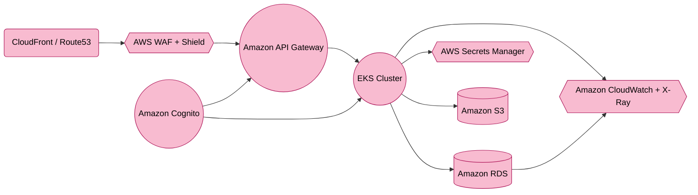

    <context>
        <project_type>Double Materiality Assessment System Development</project_type>
        <framework>EU CSRD Compliance</framework>
        <primary_goal>Analyze the provided Double Materiality Assessment context and generate critical architecture and development questions with options</primary_goal>
    </context>


<context on Double materiality assessments>
Definitions in the Context of EU CSRD:

1. DMAs (Double Materiality Assessments):
   - Definition: DMAs involve assessing sustainability matters from two perspectives:
     - Impact Materiality: The company's actual or potential effects on people and the environment.
     - Financial Materiality: The effects of sustainability matters on the company’s financial performance, position, cash flows, and access to finance.

2. IROs (Impacts, Risks, and Opportunities):
   - Definition: IROs are the sustainability-related impacts, risks, and opportunities that companies must evaluate and report on:
     - Impacts: Actual or potential effects on society and the environment.
     - Risks: Potential adverse effects on the company’s business if sustainability matters are neglected.
     - Opportunities: Positive outcomes or benefits from addressing sustainability matters.

Criteria for Assessment:

1. Impact Materiality Criteria (within DMA):
   - Scale: The gravity of the impact.
   - Scope: The number of individuals/environment affected.
   - Irremediable Character: Difficulty in reversing or compensating for the impact.
   - Likelihood (for potential impacts): Probability of occurrence.

2. Financial Materiality Criteria (within DMA):
   - Magnitude: Expected financial effects on performance, position, cash flows, access to finance, and cost of capital.
   - Likelihood: Probability of financial impact occurring.

Assessment Process:

1. DMAs:
   - Context Understanding: Analyze the business model, value chain, and stakeholders.
   - Identification of IROs: Map out actual and potential sustainability matters.
   - Application of Criteria:
     - Apply severity, scale, scope, and likelihood for impact materiality.
     - Apply magnitude and likelihood for financial materiality.
   - Consolidation: Determine material IROs based on impact and financial perspectives.

2. IROs:
   - Impacts: Assess severity, scale, scope, and likelihood.
   - Risks & Opportunities: Assess financial magnitude and likelihood.

Overall Process:

1. Step A: Understand the context (business model, value chain, stakeholders).
2. Step B: Identify actual and potential IROs.
3. Step C: Assess and determine material IROs using double materiality (impact and financial).
4. Step D: Report process and outcomes as per ESRS (European Sustainability Reporting Standards).

Key Reporting Elements:
- Document methodologies, thresholds, and stakeholder engagement processes.
- Disclose material IROs and their interactions with business strategy.
- Provide transparency regarding omissions or non-material topics.

</context on Double materiality assessments>


<Initial solution design>
# **Purpose-Built Double Materiality Assessment (DMA) SaaS Solution Design Document (AWS Edition)**

---

## **1. Executive Summary**

This document presents a **purpose-built Double Materiality Assessment (DMA) SaaS platform**, leveraging **Django** on **Amazon Web Services (AWS)**. The solution addresses the unique needs of organizations to track, assess, and report **Impacts, Risks, and Opportunities (IROs)** under **Impact Materiality** and **Financial Materiality** perspectives, as required by the **EU CSRD** and corresponding **European Sustainability Reporting Standards (ESRS)**.

### **Key Features and Goals**

- **Double Materiality Focus**: Built-in methodology to assess both *Impact Materiality* (effects on people/environment) and *Financial Materiality* (effects on the company’s finances).  
- **IRO Management**: Centralized platform to identify, assess, and monitor **Impacts**, **Risks**, and **Opportunities**, with clear workflows for stakeholder reviews.  
- **Multi-Tenant & Scalable**: Designed to handle multiple organizations with logically segregated data and robust autoscaling in AWS.  
- **Compliance & Security**: Aligns with SOC 2, GDPR, ISO 31000, and specific ESRS guidelines, ensuring data privacy and governance.  
- **Extensibility & Integration**: APIs for integration with existing sustainability tools, ERPs, and external data sources; extensible for AI-driven analytics.

---

## **2. System Architecture Overview**

### **2.1 High-Level Architecture**

The overall architecture is layered to accommodate sustainability data capture, advanced assessments, and streamlined reporting. It comprises four primary layers:

1. **Presentation Layer**  
   - **User Interface (Django-based web app)** for Double Materiality dashboards.  
   - **API Endpoints** (REST/GraphQL) for external integration (e.g., ESG data providers, stakeholder portals).  
   - **Authentication** via **Amazon Cognito** (supports SSO, multi-factor authentication, and social identity providers).

2. **Application Layer**  
   - **Core DMA Features**: IRO Inventory, Double Materiality Assessment Engine, Workflow Management, Stakeholder Sign-off, Audit Trails, and CSRD/ESRS Reporting.  
   - **Enterprise Extensions**: Multi-tenancy, Role-Based Access Control (RBAC), Data Segregation, Integration with **Amazon API Gateway** for rate limiting and versioning.  
   - **Serverless Workflows** (optional): AWS Lambda or AWS Step Functions to automate tasks such as generating summary reports or notifying reviewers.

3. **Data Layer**  
   - **Database**: Primarily **Amazon RDS** (e.g., PostgreSQL) for structured data (IRO records, workflows, assessments). Optionally, **Amazon DynamoDB** for large-scale or global data distribution.  
   - **Encryption & Key Management** via **AWS Key Management Service (KMS)** and **AWS Secrets Manager**.  
   - **Backup & Retention** using **AWS Backup** and **Amazon S3** (with lifecycle rules for archival in **S3 Glacier**).

4. **Infrastructure Layer**  
   - **AWS Services**: Amazon Elastic Kubernetes Service (EKS), AWS Identity and Access Management (IAM), Amazon EventBridge, Amazon API Gateway.  
   - **Security & Monitoring**: AWS WAF, Security Groups, AWS Shield, AWS GuardDuty, Amazon CloudWatch, and AWS X-Ray.  
   - **Scalability**: Autoscaling for application containers (EKS) and database (RDS read replicas or scaling tiers).

Below is a Mermaid diagram illustrating the **high-level architecture** on AWS:

```mermaid
flowchart TB
    classDef presentation fill:#81D4FA,stroke:#0288D1,color:#000,stroke-width:1px
    classDef core fill:#C5E1A5,stroke:#558B2F,color:#000,stroke-width:1px
    classDef enterprise fill:#C5E1A5,stroke:#2E7D32,color:#000,stroke-width:1px
    classDef data fill:#FBE9E7,stroke:#BF360C,color:#000,stroke-width:1px,shape:cylinder
    classDef infra fill:#F8BBD0,stroke:#AD1457,color:#000,stroke-width:1px

    User(Stakeholders / Sustainability Teams)
    User --> SB[Security Boundary]

    subgraph SB[Security Boundary]
      direction TB

      subgraph PL[Presentation Layer]
      A1["DMA Dashboard (Django)"]:::presentation
      A2([API Endpoints]):::presentation
      A3([Authentication - Amazon Cognito]):::presentation
      end

      subgraph AL[Application Layer]
      B1((IRO Inventory)):::core
      B2((Double Materiality Engine)):::core
      B3((Review & Approval Workflow)):::core
      B4((Sign-off & Validation)):::core
      B5((Audit Trails)):::core
      B6((CSRD/ESRS Reporting)):::core

      B7(((Multi-tenancy))):::enterprise
      B8(((RBAC & Data Segregation))):::enterprise
      B9(((Amazon API Gateway))):::enterprise
      end

      subgraph DL[Data Layer]
      C1["Amazon RDS / DynamoDB"]:::data
      C2["AWS Secrets Manager (Encryption)"]:::data
      C3["Backups (AWS Backup / S3)"]:::data
      end

      subgraph IL[Infrastructure Layer]
      D1{{AWS Services (EKS, Cognito, Lambda, EventBridge)}}:::infra
      D2{{Scaling (EKS Autoscaler, RDS read replicas)}}:::infra
      D3{{Security (WAF, Security Groups, Shield, GuardDuty)}}:::infra
      D4{{Monitoring (CloudWatch, X-Ray)}}:::infra
      end
    end

    PL --> AL
    AL --> DL
    AL --> IL
    DL --> IL

    A3 --> D1
    B8 --> D3
    B2 --> D4
    D1 --> C1
```

---

### **2.2 Technology Stack Details**

1. **Backend Framework**  
   - **Django (Python)** for rapid development, built-in admin, ORM, and security hardening.

2. **Cloud Platform**  
   - **AWS** for container orchestration (Amazon EKS), managed databases (Amazon RDS/DynamoDB), identity management (Amazon Cognito/IAM), and DevOps pipelines (e.g., AWS CodePipeline or GitHub Actions).

3. **Database Technologies**  
   - **Amazon RDS (PostgreSQL)**: Primary data store for IRO records, assessment results, and audits (ACID compliance).  
   - **Amazon DynamoDB** (optional): For large-scale, high-throughput or globally distributed scenarios. Useful if capturing streaming sustainability metrics from IoT or external data sources.

4. **Infrastructure & Services**  
   - **Amazon Elastic Kubernetes Service (EKS)** for container-based deployment, auto-scaling, and DevSecOps.  
   - **Amazon Cognito** for user authentication (user pools) and authorization (identity pools, role mapping).  
   - **AWS Secrets Manager** for secrets, certificates, and encryption keys (integrated with AWS KMS).  
   - **Amazon CloudWatch + AWS X-Ray** for end-to-end observability and distributed tracing.  
   - **AWS WAF, Security Groups, AWS Shield** for robust network security and DDoS protection.  
   - **Amazon API Gateway** for rate limiting, versioning, and transformation of API calls.  
   - **AWS Backup** for automated backups, and **Amazon S3** (with Glacier) for archiving historical or long-term data.

---

## **3. Core Functionality Design**

### **3.1 Detailed Component Breakdown**

1. **IRO Inventory Management**  
   - Central repository for sustainability **Impacts, Risks, and Opportunities**.  
   - Each IRO entry includes attributes such as *impact category*, *financial exposure*, *stakeholders affected*, *likelihood*, *severity*, etc.  
   - Integration hooks to third-party ESG data providers or existing corporate systems (via Amazon EventBridge or REST endpoints).

2. **Double Materiality Assessment Engine**  
   - **Impact Materiality**: Evaluates *scale*, *scope*, *irremediable character*, *likelihood* for potential or actual impacts on people/environment.  
   - **Financial Materiality**: Assesses *magnitude* (financial significance), *likelihood* for risk or opportunity affecting cash flows, financial performance, or cost of capital.  
   - Automated scoring that consolidates *Impact* and *Financial* criteria to identify “material” IROs.

3. **Review & Approval Workflow**  
   - Multi-stage review process: *Draft → In_Review → Approved → Disclosed*.  
   - Role-based routing to sustainability committees, CFO, or specialized teams.  
   - Automated notifications and escalations if reviews exceed configured time windows (can leverage Amazon EventBridge + Amazon SES/SNS).

4. **Sign-off & Validation**  
   - **Electronic signatures** via integration with third-party eSignature platforms (e.g., DocuSign or Adobe Sign).  
   - Maintains tamper-proof history of sign-off events for audit readiness in an immutable data store (can optionally use Amazon QLDB or versioned S3 buckets for final evidence).

5. **Audit Trails & Change History**  
   - Comprehensive logging of IRO data changes, user actions, and system events.  
   - Coupled with Amazon CloudWatch Logs for advanced correlation and AWS X-Ray for distributed tracing.

6. **CSRD/ESRS Reporting**  
   - Generates **standardized** and **custom** reports aligned with ESRS (European Sustainability Reporting Standards).  
   - Produces disclosures for Impact Materiality, Financial Materiality, and alignment with organizational strategy.  
   - Export options: PDF, CSV, Excel, direct feed to external reporting systems (via API Gateway, S3 pre-signed URLs, or EventBridge webhooks).

7. **Multi-Tenancy & RBAC**  
   - Logical segregation at the database layer (RDS schemas or row-level security, or using tenant-aware data in DynamoDB).  
   - Fine-grained roles: *Sustainability Manager, CFO, Auditor, External Stakeholder* with distinct permissions.  
   - Ensures data isolation for each tenant while maintaining central administration (IAM roles or Cognito user groups can map to these roles).

8. **API Gateway & Integrations**  
   - **Amazon API Gateway** for rate limiting, traffic throttling, request/response transformations.  
   - Provides versioned REST endpoints to integrate with GHG emission trackers, external ESG rating providers, or partner systems for real-time data ingestion.

---

### **3.2 Data Models and Relationships**

A simplified UML focusing on **Impacts, Risks, and Opportunities (IRO)** entities:

```
┌─────────────────────────┐         ┌───────────────────────────┐
│ IRO                     │ 1     n │ DMAssessment              │
│-------------------------│         │---------------------------│
│ - id (PK)               │         │ - id (PK)                 │
│ - type (Impact/Risk/Opp)|         │ - iro_id (FK -> IRO)      │
│ - title                 │         │ - impact_materiality_json │
│ - description           │         │ - financial_materiality_json
│ - category              │         │ - aggregated_score        │
│ - owner_id (FK -> User) │         │ - assessed_on (Date)      │
│ - created_on (Date)     │         │ - assessed_by (FK -> User)│
└─────────────────────────┘         └───────────────────────────┘

┌─────────────────────────┐         ┌───────────────────────────┐
│ Review                  │ 1     n │ Signoff                   │
│-------------------------│         │---------------------------│
│ - id (PK)               │         │ - id (PK)                 │
│ - iro_id (FK -> IRO)    │         │ - review_id (FK -> Review)│
│ - reviewer_id (FK->User)│         │ - signed_by (FK -> User)  │
│ - status                │         │ - signed_on (Date)        │
│ - created_on (Date)     │         │ - signature_ref           │
└─────────────────────────┘         └───────────────────────────┘

┌───────────────────────────────────┐
│ AuditTrail                       │
│----------------------------------│
│ - id (PK)                        │
│ - entity_type (e.g., "IRO")      │
│ - entity_id                      │
│ - action (created, updated)      │
│ - user_id (FK -> User)           │
│ - tenant_id (optional)           │
│ - timestamp (DateTime)           │
│ - data_diff (JSON)               │
└───────────────────────────────────┘
```

#### **Database Indexing Strategies**
- **Primary Keys**: Clustered index on `id` fields (in RDS).  
- **Composite Index**: For frequent queries, e.g. `(iro_id, assessed_on)` on **DMAssessment**.  
- **Tenant Isolation**: Index on `(tenant_id, iro_id)` or `(tenant_id, created_on)` to filter data by tenant.  
- **Periodic Index Review**: Use Amazon RDS Performance Insights or database monitoring to maintain query performance.

---

### **3.3 API Design and Endpoints**

- **`POST /api/v1/iros/`** – Create a new IRO (Impact, Risk, or Opportunity).  
- **`GET /api/v1/iros/`** – List or filter existing IROs.  
- **`GET /api/v1/iros/{iro_id}/`** – Retrieve details of a specific IRO.  
- **`PUT /api/v1/iros/{iro_id}/`** – Update an IRO.  
- **`POST /api/v1/iros/{iro_id}/assessments/`** – Submit a new Double Materiality Assessment.  
- **`GET /api/v1/reviews/`** – Query reviews (filter by status, date range, etc.).  
- **`POST /api/v1/reviews/{review_id}/signoff/`** – Perform sign-off on a review.  
- **`GET /api/v1/audittrails/`** – Retrieve audit logs.  
- **`GET /api/v1/csrd-reports/`** – Generate or fetch a pre-built CSRD/ESRS report for the tenant.  

**Authentication & Authorization**  
- **Amazon Cognito** tokens required (`Bearer <token>`).  
- Django enforces row-level RBAC or row-level security in RDS for strict data segregation.  

#### **API Rate Limiting & Versioning**  
- **Amazon API Gateway** enforces rate limiting (e.g., 100 requests/min per user).  
- **Versioning**: URL-based (`/api/v1` → `/api/v2`) or header-based. Deprecation policy in place for older versions.

#### **Webhook Support**  
- **Outbound Webhooks**: Subscribe to IRO changes or assessments for real-time updates to external systems (e.g., stakeholder portals).  
- Powered by **Amazon EventBridge** for advanced routing.

#### **Feature Toggles**  
- **Partial Rollouts**: Manage new features or pilot programs (e.g., advanced AI-driven scoring) using Django feature-flag libraries or AWS AppConfig.

---

## **4. Enterprise Architecture Considerations**

### **4.1 Scalability and Performance**

1. **Horizontal Scaling**  
   - **EKS Cluster Autoscaler** (or Karpenter) to add more pods when CPU or memory surpass thresholds.  
   - **Amazon RDS** can be scaled up/down or use read replicas.  
   - **DynamoDB** auto-scaling for high-volume or globally distributed scenarios.

2. **Resource Scaling Thresholds**  
   - Define usage triggers for pods (CPU > 70%, memory > 75%).  
   - Use Amazon CloudWatch metrics to drive auto-scaling policies.

3. **Caching**  
   - **Amazon ElastiCache (Redis)** for frequently accessed data (IRO lists, aggregated DMA results).

4. **CDN / Global Reach**  
   - **Amazon CloudFront** for global content delivery and load balancing of static assets.  
   - **AWS Global Accelerator** for optimized routing if hosting multi-region IRO reviews.

5. **SLA Targets**  
   - Aim for 99.9% or 99.95% availability, leveraging multi-AZ RDS and EKS node groups.  
   - Consider active-active or active-passive multi-region deployments to meet business continuity needs.

---

### **4.2 Security Architecture**

1. **Application Security**  
   - Django’s built-in protections (CSRF, XSS, SQL injection defense).  
   - Strict RBAC enforced in Django views and via database row-level security.  
   - Align with **SOC 2** and **GDPR** compliance for personal data handling.

2. **Network Security**  
   - Private subnets for application and database layers in an Amazon VPC.  
   - **AWS WAF** for inspecting HTTP(S) traffic to the API.  
   - **Security Groups** with strict allowlisting of ports.  
   - **AWS Shield** for DDoS protection (standard or advanced, depending on criticality).

3. **Data Security**  
   - **Encryption at Rest**: RDS encryption with AWS KMS, S3 server-side encryption (SSE-KMS).  
   - **Encryption in Transit**: Enforce TLS 1.2+ between clients and servers.  
   - **Secrets Management**: Use **AWS Secrets Manager** for storing DB credentials and other sensitive config.

4. **Identity & Access Management**  
   - **Amazon Cognito** + **AWS IAM** with fine-grained roles.  
   - **Least Privilege**: Minimally scoped IAM policies for each microservice.  
   - **AWS Organizations** with Service Control Policies (SCPs) for enterprise control.

5. **Incident Response**  
   - Integrate with **AWS GuardDuty** for continuous threat detection.  
   - **AWS Security Hub** to unify security findings from multiple sources.  
   - Predefine runbooks for incident detection, triage, containment, and post-incident analysis.

---

### **4.3 AWS Infrastructure Design**

1. **Amazon Elastic Kubernetes Service (EKS)**  
   - Containerized Django application, with a baseline of 2–3 nodes (adjustable as usage grows).  
   - Implement policy-based security (Pod Security Standards) or AWS OPA/Gatekeeper to ensure only trusted container images.

2. **Amazon RDS (PostgreSQL)**  
   - **Multi-AZ** deployment for high availability.  
   - **Read replicas** for scaling read operations.  
   - **Automated Backups**: Configurable retention (7-35 days). **Long-Term Retention** using manual snapshots to Amazon S3 if needed for 5+ years.

3. **Backup Retention & Data Archival**  
   - **AWS Backup** for RDS, EKS volumes, and DynamoDB.  
   - **Lifecycle Policies** on **S3** to move old IRO records (e.g., older than 5 years) to **S3 Glacier**.

4. **Monitoring & Alerting**  
   - **Amazon CloudWatch** for cluster-level metrics (CPU, memory, throughput).  
   - **AWS X-Ray** for application-level logging, tracing, and performance insights.  
   - Alerts integrated with Amazon SNS (notify Slack, Teams, or PagerDuty).

---

## **5. Implementation Recommendations**

### **5.1 Development Phases**

1. **Phase 1: Core IRO & Single-Tenant MVP**  
   - Implement basic IRO module (Impacts, Risks, Opportunities).  
   - Deploy on a small EKS cluster or AWS Fargate with RDS.  
   - Basic backups, monitoring, and security checks.

2. **Phase 2: Double Materiality & Multi-Tenancy**  
   - Implement the Double Materiality Assessment Engine (Impact + Financial Materiality).  
   - Introduce multi-tenant architecture with row-level security in RDS or a tenant attribute in DynamoDB.  
   - Add review workflows, sign-off features, and partial ESRS compliance.

3. **Phase 3: Enterprise-Grade Security & Compliance**  
   - Integrate AWS WAF, Security Groups, advanced RBAC with IAM roles.  
   - Enhance audit logging and tie into AWS Security Hub for SIEM-like capabilities.  
   - Conduct official readiness checks for SOC 2, GDPR, CSRD/ESRS audits.

4. **Phase 4: Global Scale & Advanced Insights**  
   - Multi-region deployments with Amazon CloudFront or AWS Global Accelerator.  
   - AI-driven analytics for IRO trend forecasting (Amazon SageMaker).  
   - Finalize SLA definitions and cross-region disaster recovery strategy.

---

### **5.2 Best Practices**

- **Infrastructure as Code**: Automate environment setup using AWS CloudFormation, AWS CDK, or Terraform.  
- **DevSecOps**: Embed security scanning (SAST/DAST) into CI/CD pipelines with CodePipeline, CodeBuild, or GitHub Actions.  
- **Zero Trust**: Implement micro-segmentation, continuous access evaluation, and least privilege.  
- **Regular DR Drills**: Validate RPO/RTO objectives with simulated failovers in RDS and EKS.  
- **Maintenance Windows**: Leverage rolling updates in EKS or blue/green deployments, communicate changes to tenants.  
- **Cost Optimization**: Monitor usage in **AWS Cost Explorer** and enforce scale-in policies during off-peak hours; consider AWS Savings Plans for stable workloads.

---

## **6. Appendices**

### **6.1 Database Schema (Example)**

Below is an example schema if using **Amazon RDS for PostgreSQL**:

```sql
CREATE TABLE dbo.IRO (
    iro_id SERIAL PRIMARY KEY,
    type VARCHAR(20) NOT NULL,                -- 'Impact', 'Risk', 'Opportunity'
    title VARCHAR(255) NOT NULL,
    description TEXT,
    category VARCHAR(100),
    owner_id INT NOT NULL,
    tenant_id INT NOT NULL,                   -- Multi-tenant reference
    created_on TIMESTAMP NOT NULL DEFAULT(NOW())
);

CREATE TABLE dbo.DMAssessment (
    assessment_id SERIAL PRIMARY KEY,
    iro_id INT NOT NULL REFERENCES dbo.IRO(iro_id),
    impact_materiality_json TEXT,             -- JSON storing scale, scope, severity, likelihood
    financial_materiality_json TEXT,          -- JSON storing magnitude, likelihood
    aggregated_score NUMERIC(5, 2),
    assessed_on TIMESTAMP NOT NULL DEFAULT(NOW()),
    assessed_by INT NOT NULL
);

CREATE TABLE dbo.Review (
    review_id SERIAL PRIMARY KEY,
    iro_id INT NOT NULL REFERENCES dbo.IRO(iro_id),
    reviewer_id INT NOT NULL,
    status VARCHAR(50) NOT NULL,
    created_on TIMESTAMP NOT NULL DEFAULT(NOW())
);

CREATE TABLE dbo.Signoff (
    signoff_id SERIAL PRIMARY KEY,
    review_id INT NOT NULL REFERENCES dbo.Review(review_id),
    signed_by INT NOT NULL,
    signed_on TIMESTAMP NOT NULL DEFAULT(NOW()),
    signature_ref VARCHAR(255)
);

CREATE TABLE dbo.AuditTrail (
    audit_id SERIAL PRIMARY KEY,
    entity_type VARCHAR(50),
    entity_id INT,
    action VARCHAR(50),
    user_id INT,
    tenant_id INT,
    timestamp TIMESTAMP NOT NULL DEFAULT(NOW()),
    data_diff TEXT
);
```

- **Tenant Identification**: `tenant_id` in each table to ensure data isolation.  
- **Indexing**: Non-clustered indexes on `(tenant_id, iro_id)` or `(owner_id)` for performance.  
- **Row-Level Security**: PostgreSQL RLS can be enabled to enforce tenant separation if required.

---

### **6.2 API Documentation (Sample)**

| Endpoint                                          | Method | Description                                                          | Auth Required | Rate Limit (req/min) |
|---------------------------------------------------|--------|----------------------------------------------------------------------|--------------|----------------------|
| **`/api/v1/iros/`**                               | POST   | Create a new IRO (Impact, Risk, or Opportunity)                      | Yes          | 50                  |
| **`/api/v1/iros/`**                               | GET    | List or filter existing IROs                                         | Yes          | 100                 |
| **`/api/v1/iros/{iro_id}/`**                      | GET    | Retrieve a specific IRO’s details                                    | Yes          | 100                 |
| **`/api/v1/iros/{iro_id}/`**                      | PUT    | Update an existing IRO                                               | Yes          | 50                  |
| **`/api/v1/iros/{iro_id}/assessments/`**          | POST   | Create a Double Materiality Assessment for an IRO                    | Yes          | 50                  |
| **`/api/v1/reviews/`**                            | GET    | List or filter reviews                                               | Yes          | 100                 |
| **`/api/v1/reviews/{review_id}/signoff/`**        | POST   | Submit digital sign-off for a review                                 | Yes          | 25                  |
| **`/api/v1/audittrails/`**                        | GET    | Retrieve audit logs (filterable by entity, date range)               | Yes          | 100                 |
| **`/api/v1/csrd-reports/`**                       | GET    | Generate or retrieve CSRD/ESRS compliance reports                    | Yes          | 25                  |
| **`/api/v1/webhooks/{entity}/subscribe`**         | POST   | Subscribe to webhook notifications for IRO or assessment changes     | Yes          | 25                  |
| **`/api/v1/webhooks/{entity}/unsubscribe`**       | DELETE | Unsubscribe from webhook notifications                               | Yes          | 25                  |

- **Versioning**: `/api/v2/` endpoints can be introduced as new features roll out.  
- **Rate Limits**: Managed in **Amazon API Gateway** at the user or subscription level.

---

### **6.3 Infrastructure Diagrams**

A simplified **AWS** deployment flow:



- **Amazon CloudFront**: (Optional) global content delivery and edge caching for static assets.  
- **AWS WAF + Shield**: Protects inbound traffic from malicious threats.  
- **Amazon API Gateway**: Enforces rate limiting, transforms requests, and integrates with Cognito for authentication.  
- **Amazon EKS**: Hosts the Django containers and runs the Double Materiality application logic.  
- **Amazon RDS**: Relational data store for IROs, assessments, and audits.  
- **AWS Secrets Manager**: Securely holds secrets, keys, and certificates.  
- **Amazon CloudWatch + AWS X-Ray**: Centralized logging, metrics, and distributed tracing.

---

## **Conclusion**

By leveraging AWS services—**Amazon EKS, Amazon RDS, Amazon API Gateway, Amazon Cognito, AWS WAF/Shield, Amazon CloudWatch**, and others—this Double Materiality Assessment SaaS platform can scale globally while providing robust security, data isolation, and compliance readiness. The design retains the core features required for CSRD/ESRS reporting, multi-tenant RBAC, and advanced sustainability analytics, ensuring organizations can effectively manage their Impacts, Risks, and Opportunities in alignment with EU regulatory standards.

</Initial solution design>

    <instructions>
        <main_task>
            Analyze the provided Double Materiality Assessment context and generate critical architecture and development questions with options
        </main_task>
        
        <response_structure>
            <section name="assessment_framework">Questions about assessment methodology and framework implementation</section>
            <section name="data_architecture">Questions about data storage, processing, and integration</section>
            <section name="user_interface">Questions about user interaction and reporting interface</section>
            <section name="compliance">Questions about regulatory compliance and audit requirements</section>
        </response_structure>

        <output_format>
            For each question:
            - Number each question sequentially
            - Provide exactly 3 potential solutions
            - Include one recommended solution with justification
            - Format as specified in output instructions
        </output_format>
    </instructions>

    <evaluation_criteria>
        <criterion>Technical feasibility</criterion>
        <criterion>Compliance with EU CSRD</criterion>
        <criterion>Scalability</criterion>
        <criterion>Maintainability</criterion>
        <criterion>User experience</criterion>
    </evaluation_criteria>


<current Q&A Bank>
All questions are numbered sequentially across sections. Each question includes **one recommended solution** with a brief **justification**.

---

## 1. **Assessment Framework**

---

### **Question 1**
**How should the Double Materiality Assessment scoring be structured or implemented to handle organization-specific rubrics while maintaining consistent core criteria?**

**Recommended Solution:**
- Provide a **baseline rubric** using the essential Double Materiality criteria:
  - **Impact Materiality:** Severity/Scale/Scope/Irremediability (for negative impacts) plus Likelihood.  
  - **Financial Materiality:** Magnitude (financial significance) plus Likelihood.
- Allow each **organization to customize** numeric scales (e.g., 1–5) and interpretation guidelines (how “3” is defined).
- **Version** each rubric so that changes are tracked over time and linked to specific assessments.

**Justification:**
- Ensures **compliance** with EU CSRD by covering the core impact and financial criteria.
- **Flexibility** accommodates sector- or organization-specific differences, allowing each tenant to refine how they measure severity or magnitude.
- **Version control** creates transparency and auditability for any scoring changes.

---

### **Question 2**
**How frequently should organizations update their Double Materiality Assessments to remain compliant with EU CSRD?**

**Recommended Solution:**
- Conduct a **comprehensive annual** review of all IROs for formal reporting.
- Perform **quarterly or biannual “spot checks”** on high-priority or rapidly evolving risks and impacts.

**Justification:**
- An **annual** cycle aligns with CSRD’s disclosure cadence.
- **Periodic interim reviews** ensure critical changes are addressed promptly, reducing the risk of outdated data influencing strategic decisions.

---

### **Question 3**
**Which approach should be used to identify and categorize IROs (Impacts, Risks, and Opportunities) across various business units and supply chains?**

**Recommended Solution:**
- Adopt a **hybrid taxonomy** anchored to recognized standards (e.g., ESRS categories) but allow **custom sub-categories** for unique industry or site-specific IROs.
- Incorporate **stakeholder input** and cross-functional reviews to ensure comprehensive identification.

**Justification:**
- **Standardization** to ESRS ensures consistency and makes external reporting simpler.
- **Customization** allows organizations in specialized sectors (e.g., mining, pharmaceuticals) to capture specific IRO nuances.
- Engaging multiple stakeholders promotes **internal alignment** and thorough risk/impact discovery.


</current Q&A Bank>