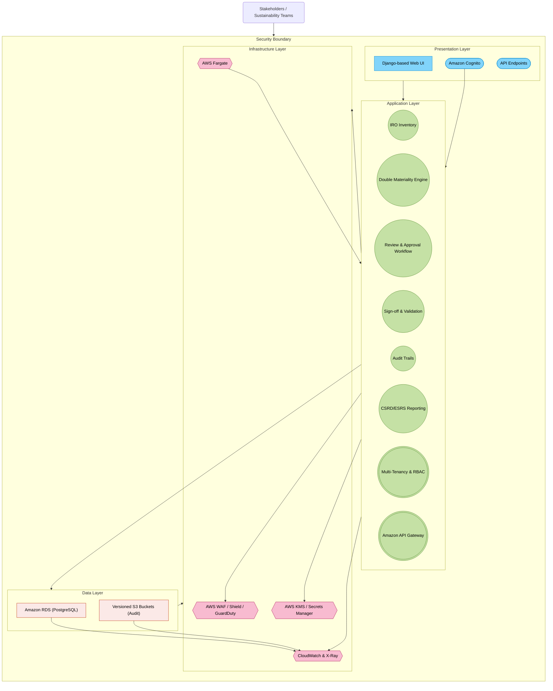
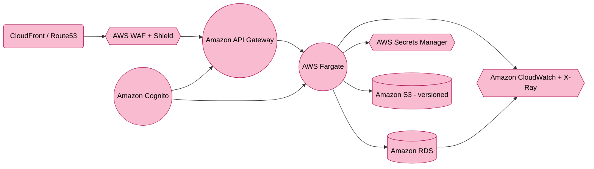

    <context>
        <project_type>Double Materiality Assessment System Development</project_type>
        <framework>EU CSRD Compliance</framework>
        <primary_goal>Analyze the provided Double Materiality Assessment context and generate net new critical thinking Q&A, specifically about the management of billing, invoicing, returns etc.. We should NOT be doing manual work unless there are bugs or for code updates</primary_goal>
    </context>

<solution design document>
# **Purpose-Built Double Materiality Assessment (DMA) SaaS Solution Design Document (AWS Edition)**

## **1. Executive Summary**

This document outlines a **purpose-built Double Materiality Assessment (DMA) SaaS platform**, enabling organizations to track, assess, and report **Impacts, Risks, and Opportunities (IROs)** from both **Impact Materiality** and **Financial Materiality** perspectives per **EU CSRD** and **ESRS** requirements. It integrates the following **refined recommendations** from a respected colleague:

1. **Security Implementation Upgrades**: Holistic audit logging, immutable storage, and strong AWS security services (e.g., WAF, Shield, Cognito, KMS).  
2. **Infrastructure Optimization**: Use **AWS Fargate** initially for container workloads to reduce operational overhead; rely on **Amazon RDS** (PostgreSQL) for primary data storage.  
3. **Revised Feature Phases**: Three-phase approach focusing on security and core features first, advanced capabilities next, and global scale thereafter.  
4. **Cost-Effective Security**: Start with AWS Shield Standard, integrate only necessary security features up front, and scale capabilities based on emerging threats.

The **updated design** ensures improved security posture from day one, reduces complexity in initial deployments, and provides a clear roadmap to scale capabilities and features over time.

---

## **2. System Architecture Overview**

### **2.1 High-Level Architecture**

The solution is organized into four layers:

1. **Presentation Layer**  
   - **User Interface** built using Django (Python) for Double Materiality dashboards and IRO management.  
   - **API Endpoints** for external linkage (ESG data, stakeholder portals).  
   - **Authentication/Authorization** via **Amazon Cognito** (supporting MFA, social logins, and SSO).

2. **Application Layer**  
   - **Core DMA Features**: IRO Inventory, Double Materiality Engine, Workflow Approvals, Audit Trails, ESRS Reporting.  
   - **Enterprise Extensions**: Multi-tenancy, row-level security in RDS, RBAC, integration with **Amazon API Gateway**.  
   - **Serverless Workflow** (optional): AWS Lambda or AWS Step Functions for background tasks (report generation, notifications).

3. **Data Layer**  
   - **Primary Database**: **Amazon RDS (PostgreSQL)** for critical data storage, row-level security, audit logging.  
   - **Optional DynamoDB** (future high-throughput needs): Skipped initially unless specific performance or global distribution use cases arise.  
   - **Immutable Audit Storage**: Use versioned **Amazon S3** buckets for storing logs/audit trails if tamper-evident archives are required.

4. **Infrastructure Layer**  
   - **Container Orchestration**: **AWS Fargate** for containerized Django services (option to migrate to full EKS if operational scale warrants it).  
   - **Network & Security**: AWS WAF, Security Groups, AWS Shield (Standard to start, upgrade if needed), Amazon GuardDuty, Cognito, KMS.  
   - **Monitoring & Observability**: Amazon CloudWatch, AWS X-Ray for distributed tracing, AWS Security Hub, and AWS Backup.

**High-Level Architecture Diagram** (using Mermaid):



---

### **2.2 Technology Stack Details**

- **Application Framework**: **Django (Python)** for rapid development, robust security defaults, and admin UI.  
- **Container Deployment**: **AWS Fargate** tasks or services to reduce the operational overhead of managing Kubernetes.  
  - *Future Option*: Migrate to **Amazon EKS** if advanced orchestration, custom scheduling, or large-scale microservices demands arise.  
- **Database**: **Amazon RDS (PostgreSQL)** with row-level security for multi-tenancy, encryption at rest, and simplified audit trails.  
  - **Potential DynamoDB** usage if extremely high-scale or globally distributed data ingestion is needed later.  
- **Security Services**: AWS WAF, Security Groups, AWS Shield (Standard initially, upgrade if needed), Amazon Cognito, AWS KMS.  
- **Observability**: Amazon CloudWatch (metrics, logs), AWS X-Ray (tracing), and AWS Security Hub to unify security findings.

---

## **3. Core Functionality Design**

### **3.1 Detailed Component Breakdown**

1. **IRO Inventory Management**  
   - Captures **Impacts, Risks, and Opportunities** with properties such as category, financial exposure, likelihood, severity, etc.  
   - Integrates with external ESG data providers for real-time sustainability metrics.  
   - Ensures multi-tenant isolation at the row level via PostgreSQL.

2. **Double Materiality Assessment Engine**  
   - **Impact Materiality**: Evaluates external impact magnitude, scope, and likelihood.  
   - **Financial Materiality**: Assesses financial severity and probability of risks/opportunities.  
   - Combines both to identify the most critical IROs for compliance and strategic decisions.

3. **Review & Approval Workflow**  
   - Configurable stage-based review: *Draft → In_Review → Approved → Disclosed*.  
   - Incorporates role-based escalations and notifications via Amazon EventBridge or AWS Lambda triggers.  
   - Flexible time-bound reviews to meet compliance deadlines.

4. **Sign-off & Validation**  
   - Electronic sign-off with a tamper-proof audit trail.  
   - Supports third-party eSignature services if required (DocuSign, Adobe Sign).  
   - Sign-off records stored in **versioned S3** or **immutable** data structures if long-term immutability is needed.

5. **Audit Trails & Logging**  
   - Comprehensive logging (create, update, delete actions) across all modules.  
   - Uses CloudWatch Logs + AWS X-Ray for advanced correlation; optionally store logs in **S3** with versioning for immutability.  
   - Facilitates SOC 2, GDPR, and general compliance requirements from day one.

6. **CSRD/ESRS Reporting**  
   - Generates standardized reports for Impact Materiality, Financial Materiality, and overall alignment with ESRS.  
   - Publish to PDF, CSV, or Excel; push to external systems via **Amazon API Gateway** or S3 pre-signed URLs.

7. **Multi-Tenancy & RBAC**  
   - **Row-level security** enforced at the database layer for strict tenant data isolation.  
   - Role-based access controls to limit unauthorized user actions.  
   - Extendable to more granular permission sets if needed.

8. **API Integrations & Gateways**  
   - **Amazon API Gateway**: Rate limiting, request transformation, and easy versioning.  
   - **Webhook Support**: Outbound webhooks for real-time updates or integrated reporting workflows.  
   - Employ Edge-optimized endpoints if global low-latency access is needed.

---

### **3.2 Data Models and Relationships**

Below is a high-level representation of the primary entities:

```
 IRO                1--n       DMAssessment
 ┌─────────────┐                ┌────────────────────────┐
 │iro_id (PK)   │                │assessment_id (PK)      │
 │tenant_id     │<--------------│iro_id (FK -> IRO)      │
 │type          │               │impact_materiality_json │
 │title         │               │financial_materiality_json
 │description   │               │aggregated_score        │
 │...           │               │assessed_on             │
 └─────────────┘               └────────────────────────┘

 Review             1--n        Signoff
 ┌─────────────┐                ┌─────────────────────┐
 │review_id (PK)│                │signoff_id (PK)      │
 │iro_id (FK)   │<--------------│review_id (FK ->Review)
 │reviewer_id   │               │signed_by            │
 │status        │               │signed_on            │
 │...           │               │signature_ref        │
 └─────────────┘               └─────────────────────┘

         AuditTrail
         ┌─────────────────────────────┐
         │audit_id (PK)               │
         │tenant_id                   │
         │entity_type                 │
         │entity_id                   │
         │action                      │
         │timestamp                   │
         │data_diff (JSON)            │
         └─────────────────────────────┘
```

- **Tenant-Aware**: Each record includes a `tenant_id` for multi-tenant partitioning.  
- **Row-Level Security**: PostgreSQL policies can restrict row access based on `tenant_id`.  
- **Auditing**: Logs every action for compliance, with optional storage in immutable S3.

---

### **3.3 API Design and Endpoints**

- **`POST /api/v1/iros/`**: Create a new IRO.  
- **`GET /api/v1/iros/`**: Retrieve a list of IROs (supports filtering, pagination).  
- **`GET /api/v1/iros/{iro_id}/`**: Get details of a specific IRO.  
- **`POST /api/v1/iros/{iro_id}/assessments/`**: Create a Double Materiality Assessment.  
- **`GET /api/v1/reviews/{review_id}/`**: Retrieve a specific review’s status.  
- **`POST /api/v1/reviews/{review_id}/signoff/`**: Perform sign-off.  
- **`GET /api/v1/audittrails/`**: Query system audit logs.  
- **`GET /api/v1/csrd-reports/`**: Generate or retrieve a pre-built CSRD/ESRS report.

**Authentication & Authorization**  
- All endpoints require **Amazon Cognito** JWT tokens (Bearer).  
- RBAC enforced in Django and row-level security in RDS.  

**Rate Limiting & Versioning**  
- **Amazon API Gateway** handles rate limits and usage plans (e.g., 100 requests/min per user).  
- **Versioning** strategy: URL-based versioning (`/api/v1` → `.../v2`).

---

## **4. Enterprise Architecture Considerations**

### **4.1 Scalability and Performance**

1. **Compute Scalability**  
   - **AWS Fargate** tasks autoscale based on CPU or memory thresholds.  
   - Evaluate migrating to **Amazon EKS** if more control over container orchestration is needed (e.g., sidecar proxies, node-level customizations).

2. **Database Scaling**  
   - **Amazon RDS (PostgreSQL)** can be vertically scaled or use read replicas.  
   - Implement partitioning if extremely large data sets become the norm.

3. **Caching**  
   - **Amazon ElastiCache (Redis)** for frequently accessed data (e.g., aggregated DMA results, reference data).  
   - Improves performance under heavy read loads.

4. **CDN/Global Deployment**  
   - **Amazon CloudFront** or **AWS Global Accelerator** for global content delivery, especially for distributed tenant bases.  
   - Multi-region architecture in Phase 3 if agility and data residency demands arise.

5. **Performance Monitoring**  
   - **Amazon CloudWatch** (metrics, logs), AWS X-Ray (tracing).  
   - Review logs in real time to proactively address latency or resource bottlenecks.

---

### **4.2 Security Architecture**

1. **Security Implementation (Refined)**  
   - **Comprehensive Audit Trails**: Log all system events and changes to an immutable store (versioned S3).  
   - **WAF, Shield, Security Groups**: Protect application endpoints from common threats and DDoS.  
   - **Data Encryption**: KMS for RDS, server-side encryption for S3.  
   - **Row-Level Security**: Strict multi-tenant data isolation at the database layer.  
   - **Cognito Authentication**: Enforce MFA and single sign-on integration.

2. **Compliance & Governance**  
   - Align with **SOC 2**, **GDPR**, and emerging **CSRD/ESRS** guidelines.  
   - Periodic penetration testing and vulnerability scans.  
   - Use **AWS Security Hub** + **GuardDuty** to centralize security alerts.

3. **Identity & Access Management**  
   - **Least Privilege**: Limit IAM roles and security group scope.  
   - Integrate AWS Organizations for environment-wide service control policies.  
   - Maintain read-only audit logs for forensic review if needed.

4. **Cost-Effective Security**  
   - Use **AWS Shield Standard** initially (upgrade to Advanced as threats escalate).  
   - Implement the essential logging and threat detection; add advanced tooling only when justified by risk profile.  
   - Leverage built-in RDS/PostgreSQL security before expanding with specialized third-party tools.

---

### **4.3 Azure Infrastructure Design (Adapted for AWS)**

*(Note: The original heading mentions Azure. Below is the AWS-equivalent design to maintain consistency with the rest of the document.)*

1. **AWS Fargate Deployment**  
   - Simple container context: Fargate tasks for Django web services.  
   - Automatic patching and minimal management overhead.

2. **Amazon RDS (PostgreSQL)**  
   - Multi-AZ configuration for high availability.  
   - Point-in-time recovery, backups configured with AWS Backup.  
   - Row-level security for multi-tenant separation.

3. **Networking & Security**  
   - Private subnets for application tasks and database.  
   - Public subnets only for load balancers / API Gateway endpoints.  
   - VPC flow logs for tracing inbound/outbound traffic.

4. **Monitoring & Logging**  
   - **Amazon CloudWatch** for container metrics, AWS X-Ray for application tracing.  
   - **AWS Security Hub** + **GuardDuty** for threat detection and compliance checks.

---

## **5. Implementation Recommendations**

### **5.1 Development Phases (Refined)**

**Phase 1: Essential Security + Core Features**  
- **Multi-tenant data isolation** using row-level security in RDS.  
- **Basic IRO management** (Impacts, Risks, Opportunities).  
- **Fundamental Double Materiality** calculations for Impact & Financial aspects.  
- **Core Security Controls**: WAF, Shield Standard, Security Groups, KMS encryption.  
- **Advanced Workflows**: Review & Approval pipelines.  
- **Detailed Audit Trails**: CloudWatch logs, versioned S3 for immutable storage.

**Phase 2: Enhanced Capabilities**  
- **AI/ML Analytics**: Integrate advanced analytics (e.g., Amazon SageMaker) for risk forecasting or materiality scoring.  
- **Extended Integrations**: Connect external ESG data, third-party sign-off platforms, or ERPs.  
- **API Maturity**: Expand versioning, webhook subscriptions, refined rate limits in API Gateway.

**Phase 3: Scale + Future Features**  
- **Multi-Region Support**: Active-passive or active-active architecture for global coverage.  
- **Disaster Recovery**: Cross-region replication for RDS, region failover strategies.  
- **Additional Features**: Based on market demand (e.g., real-time IoT data ingestion, partner marketplaces).

---

### **5.2 Best Practices**

- **Infrastructure as Code**: Use CloudFormation, AWS CDK, or Terraform to provision environments reliably.  
- **DevSecOps**: Integrate scanning tools (SAST/DAST) in pipelines, adopt automatic container image checks.  
- **Zero Trust**: Enforce least privilege, strong identity controls, and isolate workloads in separate VPC subnets.  
- **Regular DR Drills**: Validate RPO (Recovery Point Objective) / RTO (Recovery Time Objective) with simulated failovers.  
- **Cost Optimization**: Monitor usage in AWS Cost Explorer, adopt instance savings plans or Fargate savings if usage patterns are predictable.

---

## **6. Appendices**

### **6.1 Database Schema (Example)**

```sql
CREATE TABLE dbo.IRO (
    iro_id SERIAL PRIMARY KEY,
    tenant_id INT NOT NULL,
    type VARCHAR(20) NOT NULL, -- Impact, Risk, Opportunity
    title VARCHAR(255) NOT NULL,
    description TEXT,
    category VARCHAR(100),
    owner_id INT NOT NULL,
    created_on TIMESTAMP NOT NULL DEFAULT NOW()
);

CREATE TABLE dbo.DMAssessment (
    assessment_id SERIAL PRIMARY KEY,
    iro_id INT NOT NULL REFERENCES dbo.IRO(iro_id),
    impact_materiality_json TEXT,
    financial_materiality_json TEXT,
    aggregated_score NUMERIC(5,2),
    assessed_on TIMESTAMP NOT NULL DEFAULT NOW(),
    assessed_by INT NOT NULL
);

CREATE TABLE dbo.Review (
    review_id SERIAL PRIMARY KEY,
    iro_id INT NOT NULL REFERENCES dbo.IRO(iro_id),
    reviewer_id INT NOT NULL,
    status VARCHAR(50) NOT NULL,
    created_on TIMESTAMP NOT NULL DEFAULT NOW()
);

CREATE TABLE dbo.Signoff (
    signoff_id SERIAL PRIMARY KEY,
    review_id INT NOT NULL REFERENCES dbo.Review(review_id),
    signed_by INT NOT NULL,
    signed_on TIMESTAMP NOT NULL DEFAULT NOW(),
    signature_ref VARCHAR(255)
);

CREATE TABLE dbo.AuditTrail (
    audit_id SERIAL PRIMARY KEY,
    entity_type VARCHAR(50),
    entity_id INT,
    action VARCHAR(50),
    user_id INT,
    tenant_id INT,
    timestamp TIMESTAMP NOT NULL DEFAULT NOW(),
    data_diff TEXT
);
```

- **Tenant Field**: `tenant_id` is crucial for row-level security.  
- **RLS Policies**: One policy per table can restrict `tenant_id` to the user’s assigned tenant.  
- **Backups**: Enabled automatically in RDS; use AWS Backup and store long-term in S3.

---

### **6.2 API Documentation (Sample)**

| Endpoint                                          | Method | Description                                                          | Auth Required | Rate Limit/min |
|---------------------------------------------------|--------|----------------------------------------------------------------------|--------------|---------------|
| `/api/v1/iros/`                                   | POST   | Create a new IRO                                                     | Yes          | 50            |
| `/api/v1/iros/`                                   | GET    | List/filter existing IROs                                           | Yes          | 100           |
| `/api/v1/iros/{iro_id}/`                          | GET    | Retrieve a single IRO                                               | Yes          | 100           |
| `/api/v1/iros/{iro_id}/`                          | PUT    | Update a specific IRO                                               | Yes          | 50            |
| `/api/v1/iros/{iro_id}/assessments/`              | POST   | Submit a Double Materiality Assessment                              | Yes          | 50            |
| `/api/v1/reviews/`                                | GET    | List reviews (filter by status, date)                               | Yes          | 100           |
| `/api/v1/reviews/{review_id}/signoff/`            | POST   | Provide digital sign-off for a review                               | Yes          | 25            |
| `/api/v1/audittrails/`                            | GET    | Query system audit logs                                             | Yes          | 100           |
| `/api/v1/csrd-reports/`                           | GET    | Generate/fetch CSRD/ESRS compliance reports                         | Yes          | 25            |

- **Versioning**: Additional endpoints or changes introduced at `/api/v2/...`.  
- **Webhooks**: Subscribe to changes in IRO or assessment statuses, configured via custom endpoints.

---

### **6.3 Infrastructure Diagrams (AWS Fargate Emphasis)**



- **AWS Fargate**: Runs containers with minimal operational overhead.  
- **Amazon RDS**: Managed PostgreSQL for the core data store.  
- **S3 (Versioned)**: Storing immutable logs/audit evidence.  
- **CloudWatch/X-Ray**: Central logging, tracing, and metric analysis.

---

## **Conclusion**

By adopting **AWS Fargate** for containers, focusing on **Amazon RDS** for data isolation, and embedding **day-one security** through comprehensive auditing, encryption, and threat detection, this updated design balances ease of implementation with the flexibility to grow. **Phased feature** rollouts ensure critical security and multi-tenant needs are met first, followed by advanced analytics and global scale in later phases. Future enhancements—like migrating to **Amazon EKS** for more granular container orchestration or incorporating **DynamoDB** for specific high-volume use cases—are still possible. Ultimately, this approach provides a **cost-effective, secure, and compliant** foundation for a Double Materiality Assessment SaaS platform, ready to satisfy **EU CSRD**, **ESRS**, and broader enterprise requirements. 
</solution design document>


<instructions>
<primary_goal>Analyze the provided Double Materiality Assessment context and generate net new critical thinking Q&A, specifically about the management of billing, invoicing, returns etc.. We should NOT be doing manual work unless there are bugs or for code updates</primary_goal>
    
    
    <response_structure>
        <section name="data_architecture">Questions about data storage, processing, and integration</section>
    </response_structure>

    <output_format>
        For each question:
        - Number each question sequentially
        - Provide exactly 3 potential solutions
        - Include one recommended solution with justification
        - Format as specified in output instructions
    </output_format>
</instructions>

<evaluation_criteria>
    <criterion>Technical feasibility</criterion>
    <criterion>Compliance with EU CSRD</criterion>
    <criterion>Scalability</criterion>
    <criterion>Maintainability</criterion>
    <criterion>User experience</criterion>
</evaluation_criteria>


<current Q&A Bank>
All questions are numbered sequentially across sections. Each question includes **one recommended solution** with a brief **justification**.

---
## 2. **Data Architecture**

---

### **Question 4**
**What is the optimal approach for storing and managing assessment evidence (e.g., documents, images) linked to IROs?**

**Recommended Solution:**
- Store **files in Amazon S3** (enabling versioning and lifecycle policies).
- Keep **structured metadata** (file references, timestamps, context) in the main database (e.g., Amazon RDS).

**Justification:**
- **S3** scales cost-effectively and supports immutability/versioning of large files.
- Storing **pointers** in the relational DB maintains quick reference for searching, sorting, and auditing.

---

### **Question 5**
**How should the system handle data integration with existing ESG systems?**

**Recommended Solution:**
- Support **file-based batch imports** (CSV/Excel) for large or historical data sets.
- Where possible, implement a **REST API or ETL layer** to automate data ingestion from common ESG platforms.

**Justification:**
- **Batch imports** simplify initial or periodic large-scale data transfers.
- An **API-based approach** allows near-real-time updates and a more modern integration path for systems that expose web services.

---

### **Question 6**
**How should the solution handle the storage of granular Impact Materiality and Financial Materiality scoring data?**

**Recommended Solution:**
- Create **dedicated tables** (e.g., `impact_materiality`, `financial_materiality`) or well-defined JSON columns to capture each dimension (scale, scope, magnitude, likelihood).
- Reference these detail tables from a main **assessments** table via foreign keys.

**Justification:**
- **Normalized** separation provides clarity, reduces redundancy, and facilitates easier reporting queries.
- Storing data with **clear foreign-key relationships** keeps the schema extensible as scoring criteria evolve.

---

### **Question 7**
**What is the best strategy for archiving older IRO records and their assessments while still retaining accessibility for audit or compliance checks?**

**Recommended Solution:**
- Move IRO records older than a defined threshold (e.g., 5 years) to **Amazon S3 (with Glacier)** for cheaper long-term storage.
- Keep **minimal references** in the main DB to allow quick lookups and retrieval on-demand.

**Justification:**
- **Lower storage costs** and a leaner primary database improve performance.
- S3 and Glacier offer **durability** and compliance features (versioning, retrieval logs).
- References ensure **faster compliance responses** whenever older data must be accessed.

---

### **Question 8**
**Which data model strategy is most appropriate for storing and linking IRO records with their respective Double Materiality Assessments?**

**Recommended Solution:**
- Maintain **separate relational tables** for:
  1. **IRO** (Impacts, Risks, Opportunities)
  2. **Impact Materiality** data
  3. **Financial Materiality** data
  4. **Assessments** (linking IRO to the scoring details)
- Join them with **foreign keys** to ensure data integrity.

**Justification:**
- **Logical separation** improves clarity and maintainability.
- **Relational integrity** enforces consistent links among IROs, Impact/Financial scoring, and final assessments.
- Facilitates **scalable queries** for reporting, auditing, and analytics.

---

### **Question 9**
**How should the platform manage multi-tenancy at the database level to ensure data isolation and scalability?**

**Recommended Solution:**
- Use a **single database** with:
  - **Row-level security** or **separate schemas** for each tenant.
  - **Tenant ID** columns in core tables for partitioning.
- For extremely large or compliance-heavy tenants, offer an **option** to deploy dedicated DB instances.

**Justification:**
- A **single DB + row-level security** or dedicated schemas reduces operational overhead while ensuring isolation.
- Organizations with higher compliance or performance demands can choose a **physically separate** deployment if needed.
- This **hybrid** approach balances **cost, scalability, and security**.


<section name="data_architecture">

  <question id="10">
    <text>How should we design the data model to accommodate stakeholder feedback at multiple levels (e.g., local site teams, CSR committees, board-level reviews) without causing schema bloat or redundant records?</text>
    <solutions>
      <solution>Create separate normalized tables (e.g., <em>Feedback</em>, <em>StakeholderGroup</em>, <em>FeedbackDetail</em>) linked by foreign keys to reduce redundancy.</solution>
    </solutions>
    <recommendedSolution>
      <text>Create separate normalized tables to isolate stakeholder feedback from core assessment data, linking via foreign keys.</text>
      <justification>
        This approach prevents schema bloat by centralizing feedback attributes in their own tables, ensures data integrity through relational constraints, and supports clear queries (e.g., per stakeholder group, feedback type) without imposing rigid or overly complex JSON structures.
      </justification>
    </recommendedSolution>
  </question>

  <question id="11">
    <text>What is the best method for ingesting near real-time environmental or financial metrics (e.g., energy consumption, carbon footprints) into the DMA platform?</text>
    <solutions>
      <solution>This is not a feature in the foreseable future</solution>
    </solutions>
  </question>

  <question id="12">
    <text>How should the system handle on-demand analytics (e.g., financial stress tests, scenario modeling) that require aggregating large volumes of assessment data?</text>
    <solutions>
      <solution>This is not a feature in the foreseable future</solution>
    </solutions>
  </question>

  <question id="13">
    <text>What strategy should be used to integrate external ESG or sustainability frameworks (e.g., GRI, SASB, TCFD) so that their data can be leveraged for a comprehensive Double Materiality Assessment?</text>
    <solutions>
     <solutions>
      <solution>This is not a feature in the foreseable future</solution>
    </solutions>
  </question>

  <question id="14">
    <text>How should the platform manage integration with external financial systems (e.g., ERP, accounting software) to correlate sustainability metrics with actual financial performance?</text>
    <solutions>
     <solutions>
      <solution>This is not a feature in the foreseable future</solution>
    </solutions>
  </question>


---

**Question 15**  
*How can we securely expose the DMA platform’s data resources to external clients, enabling them to read and update their IRO records via an API?*

**Recommended Solution:**  Leverage OAuth 2.0 (for example, via Amazon Cognito) to issue tokens with user-specific scopes and implement granular Role-Based Access Control (RBAC).  
Utilize OAuth 2.0 with Amazon Cognito for token issuance, integrated with granular RBAC in Django and enhanced by row-level security in the RDS backend.

**Justification:**  
This solution leverages a proven, standards-based authentication mechanism that simplifies token management and meets compliance requirements (including GDPR and EU CSRD). The use of OAuth tokens alongside per-tenant row-level security ensures that only authorized clients can access or modify their specific data while maintaining scalability and ease of maintenance.

---

**Question 16**  
*What measures can we implement to ensure that only authorized external clients can programmatically manipulate assessment data without introducing undue complexity?*

**Recommended Solution:**  
**Short-Lived Access Tokens:** Use fine-grained access tokens (based on OAuth 2.0) with short expiration periods, with validation enforced at the API Gateway.  
Implement fine-grained, short-lived access tokens via OAuth 2.0, with all token validations occurring at the Amazon API Gateway layer.

**Justification:**  
Short-lived tokens reduce the risk associated with compromised credentials while centralizing authentication and request validation at the gateway. This method is straightforward to maintain, scales efficiently during high-demand periods, and provides the granular access control required to meet both organizational policies and EU CSRD guidelines.

---

**Question 17**  
*How can the DMA platform maintain stable, secure, and backward-compatible API endpoints for clients who integrate deeply with the system over time?*

**Recommended Solution:**  
Implement a versioned REST API strategy (e.g., `/api/v1/`, `/api/v2/`) with established deprecation policies for older endpoints.  
Adopt a versioned REST API approach with clear documentation, deprecation timelines, and robust error handling measures.

**Justification:**  
Versioning ensures that clients have a predictable upgrade path without experiencing sudden breaking changes. Detailed documentation and scheduled deprecation policies build client confidence, ensure transparency, and help meet the EU CSRD requirement for consistent and auditable reporting, all while maintaining system stability and security.

---
  


</section data_architecture >
</current Q&A Bank>